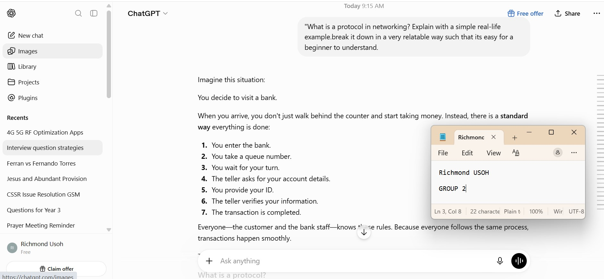
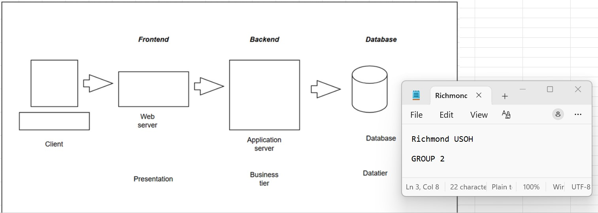
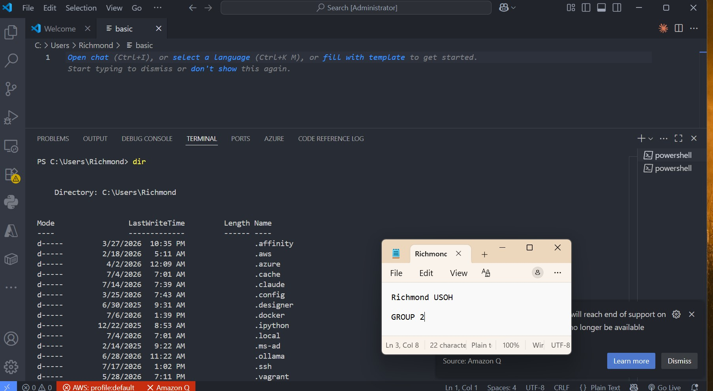

# Week 00 - Internet and Networking

Part of the DevOps Micro Internship (DMI) Cohort 3 with Agentic AI

---

# 🧑‍💻 Task 1: Using ChatGPT as Your Learning Assistant

## Scenario

You're new to DevOps and will frequently encounter technical questions. ChatGPT can be your learning companion.

## Your Task

Write a clear ChatGPT prompt to help you understand:

> "What is a protocol in networking? Explain with a simple real-life example."

Take a screenshot of your interaction showing:

* Your detailed prompt (with clear expectations)
* ChatGPT's simplified response with an example

## Screenshot

Save your screenshot in the `screenshots` folder and update the file name below.




Replace `task-1-chatgpt.png` with your actual screenshot file name.

---

## What I Learned (2–3 lines)

chatgpt gave a simplified learning format which is very relatable, i further learnt that A protocol is a set of rules that tells devices how to communicate with each other over a network.
Just as people need a common language and agreed rules to have a meaningful conversation, computers and devices need protocols to exchange information correctly.
Without protocols, one computer might send information in a way that another computer doesn't understand. every system has a set of rules or protocols that makes it perform as a system.

---

# 🌐 Task 2: Internet and Networking

## Scenario

Your friend is launching an online bookstore named **EpicReads**.

He asked you to explain how users globally can access his website hosted in Finland.

## Your Task

Write a short explanation (**100–150 words**) that includes:

* Packet Switching
* IP Address
* TCP/IP
* HTTP/HTTPS

💡 **Tip:** You may use ChatGPT (as demonstrated in Task 1) to refine your explanation.

## Answer

When someone anywhere in the world visits the **EpicReads** website, their computer first uses **HTTP** (or the more secure **HTTPS**) to request the webpage from the server hosted in Finland. That request is broken into small pieces called **packets** through a process known as **packet switching**, allowing the data to travel efficiently across the internet. Each packet contains the **IP address** of both the user's device and the Epicreads server, ensuring it knows where to go and where to return. The **TCP/IP** protocol suite manages the communication by making sure the packets are delivered, checked for errors, and reassembled in the correct order. Within seconds, all the packets arrive, and the user's browser puts them back together to display the EpicReads website, no matter where the visitor is in the world.


---

# 🏗️ Task 3: Application Architecture & Stack

## Scenario

EpicReads bookstore has two application versions:

### Two-Tier Application

* Frontend
* Database

### Three-Tier Application

* Frontend
* Backend
* Database

## Your Task

* Draw simple diagrams (hand-drawn or tool-based such as draw.io)
* Label each layer clearly
* List at least two common technologies or tools used for each layer
* Submit a screenshot or photo clearly showing your own drawing

## Diagram Screenshot / Photo

Save your diagram image in the `screenshots` folder and update the file name below.




Replace `task-3-diagram.png` with your actual diagram file name.

---

## Technologies Used

### Frontend

* Web server
* Also Known as NGINX OR Presentation layer

### Backend

* Application server
* Also known as business tier

### Database

* DATABASE 
* MySQL or postgres

---

# 🌍 Task 4: Domain Name & DNS (Basic Concepts)

## Scenario

Your friend's bookstore **EpicReads** is currently accessible through:

```text
52.172.142.222:3000
```

He purchased the domain:

```text
epicreads.com
```

## Your Task

In **50–100 words**, explain in your own words:

1. What is DNS (Domain Name System)?
2. Which DNS record type should be used to connect the domain to the given IP, and why?

## Answer

The Domain Name System (DNS) is like the internet's phone book. Instead of remembering a numeric IP address such as 52.172.142.222, people can simply type epicreads.com into their browser. DNS translates the domain name into the server's IP address so the browser knows where to connect. To link epicreads.com to the server, an A record should be used because it maps a domain name directly to an IPv4 address, making the website easy for users to access.

---

# 💻 Task 5: Visual Studio Code Setup (Hands-on)

## Your Task

Install Visual Studio Code (if not already installed).

Take a screenshot of your VS Code environment showing:

* Terminal open inside VS Code
* Running a basic command:

### Windows

```powershell
dir
```

### Linux / macOS

```bash
pwd
ls
```

* Your selected VS Code theme clearly visible

⚠️ **Important:** The screenshot must show your username or another identifiable detail to confirm it is your environment.

## Screenshot

Save your screenshot in the `screenshots` folder and update the file name below.




Replace `task-5-vscode.png` with your actual screenshot file name.

---

# 🔗 Task 6: Publish Your Assignment as a LinkedIn Post

## Objective

Publishing on LinkedIn helps you:

* Build your professional online presence
* Reinforce your learning
* Document your DevOps journey publicly

## Your Task

Summarize your answers from Tasks 1–5 into a LinkedIn post.

Clearly structure your post into the following sections:

* ChatGPT
* Internet & Networking
* App Architecture
* DNS
* VS Code Setup

Add the following credit note at the end of your post:

> **P.S. This post is part of the DevOps Micro Internship (DMI) with Agentic AI — Cohort 3 — by Pravin Mishra. My graded progress is public: https://dmi.pravinmishra.com/s/YOUR-GITHUB-USERNAME.html · Start your DevOps journey: https://dmi.pravinmishra.com/?utm_source=student&utm_medium=ps-linkedin&utm_campaign=cohort3**

---

## LinkedIn Post URL

Paste your LinkedIn post URL here:

https://www.linkedin.com/posts/richmond-usoh-16672531_devops-micro-internship-dmi-by-pravin-activity-7385842199235637250-DQ-m?utm_source=share&utm_medium=member_desktop&rcm=ACoAAAaxKJ4B4307Oy0LMj-MkWnZs1lOOjPvqqY

---

## LinkedIn Post Backup Copy

Paste the full text of your LinkedIn post here:

My Learning Journey in Cloud and DevOps.
I finally started my Cloud & DevOps Journey after several months of procrastination.
Thanks to Pravin Mishra FREE DevOps Micro Internship.
Here’s a quick summary of what I’ve learned so far 👇 

💬 1. Using ChatGPT as a Learning Assistant
ChatGPT have always been my go-to learning partner! So I found more dynamic ways to use it. It helped simplify complex DevOps concepts, clarify commands, it gave me a good guide. It’s like having a 24/7 mentor that explains both “what” and “why.” 

🌐 2. Internet and Networking
I deepened my understanding of how data travels across networks — boosting my knowledge about IP addresses, protocols, and how connectivity forms the backbone of cloud applications. These basics are essential for deploying scalable systems. 

🏗️ 3. Application Architecture & Stack
I explored how modern applications are structured using a three-tier architecture — frontend (UI), backend (logic), and database (storage). This clarified how components interact in real-world DevOps environments. 

🌍 4. Domain Name & DNS (Basic Concepts)
We explored DNS use cases and examined how domain names like epicreads.com are mapped to server IPs, allowing global users to access websites seamlessly. The A record, CNAME, and other DNS types now make practical sense. 

💻 5. Visual Studio Code Setup (Hands-On)
Setting up VS Code for web and cloud projects was another highlight — from installing extensions and using the terminal to running live previews. It’s now my main workspace for development and automation tasks.
 
Its going to be a good ride, trust me! I say this because Pravin is a hands-on teacher and he knows how to simplify complex concepts. 
**P.S. This post is part of the DevOps Micro Internship (DMI) with Agentic AI — Cohort 3 — by Pravin Mishra. My graded progress is public: https://dmi.pravinmishra.com/s/YOUR-GITHUB-USERNAME.html · Start your DevOps journey: https://dmi.pravinmishra.com/?utm_source=student&utm_medium=ps-linkedin&utm_campaign=cohort3**

---

# Reflection – Week 0

### What did you find easy?

I found the terminilogies easy i.e frontend, backend, database. i also found the technicalities easy like HTTP, HTTPS, Internet protocols, TCP/IP and how it helps with packet switching.
i enjoyed how data and packets are transimitted over the internet.

---

### What was difficult?

I found ip addressing and subnet masking quite challenging however i will take more research approaches to study and understand it.

---

### What will you improve next week?

i will improve on studying ahead of the class session and being conversant with the new topic, while researching ahead. I will also improve on my knowledge on cloud infrastructure and its configuration.

---

## 📌 About DMI & CloudAdvisory

DevOps Micro Internship (DMI) is a project-based DevOps program run by Pravin Mishra (The CloudAdvisory) focused on real-world execution, systems thinking, and career readiness.

It helps learners build strong DevOps foundations with hands-on experience.


## 📌 Resources

- 🌐 **DMI Official Website:** https://pravinmishra.com/dmi  
- 🎓 **DevOps for Beginners (Udemy):** https://www.udemy.com/course/devops-for-beginners-docker-k8s-cloud-cicd-4-projects/  
- 🎓 **Ultimate Agentic AI DevOps with Clude Code** https://www.udemy.com/course/ultimate-agentic-ai-devops-with-claude-code/?referralCode=448389767BC96284087B
- 🎓 **DevOps with Claude Code: Terraform, EKS, ArgoCD & Helm** https://www.udemy.com/course/devops-with-claude-code-terraform-eks-argocd-helm/?referralCode=1C5B734505D65A010FA3
- ▶️ **YouTube Playlist (DMI Cohort 3):** https://www.youtube.com/playlist?list=PLFeSNDtI4Cho  
- 🔗 **Pravin Mishra (LinkedIn):** https://www.linkedin.com/in/pravin-mishra-aws-trainer/  
- 🏢 **CloudAdvisory (LinkedIn):** https://www.linkedin.com/company/thecloudadvisory/

---

*This submission is part of DevOps Micro Internship (DMI) Cohort 3 — Agentic AI Track*