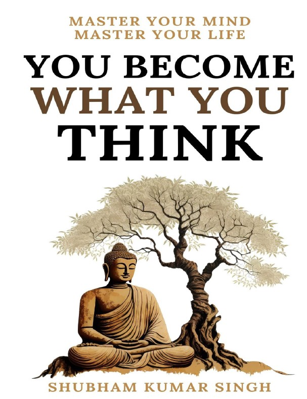
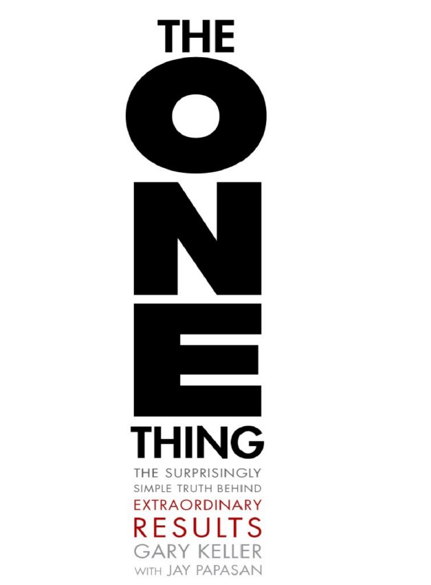
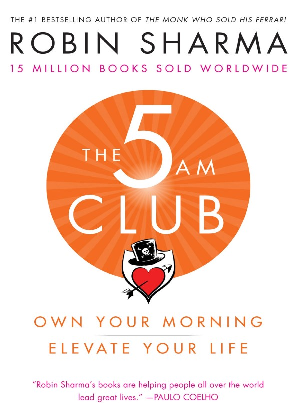
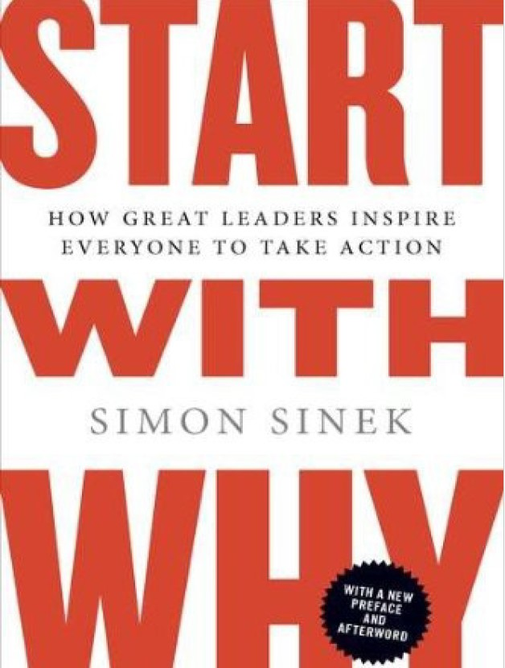
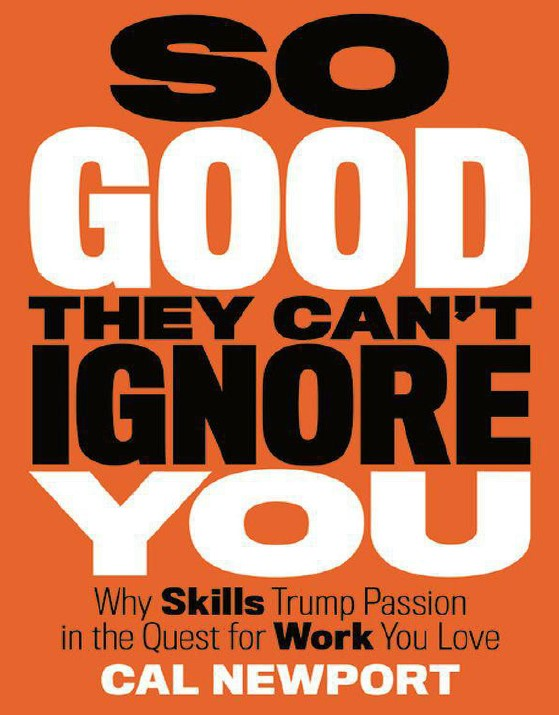
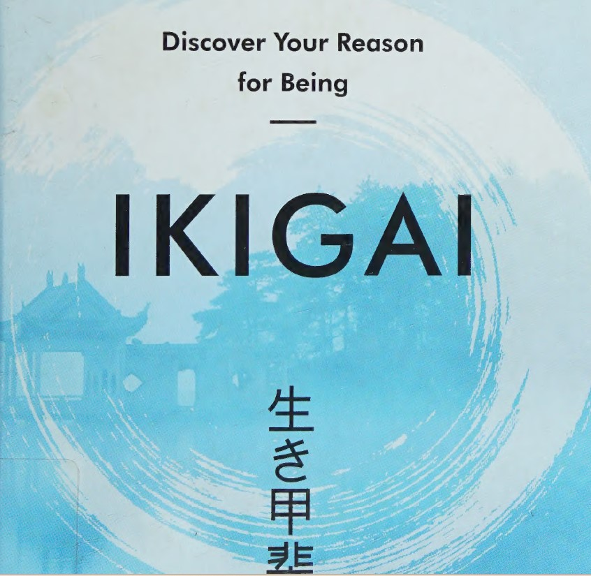
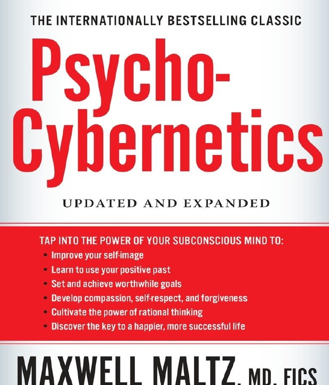
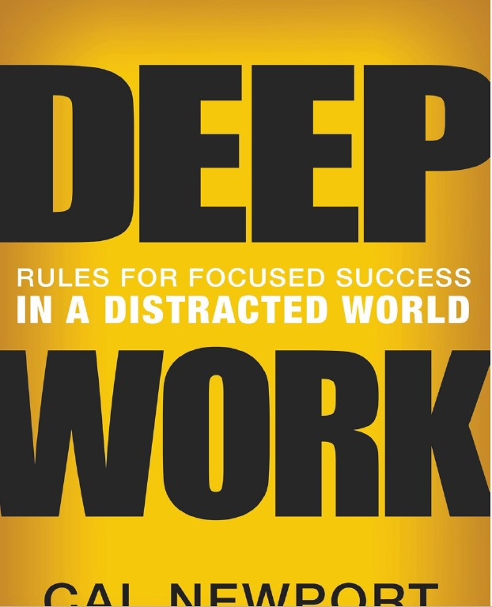
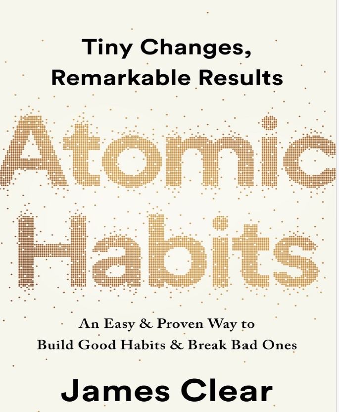

# Week 01 — Success Mindset (Mindset OS)

Part of the DevOps Micro Internship (DMI) Cohort 3 with Agentic AI

---

## Purpose (Read This First)

This week is not motivation homework.

This is you building your **Mindset OS** — the system you will use for the next 5 months (and honestly, for years).

### Expectations

* Be honest.
* Be specific.
* Be practical.
* Write like an adult professional: clear sentences, no one-liners.

You will reuse this in later weeks. So do it properly once.

---

# Assignment 1. What is something you believe to be true that most people around you would disagree with?

### Rules

* No "safe" answers.
* Must be your real belief (not copied from internet).
* Minimum 50 words.

**Hint:** What do you believe about career, money, learning, discipline, relationships, health, success, life, tech industry, etc. that most people don't agree with?

## Answer

I will categorize the assignment into 5 angles.

1. Personal growth / mindset angle
  I believe that most people are capable of far more than they achieve, but comfort and fear of uncertainty keep them stuck. Many people around me, Lagos Nigeria specifically think success is mostly about luck, fervent prayers but I believe it’s more about consistency, focused learning, and discipline over time.

2. Career / success angle
  I believe that formal education alone doesn’t guarantee success. Many people around me think a degree is enough, but I believe skills, adaptability, and continuous learning matter more in the long run.
  Why this works: it’s respectful but forward-thinking.

3. Money / wealth mindset 
  I believe poverty is often first a mindset problem before it becomes a financial one. Many people disagree and think it’s only about circumstances for example being born into a rich or poor homes, but I believe how people think about money, opportunity, and growth plays a major role.

4. Faith / life philosophy 
  I believe that life has purpose beyond survival and success. Many people around me focus only on money or status, but I believe meaning, service, and spiritual alignment matter more in the end.

5. Discipline vs Motivation 
  I believe discipline is more important than motivation. Most people around me wait to feel motivated, but I believe showing up consistently—even when you don’t feel like it—is what actually changes lives.

# Assignment 2. What are the top 3 objective truths you discovered through experimentation and results?

### Definition

Objective truths do not depend on opinions. They hold true regardless of how people feel.

Write each truth in this format:

**Truth:** (1 sentence)

**Evidence from my life:** (2–4 lines: what you tried + what happened)

---

## Truth #1

### Truth

●	Truth #1: Consistency produces better results than intensity.

### Evidence from my life

●	 I didn't have any background in telecommunications when i gained employment in the industry but i set daily study time, i kept to it, i kept taking corrections humbly and today, several years later am an experienced radio network engineer.

## Truth #2

### Truth

●	Truth #2: Feedback and correction accelerate improvement.

### Evidence from my life

part of what helped my growth in the telecommunications space is my ability to receive feedbacks and correction from both senior and junior colleagues, these has given me the success i enjoy at the moment.

## Truth #3

### Truth

●	Truth #3: Action leads to clarity more than planning alone.

### Evidence from my life

while i was studying my AWS Cloud practitioner certification, i initially studied then attempted past questions or exam dumps but when i did hands- on to deploy instances even though sometimes i was wrong but it helped me gain better understanding. Now i passed the certification.

# Assignment 3. What does your 2.0 version look like?

### Instructions

Write as if a journalist is writing about you **3 to 7 years from now** (not 20 years).

**Minimum 300 words.**

### Rules

* Write in past tense, like it already happened.
* Don't use "likes to / wants to / hopes to."
* Use specifics:

  * built
  * shipped
  * led
  * published
  * earned
  * relocated
  * contributed
* Include skills proof:

  * projects
  * portfolios
  * GitHub
  * blogs
  * certifications
  * job role
  * leadership
  * community contribution
* Add 1–3 images if you can (optional but powerful).

### Publish It Publicly On Any ONE

* LinkedIn
* Medium
* WordPress
* Blogspot
* Personal blog
* Portfolio page

Include this line:

> **P.S. This post is a part of DevOps Micro Internship with Agentic AI Cohort-3 by [Pravin Mishra](https://www.linkedin.com/in/pravin-mishra-aws-trainer/). You can start your DevOps journey by joining this [Discord community](https://discord.pravinmishra.com/) ( https://discord.pravinmishra.com/ ).**

## Your Article

My version 2.0 (Future Self)
By 2030, I had become a globally recognized cloud and DevOps professional and the founder of Revealing Blaze Technologies, a technology company that helps enterprises design, secure, and operate resilient cloud infrastructure. As technology evolves, Revealing Blaze plays a significant role in helping organizations stay ahead, adopt modern solutions, and maintain competitive advantage.

I have trained and mentored over 20,000 cloud and DevOps engineers, empowering young professionals in Nigeria and across Africa. I lead large-scale cloud migrations, automation, and multi-cloud projects across Africa, Europe, and North America, while contributing to open-source DevOps tools used globally. I deliver secure, cost-optimized, and highly reliable systems with near-zero downtime for critical workloads.

Through Revealing Blaze Technologies, I advise governments, startups, and enterprises on cloud adoption, digital transformation, and workforce development. I am building a legacy of technical excellence, ethical leadership, and empowerment—using cloud technology to create opportunity and solve real-world problems.

P.S. This post is part of the DevOps Micro Internship (DMI) Cohort-3 by Pravin Mishra

### Public Link

https://www.linkedin.com/posts/richmond-usoh-16672531_my-version-20-future-self-by-2030-i-had-activity-7417354842697981952-IPka?utm_source=share&utm_medium=member_desktop&rcm=ACoAAAaxKJ4B4307Oy0LMj-MkWnZs1lOOjPvqqY
=======
`https://www.linkedin.com/posts/richmond-usoh-16672531_my-version-20-future-self-by-2030-i-had-activity-7417354842697981952-IPka?utm_source=share&utm_medium=member_desktop&rcm=ACoAAAaxKJ4B4307Oy0LMj-MkWnZs1lOOjPvqqY`

---
upstream/main

# Assignment 4. Have you ever cut corners (unethical / dishonest / shortcut behavior — not necessarily illegal)? If yes, how did it make you feel?

### Important

You don't need to write the full story.

Focus on the feeling:

* guilt
* fear
* shame
* stress
* regret
* numbness
* etc.

This is about self-awareness, not judgment.

### Answer Format

**Yes / No**

If Yes:

**What emotion did you feel?** (minimum 50–100 words)

## Answer
●	Yes 
●	It was at the airport, i was travelling to another state in Nigeria and i could not afford to miss my flight so i had to jump the queue, At the time of such shortcut behaviour, i felt clever, smart because the Queue was really long and if i had to join the queue from the right position which is from behind, i felt i might miss my flight.
When some elderly people started complaining from behind why i didnt join the queue like every normal citizens i felt embarrassed and disappointed in myself. I wondered if elderly people could be civilized to join the queue normally why could i not do same.
I changed my mentality after that incident.

# Assignment 5. What are 10 non-fiction books you plan to read in the next 1 year?

### Rules

* Mention **Title + Author**
* Any language allowed
* No fiction novels

### Tip

Choose books that improve:

* mindset
* communication
* productivity
* health
* money
* career
* leadership

## Book List

1. You become what you think - Shubam Khumar

2. The ONE thing - Gary Keller

3. The 5 AM Club - Robin Sharma

4. Start with why - Simon Sinek

5. so good they cant ignore you - Cal Newport

6. Shoe Dog - Phil Knight

7. IKIGAI - Justin Barnes

8. psycho cybenetics - Maxwell Maltz

9. Deep work - Cal Newport

10.Atomic Habits - James Clear 

# Assignment 6. What are the things you will measure regularly in your life and career?

### Rules

List topics only. No need to share numbers.

### Must Include

* Learning / skill
* Output / proof
* Health / energy
* Time / focus
* Money / finance (personal or business)

### Example

* Learning hours per week
* Deep work sessions per week
* Projects shipped / documented
* Steps / workouts
* Sleep hours
* Spending tracker

## My Metrics

* Income and wages
* Career certifications and professional achievements
* Health and fitness
* Time management 
* Financial intelligence and expenses management
* Childrens academic progress
* Spiritual growth.
* Daily sleeping hours
* Family bonding
* Mental health

---

# Assignment 7. Brain Dump + 5-Month System Plan

## Step 1: Brain Dump (Private)

Do a brain dump of everything in your mind into a notebook.

Examples:

* Bills
* Tasks
* Worries
* Goals
* Pending messages
* Ideas
* Responsibilities

### Did You Do It?

**Yes / No**
Answer: Yes

1. Buy building materials for site work at ikorodu
2. prepare for a job interview
3. Apply for national passport for family
4. visit a former colleague, pastor ID during the weekend.
5. continue revision for solutions achitect
6. visit isreal studio to get the price of studio lighting setup kit
7. start reading ikigai this week
8. study how to setup claude code and its usage
9. take lenovo laptop to ikeja and replace faulty hard disk 
10. enroll for an AI Automatioc course

## Step 2: Your 5-Month Routine + Focus Blocks

Create a simple plan you can realistically follow for the next 5 months.

### Weekly Routine

Example:

* Mon–Thu: 60 min deep work
* Sat: DMI session
* Sun: Weekly review

#### My Weekly Routine

1.	
Mon– Fri, 6pm - 9pm (DMI Study and assignments)
Sat, 5am - 2pm (DMI Live classes)

### Focus Blocks

#### When Will You Do DMI Work? (Days + Time)

(mon - fri) (6pm - 9pm daily)

#### How Many Sessions Per Week?

5 sessions per week

### Distraction Rules

Examples:

* Phone rules
* Social media rules
* Environment setup

#### My Distraction Rules

1. No phones in study room
2. No social media tabs open while studying
3. Atleast minimum of 2 hours study daily

# Reflection – Week 1

### Biggest insight I got about myself this week

I realized due to my drive for knowledge, i tend to consume one youtube videos after the other but I learn best when I slow down, seek clarity, and focus on understanding the foundational knowledge rather than rushing through content.

### My biggest weakness/loop I noticed

I tend to consume information without always converting it immediately into hands-on practice or documented output.

### One system I will implement from this week (exact habit + time)

Daily 60-minute focused learning block from 8:00–9:00 PM, followed by 1 hour of hands-on practice or notes documentation.

### LinkedIn Post

https://www.linkedin.com/posts/richmond-usoh-16672531_biggest-insight-i-got-about-myself-this-week-activity-7417643741164822528-f1kV?utm_source=share&utm_medium=member_desktop&rcm=ACoAAAaxKJ4B4307Oy0LMj-MkWnZs1lOOjPvqqY
=======
`https://www.linkedin.com/posts/richmond-usoh-16672531_biggest-insight-i-got-about-myself-this-week-activity-7417643741164822528-f1kV?utm_source=share&utm_medium=member_desktop&rcm=ACoAAAaxKJ4B4307Oy0LMj-MkWnZs1lOOjPvqqY
=======`

upstream/main

## 10. Proof of Work

- LinkedIn Post URL: **https://www.linkedin.com/posts/richmond-usoh-16672531_biggest-insight-i-got-about-myself-this-week-activity-7417643741164822528-f1kV?utm_source=share&utm_medium=member_desktop&rcm=ACoAAAaxKJ4B4307Oy0LMj-MkWnZs1lOOjPvqqY**  
- Blog / Medium : **https://medium.com/@richmondusoh92/the-agentic-shift-how-autonomous-ai-is-rewriting-the-devops-playbook-353fa24329d1**  

## 📌 About DMI & CloudAdvisory

DevOps Micro Internship (DMI) is a project-based DevOps program run by Pravin Mishra (The CloudAdvisory) focused on real-world execution, systems thinking, and career readiness.

It helps learners build strong DevOps foundations with hands-on experience.

## 📌 Resources

- 🌐 **DMI Official Website:** https://pravinmishra.com/dmi  
- 🎓 **DevOps for Beginners (Udemy):** https://www.udemy.com/course/devops-for-beginners-docker-k8s-cloud-cicd-4-projects/  
- 🎓 **Ultimate Agentic AI DevOps with Clude Code** https://www.udemy.com/course/ultimate-agentic-ai-devops-with-claude-code/?referralCode=448389767BC96284087B
- 🎓 **DevOps with Claude Code: Terraform, EKS, ArgoCD & Helm** https://www.udemy.com/course/devops-with-claude-code-terraform-eks-argocd-helm/?referralCode=1C5B734505D65A010FA3
- ▶️ **YouTube Playlist (DMI Cohort 3):** https://www.youtube.com/playlist?list=PLFeSNDtI4Cho  
- 🔗 **Pravin Mishra (LinkedIn):** https://www.linkedin.com/in/pravin-mishra-aws-trainer/  
- 🏢 **CloudAdvisory (LinkedIn):** https://www.linkedin.com/company/thecloudadvisory/

---

*This submission is part of DevOps Micro Internship (DMI) Cohort 3 — Agentic AI Track*