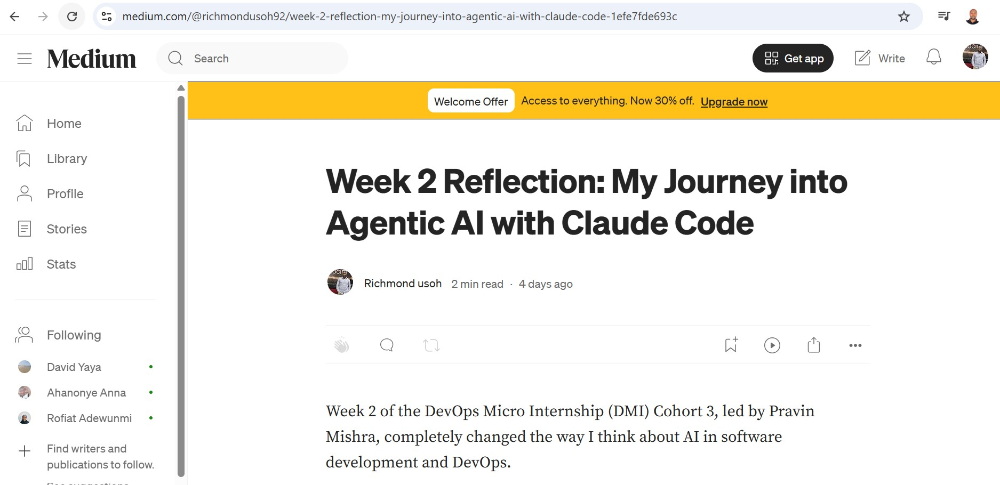
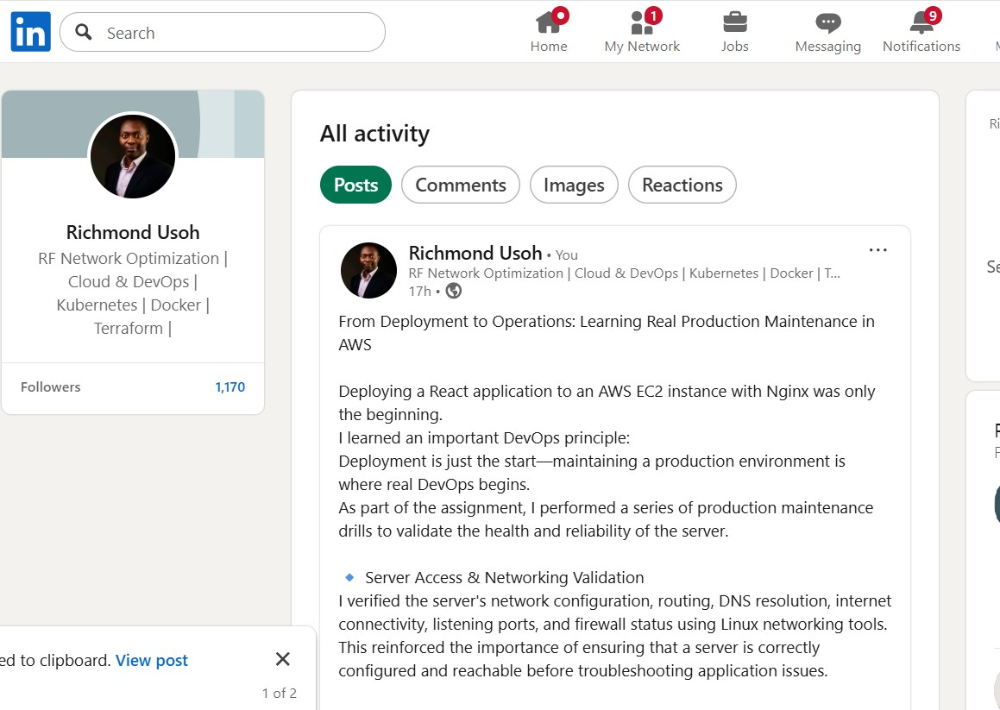

# Assignment 8 — Week 2 Reflection Blog

Part of the DevOps Micro Internship (DMI) Cohort 3 with Agentic AI

---

# Purpose

In this assignment, you will reflect on your Week 2 learning journey and write a short blog capturing your experience working with Agentic AI tools such as Claude Code, Skills, Subagents, MCP, Hooks, Permissions, and Memory.

You will also publish a LinkedIn post summarizing your learning and share both links for evaluation.

---

# Task 1 — Write Your Reflection Blog

## Goal

Write a reflection blog covering your Week 2 learning experience.

### Blog Requirements

Your blog must include:

* Title: **Reflection – Week 2**
* Minimum 300 words
* At least 2–3 topics from Week 2 (Claude Code, Skills, Subagents, MCP, Hooks, Permissions, Memory)
* Honest personal reflection (learning, challenges, mindset)
* One habit/system you plan to implement
* Your full name clearly visible

### Allowed Platforms

You can publish your blog on:

* Hashnode
* Medium
* Dev.to
* LinkedIn Article
* GitHub Markdown file
* Substack

---

### Evidence

#### Screenshot 1 — Blog published and visible

.

---

### Submission Field

Blog Link:

`https://medium.com/@richmondusoh92/week-2-reflection-my-journey-into-agentic-ai-with-claude-code-1efe7fde693c?sharedUserId=richmondusoh92`

---

# Task 2 — Create LinkedIn Post

## Goal

Share your Week 2 learning publicly on LinkedIn.

---

### LinkedIn Post Requirements

Your post must include:

* One screenshot from any Week 2 assignment
* Short reflection (what you learned or built)
* Required P.S. line exactly as given below

---

### Required P.S. Line (Must Include Exactly)

> **P.S. This post is part of the DevOps Micro Internship (DMI) with Agentic AI — Cohort 3 — by [Pravin Mishra](https://www.linkedin.com/in/pravin-mishra-aws-trainer/). My graded progress is public: https://dmi.pravinmishra.com/s/YOUR-GITHUB-USERNAME.html · Start your DevOps journey: https://dmi.pravinmishra.com/?utm_source=student&utm_medium=ps-linkedin&utm_campaign=cohort3**

---

### Suggested Hashtags

#DMIByPravinMishra #AgenticAI #ClaudeCode #DevOps #LearningInPublic

---

### Evidence

#### Screenshot 2 — LinkedIn post published

.

---

### Submission Field

LinkedIn Post Content From Deployment to Operations: Learning Real Production Maintenance in AWS

Deploying a React application to an AWS EC2 instance with Nginx was only the beginning. 
I learned an important DevOps principle:
Deployment is just the start—maintaining a production environment is where real DevOps begins.
As part of the assignment, I performed a series of production maintenance drills to validate the health and reliability of the server.

🔹 Server Access & Networking Validation
I verified the server's network configuration, routing, DNS resolution, internet connectivity, listening ports, and firewall status using Linux networking tools. This reinforced the importance of ensuring that a server is correctly configured and reachable before troubleshooting application issues.

🔹 Service Health & Systemd Validation (Nginx)
I checked the health of the Nginx service, validated its configuration, confirmed it starts automatically after reboot, verified that it was listening on the correct port, and safely restarted the service. This highlighted how critical service management is to keeping production applications available.

🔹 Logs & Request Tracing
Using HTTP requests and Nginx access and error logs, I confirmed that the application was serving traffic correctly and learned how logs provide valuable insight into application behavior, client requests, and potential issues.

Key Lessons Learned
✅ Successful deployment does not guarantee a healthy production environment.
✅ Network connectivity, DNS, routing, and firewall configuration are fundamental to application availability.
✅ Regular service health checks help detect issues before they become outages.
✅ Log analysis is one of the most valuable troubleshooting skills for DevOps engineers.
✅ Production maintenance requires continuous monitoring, validation, and operational discipline—not just deploying code.

This hands-on experience has strengthened my understanding of Linux system administration, Nginx, networking, and production operations on AWS. Every assignment continues to bridge the gap between theory and real-world DevOps practices.

As usuall special thanks to my comentors Pravin Mishra, Anjana Muthunayake, Joy Ukpabi for the continued support.

hashtag#DevOps hashtag#AWS hashtag#Nginx hashtag#Linux hashtag#CloudComputing hashtag#ReactJS hashtag#SystemAdministration hashtag#Networking hashtag#Infrastructure hashtag#Monitoring

P.S. This post is part of my hands-on journey in the DevOps Micro Internship with Agentic AI (Cohort 3) by Pravin Mishra. If you are looking to accelerate your own engineering skills and transition into the DevOps space, you can join the DMI official waiting list here:

---

### LinkedIn Post Link:

`https://www.linkedin.com/posts/richmond-usoh-16672531_devops-aws-nginx-activity-7485003923880128513-cr54?utm_source=share&utm_medium=member_desktop&rcm=ACoAAAaxKJ4B4307Oy0LMj-MkWnZs1lOOjPvqqY`

---

# Submission Instructions

* Blog must be publicly accessible
* LinkedIn post must be visible (public or unlisted where applicable)
* All required fields must be filled
* Screenshot proofs must be added to GitHub repository
* Do not include sensitive information in blog or post

---

# Completion Checklist

* [✅] Blog written with required structure
* [✅] Blog includes at least 2–3 Week 2 topics
* [✅] Blog is publicly accessible
* [✅] LinkedIn post created
* [✅] Required P.S. line included
* [✅] LinkedIn post content copied in submission field
* [✅] Blog link added
* [✅] LinkedIn post link added
* [✅] Screenshots added to GitHub repo

---

# About DMI & CloudAdvisory

DevOps Micro Internship (DMI) is a project-based DevOps program run by Pravin Mishra (The CloudAdvisory), focused on real-world execution, systems thinking, and agentic AI workflows.

It helps learners build strong DevOps foundations through hands-on experience.

---

# Resources

* 🌐 DMI Official Website: [https://pravinmishra.com/dmi](https://pravinmishra.com/dmi)
* 🎓 DevOps for Beginners (Udemy): [https://www.udemy.com/course/devops-for-beginners-docker-k8s-cloud-cicd-4-projects/](https://www.udemy.com/course/devops-for-beginners-docker-k8s-cloud-cicd-4-projects/)
* 🎓 Agentic AI DevOps with Claude Code: [https://www.udemy.com/course/ultimate-agentic-ai-devops-with-claude-code/](https://www.udemy.com/course/ultimate-agentic-ai-devops-with-claude-code/)
* 🎓 DevOps with Claude Code: Terraform, EKS, ArgoCD & Helm: [https://www.udemy.com/course/devops-with-claude-code-terraform-eks-argocd-helm/](https://www.udemy.com/course/devops-with-claude-code-terraform-eks-argocd-helm/)
* ▶️ YouTube Playlist: [https://www.youtube.com/playlist?list=PLFeSNDtI4Cho](https://www.youtube.com/playlist?list=PLFeSNDtI4Cho)
* 🔗 Pravin Mishra (LinkedIn): [https://www.linkedin.com/in/pravin-mishra-aws-trainer/](https://www.linkedin.com/in/pravin-mishra-aws-trainer/)
* 🏢 CloudAdvisory (LinkedIn): [https://www.linkedin.com/company/thecloudadvisory/](https://www.linkedin.com/company/thecloudadvisory/)

