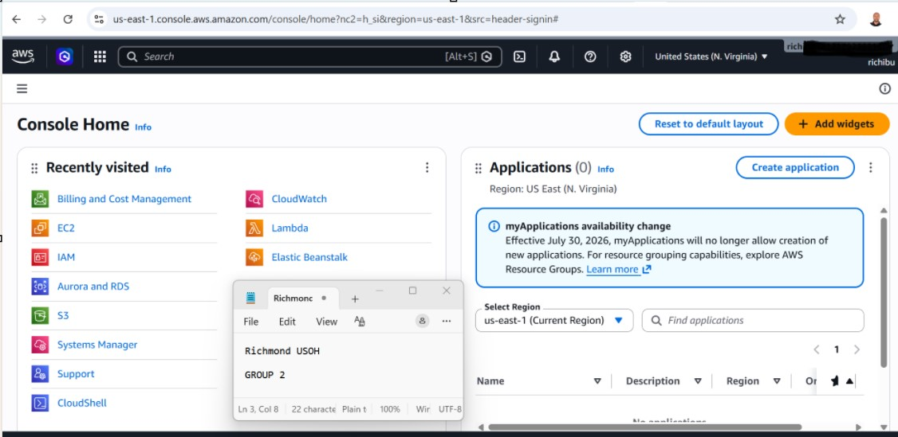

# Assignment 1 — AWS Free Tier Account Setup (EpicReads Cloud Onboarding)

Part of the DevOps Micro Internship (DMI) Cohort 3 with Agentic AI

## Purpose

In this assignment, you will create and verify an AWS Free Tier account as part of onboarding EpicReads — an online bookstore moving to the cloud. You will demonstrate an understanding of AWS fundamentals, Free Tier services, and account setup by answering conceptual questions and capturing proof of a working AWS Console login.

# Task 1 — Understanding AWS & Free Tier

## Goal

Demonstrate understanding of AWS basics and Free Tier usage by answering the following questions in your own words (3–4 lines each).

### Answers

#### Question 1 — What is an AWS account, and why do you need it at this stage?

AWS account is a digital workspace where all your cloud infrastructure is created, managed, secured, and billed.
We need it at this DMI to Practice hands-on, not just theory,
2. Create and manage real cloud resources (EC2, S3, IAM, VPC),
3. Understand how cloud infrastructure works in real life,
4. Learn security basics like users, roles, and permissions,
5. Deploy sample applications and static websites,
6. Experiment safely using the AWS Free Tier,
7. Build real projects you can document and show as proof of learning

#### Question 2 — What is AWS Free Tier, and how long does it last?

The AWS Free Tier is a program from Amazon Web Services that allows new users to use selected AWS services for free, within defined limits. It is designed to help beginners learn, experiment, and build simple projects on AWS without immediate cost.
The AWS Free Tier has three types, each with different durations:
1.12-Month Free Tier,
Starts from the day you create your AWS account till the 12th month.
Offers limited free usage of popular services (e.g., EC2, S3, RDS),
2.Always Free Tier,
Available indefinitely,
Includes services with small free usage limits every month (e.g., AWS Lambda, IAM, RDS, S3, EC2,),
3.Short-Term Trials,
Free for a limited time (usually days or months),
○Applies to specific services.

#### Question 3 — Name three AWS Free Tier services and their free usage limits.

1. Amazon EC2, 	Virtual servers (compute)	750 hours/month of t2.micro or t3.micro instance	12-Month Free Tier.
2. Amazon S3, Object storage (files, backups, static websites)	5 GB standard storage, 20,000 GET requests, 2,000 PUT requests per month	12-Month Free Tier.
3. AWS Lambda	Serverless code execution	1 million requests + 400,000 GB-seconds compute time per month	Always Free

# Task 2 — Create AWS Free Tier Account

## Goal

Create a valid AWS Free Tier account and sign in to the AWS Management Console.

> No screenshots required for this task. Completion is verified through Task 3.

---

# Task 3 — Verify AWS Account

## Goal

Confirm that your AWS account setup is complete by navigating to the Account section and capturing proof.

### Evidence

#### Screenshot 1 — AWS Account page showing account name (email may be blurred)

# Submission Instructions

- Add all required screenshots in your GitHub repository submission
- Full name must be visible in required screenshots
- Do not expose sensitive information (keys, passwords, account IDs)

---

# Completion Checklist

- [✅] Task 1 answers written in own words
- [✅] AWS Free Tier account created successfully
- [✅] Signed in to AWS Management Console
- [✅] Screenshot of AWS Account page captured (full name visible, no sensitive data)
- [✅] All required screenshots added to repository

---

## 📌 About DMI & CloudAdvisory

DevOps Micro Internship (DMI) is a project-based DevOps program run by Pravin Mishra (The CloudAdvisory) focused on real-world execution, systems thinking, and career readiness.

It helps learners build strong DevOps foundations with hands-on experience.

---

## 📌 Resources

- 🌐 DMI Official Website: https://pravinmishra.com/dmi  
- 🎓 DevOps for Beginners (Udemy): https://www.udemy.com/course/devops-for-beginners-docker-k8s-cloud-cicd-4-projects/  
- 🎓 Agentic AI DevOps with Claude Code: https://www.udemy.com/course/ultimate-agentic-ai-devops-with-claude-code/  
- 🎓 DevOps with Claude Code: Terraform, EKS, ArgoCD & Helm: https://www.udemy.com/course/devops-with-claude-code-terraform-eks-argocd-helm/  
- ▶️ YouTube Playlist: https://www.youtube.com/playlist?list=PLFeSNDtI4Cho  
- 🔗 Pravin Mishra (LinkedIn): https://www.linkedin.com/in/pravin-mishra-aws-trainer/  
- 🏢 CloudAdvisory (LinkedIn): https://www.linkedin.com/company/thecloudadvisory/

---

*This submission is part of DevOps Micro Internship (DMI) Cohort 3 — Agentic AI Track.*