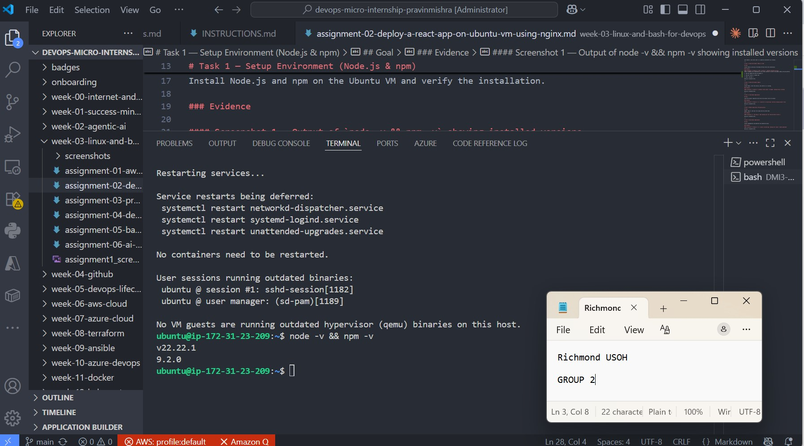
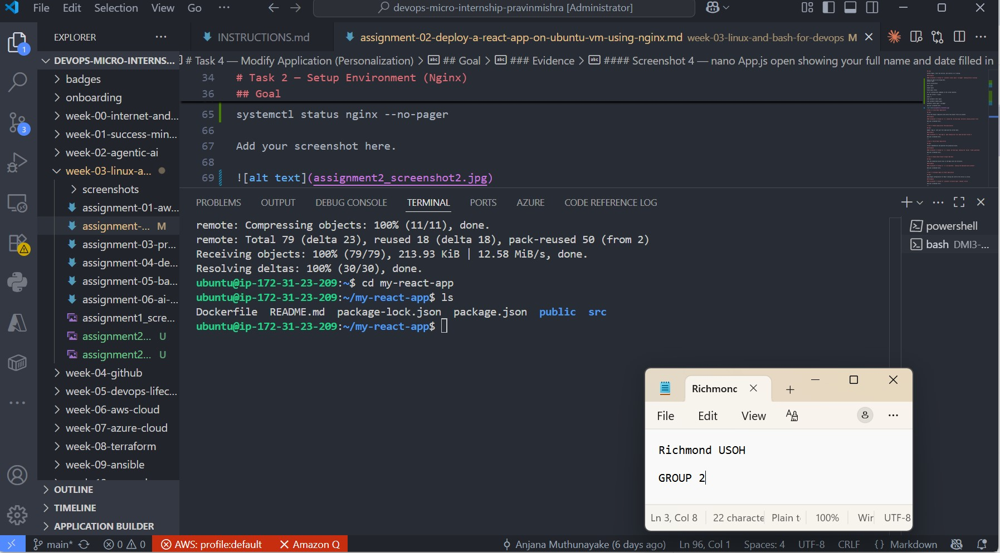
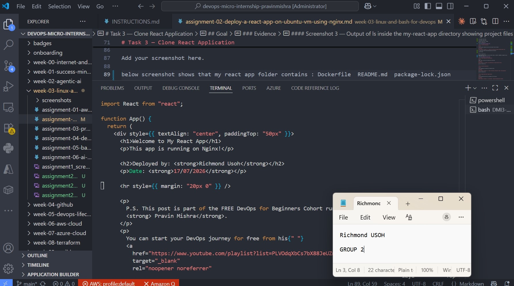
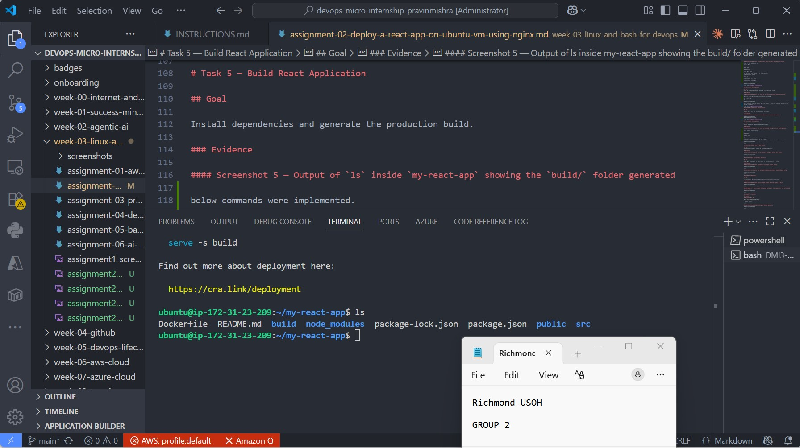
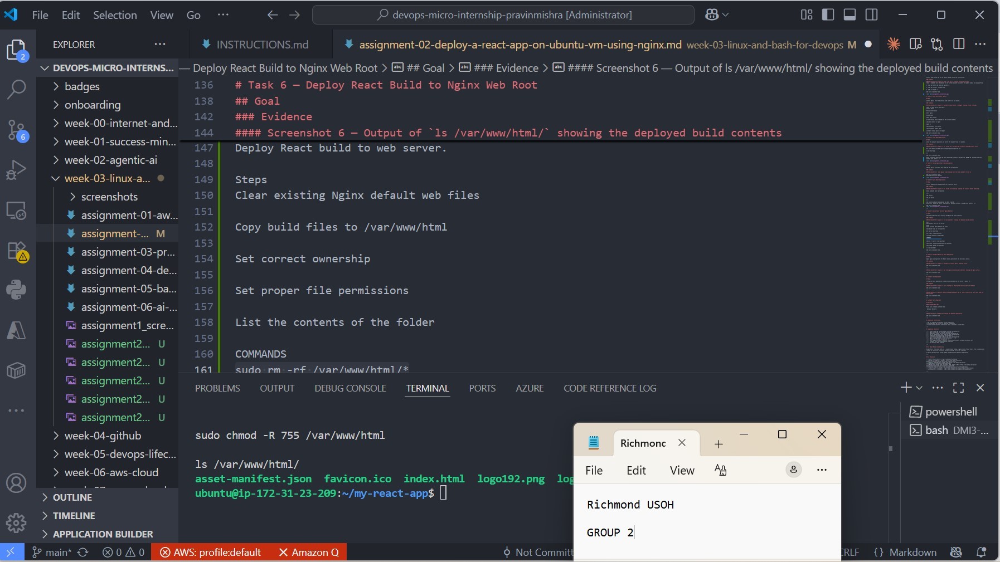
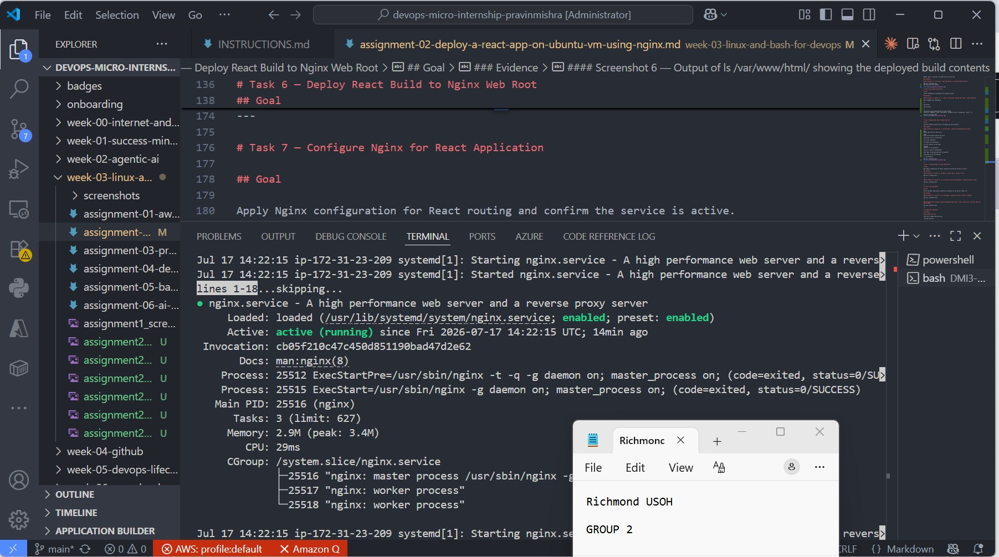
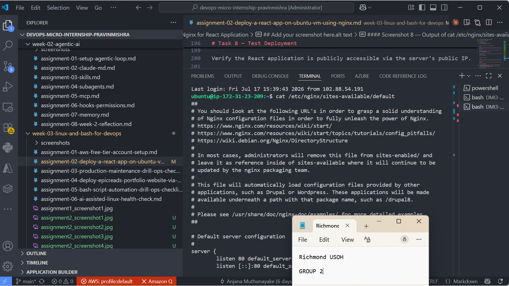
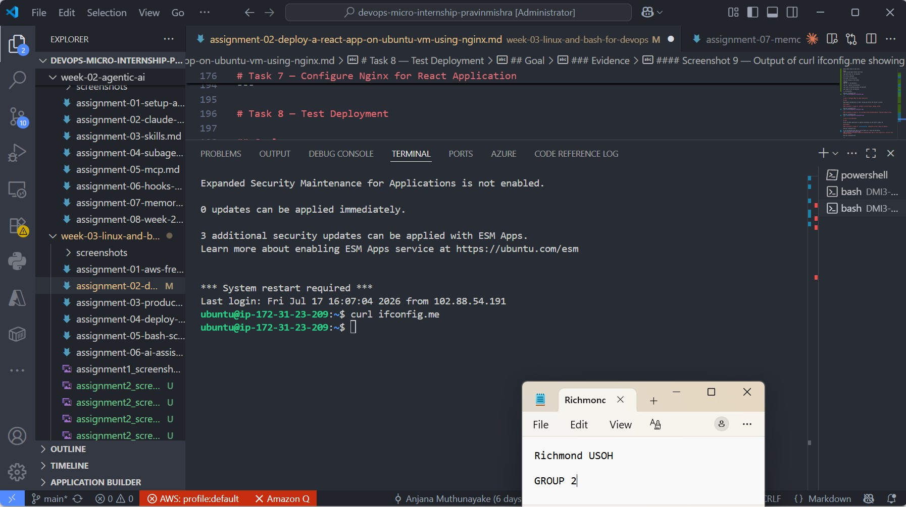
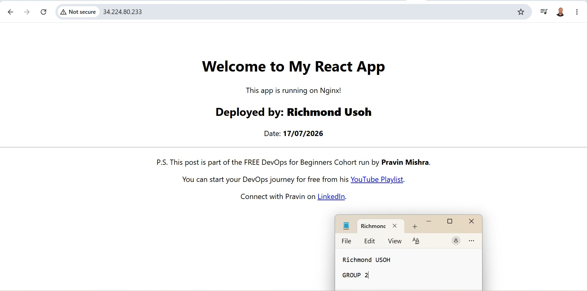
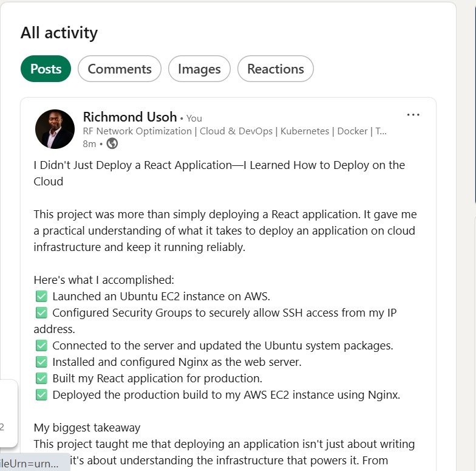

# Assignment 2 — Deploy a React App on Ubuntu VM Using Nginx

Part of the DevOps Micro Internship (DMI) Cohort 3 with Agentic AI

---

## Purpose

In this assignment, you will deploy a React application on an Ubuntu EC2 instance and serve it using Nginx. You will provision a Linux server, install the required tools, personalize the application with your details, and verify that it is publicly accessible via a browser.

---

# Task 1 — Setup Environment (Node.js & npm)

## Goal

Install Node.js and npm on the Ubuntu VM and verify the installation.

### Evidence

#### Screenshot 1 — Output of `node -v && npm -v` showing installed versions
these 3 commands were implemeted on the virtual machine to install and update nodejs and npm platform.

1. sudo apt update && sudo apt upgrade -y

2. sudo apt install -y nodejs npm

3. node -v && npm -v

# Task 2 — Setup Environment (Nginx)

## Goal

Install Nginx, start the service, and confirm it is running.

### Evidence

#### Screenshot 2 — Output of `systemctl status nginx --no-pager` showing Active (running)

these are what we are doing here. 
Install nginx

Verify installation

Start nginx

Enable nginx

Check nginx status 

we are running below commands on the virtual machine,

sudo apt install -y nginx

nginx -v

sudo systemctl start nginx

sudo systemctl enable nginx

systemctl status nginx --no-pager

# Task 3 — Clone React Application

## Goal

Clone the project repository and verify the project files are present.

### Evidence

#### Screenshot 3 — Output of `ls` inside the `my-react-app` directory showing project files

git clone https://github.com/pravinmishraaws/my-react-app.git

cd my-react-app

ls

below screenshot shows that my react app folder contains : Dockerfile  README.md  package-lock.json  package.json  public  src

# Task 4 — Modify Application (Personalization)

## Goal

Update `App.js` with your full name and the current date.

### Evidence

#### Screenshot 4 — `nano App.js` open showing your full name and date filled in

# Task 5 — Build React Application

## Goal

Install dependencies and generate the production build.

### Evidence

#### Screenshot 5 — Output of `ls` inside `my-react-app` showing the `build/` folder generated

below commands were implemented.

cd ..

npm install

npm run build

ls

new directory build mode_modules has been created.
Dockerfile  README.md  build  node_modules  package-lock.json  package.json  public  src

---

# Task 6 — Deploy React Build to Nginx Web Root

## Goal

Copy the production build files to the Nginx web root directory.

### Evidence

#### Screenshot 6 — Output of `ls /var/www/html/` showing the deployed build contents

Goal
Deploy React build to web server.

Steps
Clear existing Nginx default web files

Copy build files to /var/www/html

Set correct ownership

Set proper file permissions

List the contents of the folder

COMMANDS
sudo rm -rf /var/www/html/*

sudo cp -r build/* /var/www/html/

sudo chown -R www-data:www-data /var/www/html

sudo chmod -R 755 /var/www/html

ls /var/www/html/

---

# Task 7 — Configure Nginx for React Application

## Goal

Apply Nginx configuration for React routing and confirm the service is active.

### Evidence

#### Screenshot 7 — Output of `systemctl is-active nginx` showing `active`

---

#### Screenshot 8 — Output of `cat /etc/nginx/sites-available/default` showing the Nginx config

---

# Task 8 — Test Deployment

## Goal

Verify the React application is publicly accessible via the server's public IP.

### Evidence

#### Screenshot 9 — Output of `curl ifconfig.me` showing the server's public IP address

curl ifconfig.me shows my ip ubuntu@ip-172-31-23-209:

as can be observed react app is live on public ip : http://34.224.80.233/

#### Screenshot 10 — Browser showing the deployed React app at `http://<public-ip>` with your name and date visible

http://34.224.80.233/

---

# LinkedIn Post (Required)

## Evidence

#### LinkedIn Post URL

Paste your LinkedIn post URL here:

`https://www.linkedin.com/posts/richmond-usoh-16672531_aws-cloudcomputing-devops-activity-7483943913112715265-l-MD?utm_source=share&utm_medium=member_desktop&rcm=ACoAAAaxKJ4B4307Oy0LMj-MkWnZs1lOOjPvqqY`

https://www.linkedin.com/posts/richmond-usoh-16672531_aws-cloudcomputing-devops-activity-7483943913112715265-l-MD?utm_source=share&utm_medium=member_desktop&rcm=ACoAAAaxKJ4B4307Oy0LMj-MkWnZs1lOOjPvqqY
---

#### Screenshot — LinkedIn post showing the deployed application

# Submission Instructions

- Add all required screenshots in your submission
- Full name must be visible in required screenshots
- Do not expose sensitive information (keys, passwords, account IDs)

---

# Completion Checklist

- [✅] Node.js and npm installed and verified (Screenshot 1)
- [✅] Nginx installed and running (Screenshot 2)
- [✅] Repository cloned and files verified (Screenshot 3)
- [✅] App.js updated with full name and date (Screenshot 4)
- [✅] Production build generated (Screenshot 5)
- [✅] Build files deployed to Nginx web root (Screenshot 6)
- [✅] Nginx configured and active (Screenshots 7 & 8)
- [✅] Public IP retrieved (Screenshot 9)
- [✅] React app accessible in browser with personal details visible (Screenshot 10)
- [✅] LinkedIn post published and URL submitted
- [✅] No sensitive data exposed

---

## 📌 About DMI & CloudAdvisory

DevOps Micro Internship (DMI) is a project-based DevOps program run by Pravin Mishra (The CloudAdvisory) focused on real-world execution, systems thinking, and career readiness.

It helps learners build strong DevOps foundations with hands-on experience.

---

## 📌 Resources

- 🌐 DMI Official Website: https://pravinmishra.com/dmi  
- 🎓 DevOps for Beginners (Udemy): https://www.udemy.com/course/devops-for-beginners-docker-k8s-cloud-cicd-4-projects/  
- 🎓 Agentic AI DevOps with Claude Code: https://www.udemy.com/course/ultimate-agentic-ai-devops-with-claude-code/  
- 🎓 DevOps with Claude Code: Terraform, EKS, ArgoCD & Helm: https://www.udemy.com/course/devops-with-claude-code-terraform-eks-argocd-helm/  
- ▶️ YouTube Playlist: https://www.youtube.com/playlist?list=PLFeSNDtI4Cho  
- 🔗 Pravin Mishra (LinkedIn): https://www.linkedin.com/in/pravin-mishra-aws-trainer/  
- 🏢 CloudAdvisory (LinkedIn): https://www.linkedin.com/company/thecloudadvisory/

---

*This submission is part of DevOps Micro Internship (DMI) Cohort 3 — Agentic AI Track.*