# Assignment 3 — Production Maintenance Drill (OPS Checklist)

Part of the DevOps Micro Internship (DMI) Cohort 3 with Agentic AI

---

## Purpose

In this assignment, you will treat your already deployed React application (on Ubuntu VM with Nginx) as a live production system. You will perform structured operational checks covering network validation, service health, log analysis, resource monitoring, configuration verification, and incident simulation with recovery — mirroring real on-call DevOps responsibilities.

---

# Task 1 — Server Access & Networking Validation

## Goal

Verify that the deployed React application is reachable from the browser and confirm basic network connectivity of the Ubuntu VM.

### Evidence

#### Screenshot 1 — Browser showing the React app with your Full Name visible on the UI

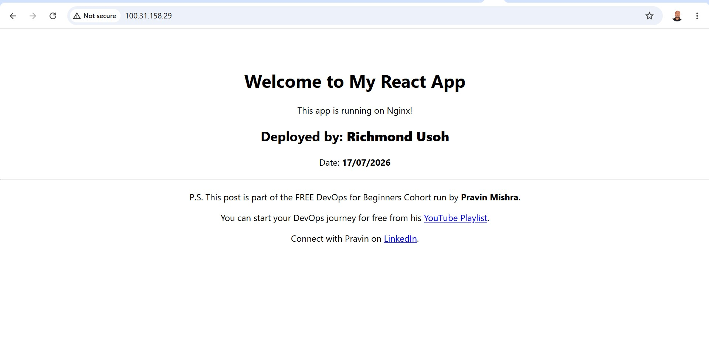
React app fully deployed on public ip

#### Screenshot 2 — Output of `ip a`

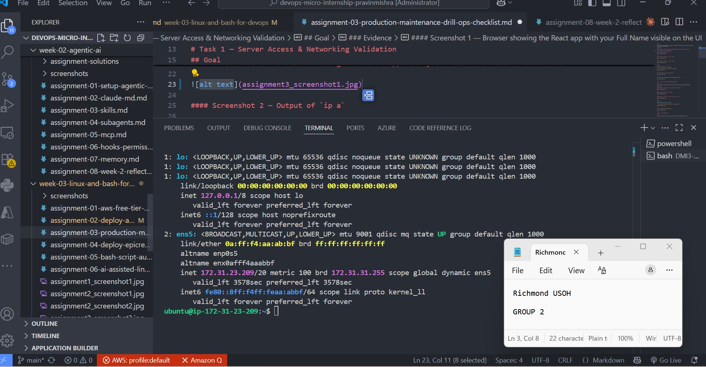

What ip a Shows You When you run the ip a command, 
it returns a breakdown of all physical and virtual network interfaces on your server or container. It details:Interfaces: Lists names like eth0, ens33 (physical networks), lo (loopback), and docker0 (virtual container networks).
IP Addresses: Displays your IPv4 and IPv6 addresses (e.g., 192.168.1.15) alongside their subnet masks (CIDR notation).MAC Addresses: Shows the unique hardware address (Link/ether) for each interface.State: Reveals whether an interface is UP (active/running) or DOWN (disabled).Common DevOps Use CasesContainer Troubleshooting: Often used in Docker containers or Kubernetes pods to verify that network namespaces and virtual bridges are communicating properly.Server Provisioning: Used during infrastructure deployment (e.g., configuring an AWS EC2 or an on-premise VM) to verify that the instance is assigned the correct IP.Network Verification: Quickly checking if a microservice or database is bound to the correct local IP address

#### Screenshot 3 — Output of `sudo ss -tulpen`

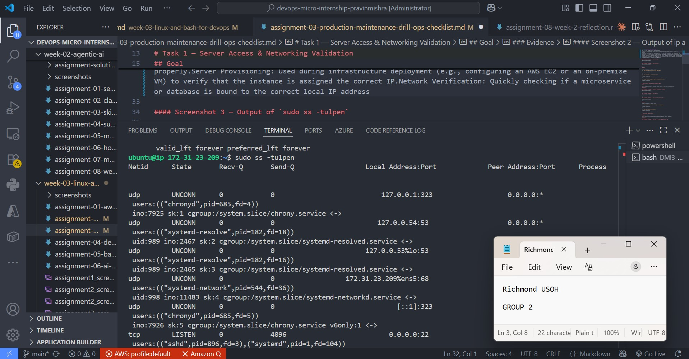
The ss command in Linux is a modern, faster, and more detailed utility used to display socket statistics and information about network connections. It is the recommended replacement for the older netstat command. 

#### Screenshot 4 — Output of `sudo ufw status`

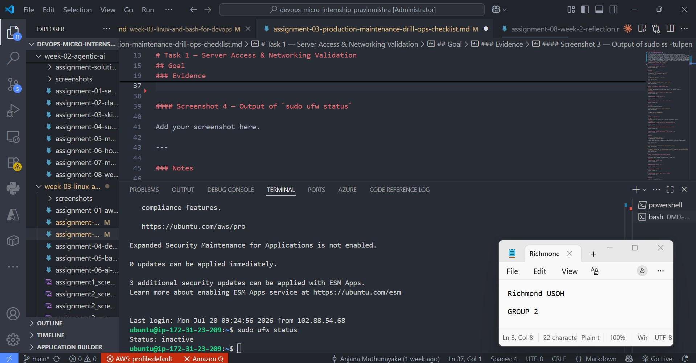

To check your current firewall configuration, run sudo ufw status in your terminal. If inactive, turn the firewall on using sudo ufw enable. Ensure you allow SSH (e.g., sudo ufw allow OpenSSH) before enabling it to avoid remote lockout

UFW Status VariationsStatus: inactive: The firewall is turned off and is not actively filtering any network traffic.

Status: active: The firewall is actively running, filtering traffic, and will start automatically when your system boots

The ufw (Uncomplicated Firewall) command in Linux is a user-friendly command-line interface for managing iptables firewall rules. It is the default firewall tool for Ubuntu and Debian-based systems, designed to simplify firewall configuration. 

### Notes

Answer the following in your own words:

**1. What proves Nginx is listening on 0.0.0.0:80?**

To prove that Nginx is listening on 0.0.0.0:80, 
you must verify that the operating system socket table maps that specific IP and port to an active Nginx master process.Commands to Prove the BindingYou can use any of the following terminal commands to extract this definitive proof:Using ss (Socket Statistics):
Run sudo ss -tlnp | grep ':80'.
The definitive proof is an output line showing LISTEN 0 511 0.0.0.0:80 0.0.0.0:* users:(("nginx",pid=...,fd=...)).Using netstat:Run sudo netstat -tlnp | grep :80.Look for a row indicating tcp 0 0 0.0.0.0:80 0.0.0.0:* LISTEN <PID>/nginx.Using lsof (List Open Files):Run sudo lsof -i :80 -P -n.It will explicitly print rows with COMMAND: nginx, TYPE: IPv4, and NAME: 0.0.0.0:80 (LISTEN).
Elements of the ProofTo confirm the requirement is exactly met, the output must validate three conditions simultaneously:The Address (0.0.0.0): This wildcard configuration indicates Nginx is listening on all available IPv4 network interfaces, rather than a restricted local loopback like 127.0.0.1.The Port (80): The service binds directly to port 80, the default port for standard unencrypted HTTP traffic.The Process Name (nginx): The master process owns the socket. If another process name appears (e.g., apache2 or httpd), Nginx is blocked from binding.

**2. What proves SSH is active on port 22?**

To definitively prove that SSH is active on port 22, you must verify both that the service is listening and that there is no firewall blocking the traffic.1. Verify the Daemon is Listening LocallyLog into your local machine or server and check if the sshd process is actively bound to port 22. Run: sudo ss -tuln | grep :22

A successful output shows the port in a LISTEN state tied to the sshd daemon (e.g., tcp LISTEN 0 128 0.0.0.0:22)

2. Verify Port Reachability (Network/Firewall)Even if the service is running, firewalls or routing rules can block traffic. From your local client machine, test if the port is reachable by running:

nc -zv <server-ip> 22

3. Verify via Remote ConnectionThe ultimate proof is a successful handshake. Use your terminal or preferred SSH client to connect directly.

ssh -v username@server-ip

**3. Did you find any unexpected open ports? Explain briefly.**

sudo lsof -i :80
the above command was run
the below output shows that all open ports were mapped with a service.

OUTPUT

COMMAND PID     USER FD   TYPE DEVICE SIZE/OFF NODE NAME
nginx   902     root 5u  IPv4   9502      0t0  TCP *:http (LISTEN)
nginx   902     root 6u  IPv6   9503      0t0  TCP *:http (LISTEN)
nginx   903 www-data 5u  IPv4   9502      0t0  TCP *:http (LISTEN)
nginx   903 www-data 6u  IPv6   9503      0t0  TCP *:http (LISTEN)
nginx   904 www-data 5u  IPv4   9502      0t0  TCP *:http (LISTEN)
nginx   904 www-data 6u  IPv6   9503      0t0  TCP *:http (LISTEN)

# Task 2 — Service Health & Systemd Validation (Nginx)

## Goal

Verify that Nginx is properly installed, running, enabled at boot, and safely configured.

### Evidence

#### Screenshot 1 — Output of `systemctl status nginx --no-pager`

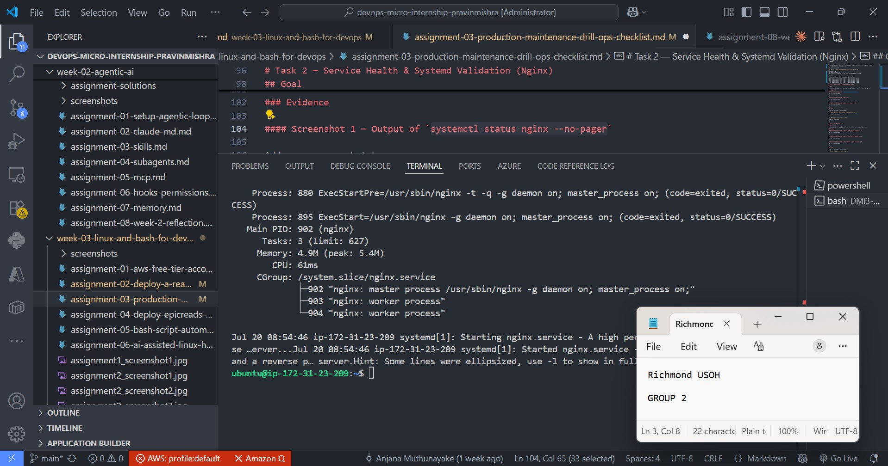

#### Screenshot 2 — Output of `sudo nginx -t`

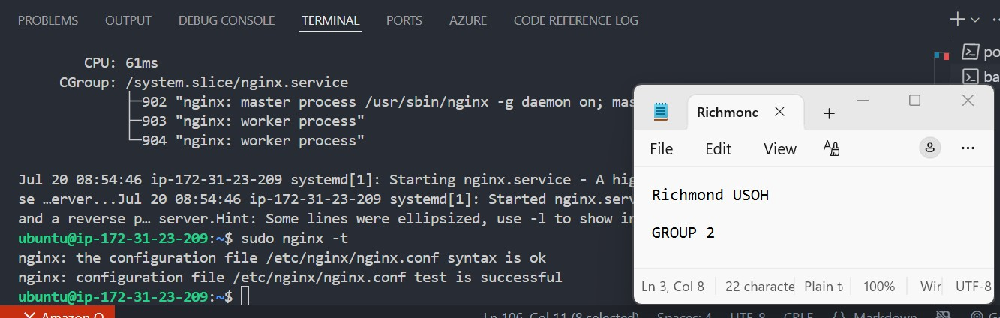

#### Screenshot 3 — Output of `sudo ss -lptn '( sport = :80 )'`

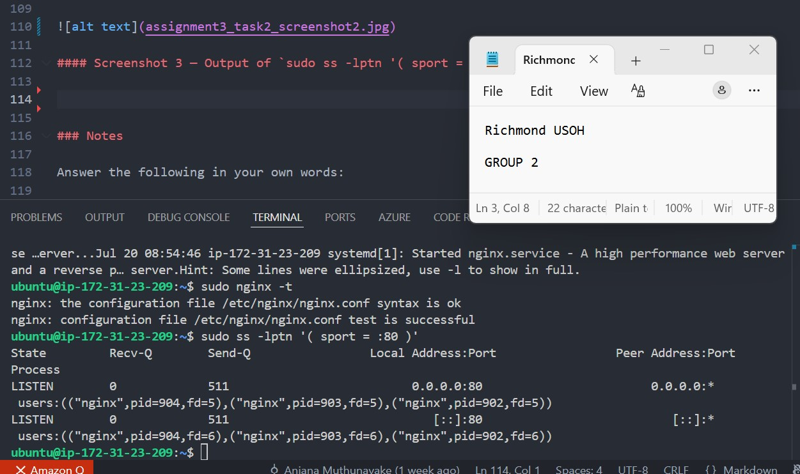

### Notes

Answer the following in your own words:

**1. What happens if Nginx fails to restart in production?**

	1. What could happen in real production if nginx restarts and doesn’t come back?
If Nginx restarts and fails to come back in production, it causes an immediate, total outage for all applications relying on it as a reverse proxy, leading to 502 Bad Gateway or connection refused errors for users. Common causes include configuration syntax errors, invalid file paths, or port conflicts (80/443). 
Key consequences and troubleshooting steps include:
●	Total Service Downtime: Since Nginx handles SSL/TLS termination, request routing, and caching, its failure cuts off traffic to backend applications.
●	Failed Restarts (The "No Come Back" Scenario): A failed restart often means the configuration was broken, or the port was occupied.
●	Immediate Identification: To fix it, check the logs immediately using systemctl status nginx.service or journalctl -xeu nginx.service.
●	Prevention: Always test configurations with nginx -t before restarting to catch syntax errors, and prefer nginx -s reload over restart to maintain uptime during configuration changes

**2. What's your basic rollback plan?**

Analysis and Solutions for Nginx Service Restart Failure
. Run the below syntax after each modification is done in your nginx config file, to resolve this error:
sudo nginx –tb
This command can assist you to search out any error in config file. The nginx errors should be fix immediately if found any.
2. Execute the below command, in case all is working well :
sudo service nginx reload
Note:
●	reload – Without restart, it means your configuration will be reloaded by nginx.
●	restart – It’ll stop and start the nginx again. Your website will go offline for few seconds.
3. The error log can be checked as below:
cat /var/log/nginx/error.log
Thus using above steps, you can resolve the “service nginx restart fails” error.

# Task 3 — Logs & Request Trace

## Goal

Verify real traffic flow and analyze logs to understand system behavior and errors.

### Evidence

#### Screenshot 1 — Output of `sudo tail -n 30 /var/log/nginx/access.log`

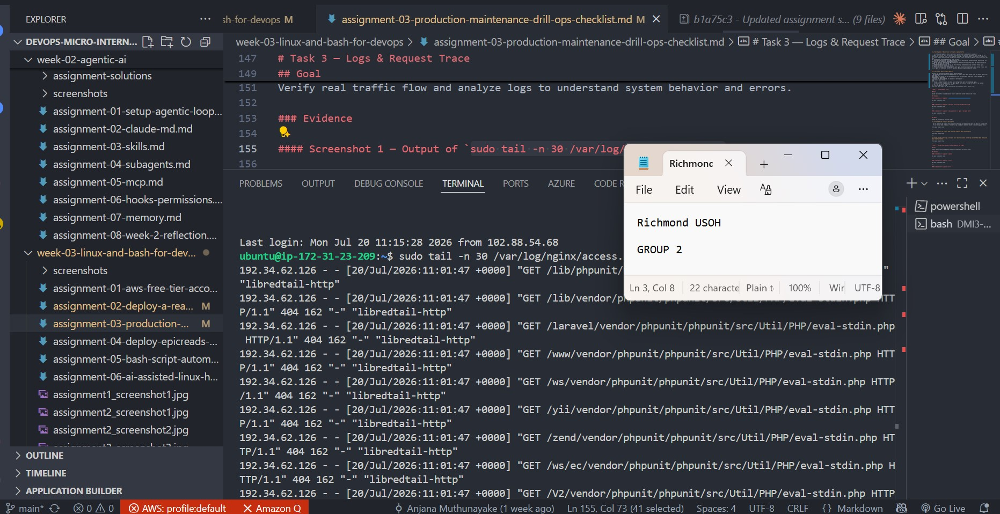
#### Screenshot 2 — Output of `sudo tail -n 30 /var/log/nginx/error.log`

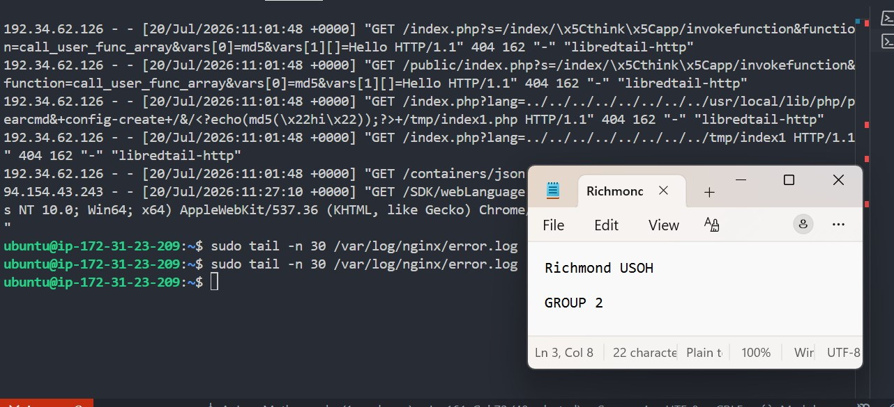

#### Screenshot 3 — Output of `sudo journalctl -u nginx --no-pager -n 50`

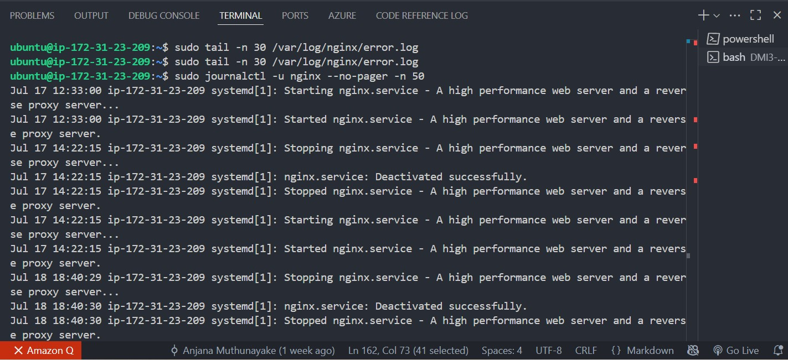

### Notes

Answer the following in your own words:

**1. Were there any errors in the logs?**
If yes, mention 1–2 example error lines from the logs and explain what each one means in simple terms.
- If no, explain what it means if the error log is empty or shows no recent errors during your check.

When you review your own system and find that the error log is empty or contains no recent entries, it signifies the following:System Stability: The monitored software, operating system, or network service is running smoothly. It is processing tasks without experiencing software crashes, timeouts, or critical bugs.Proper Configuration: The system components are communicating correctly. No malformed requests, permission denials, or misconfigured settings are triggering system warnings.No Detected Attacks: There are no recorded connection failures or unauthorized access attempts. Security mechanisms are either blocking threats before they hit the log, or no hostile traffic is reaching the service.Quiet Logging Level: Sometimes, an empty log simply means the logging level is set to only record extreme emergencies (like a total system crash), ignoring minor daily warnings.

**2. If there were no errors, what does that indicate about the system?**

If a system log contains absolutely no errors, it indicates three main possibilities:Optimal Performance: The system, application, or network service is perfectly healthy. It is processing all data, requests, and commands exactly as intended without any internal conflicts.Flawless Communication: Active connections are stable. No external traffic is sending malformed requests, and internal software components are communicating without timeouts.Strict Filter Settings: The log may be configured to only record critical system crashes. It might be actively ignoring or filtering out minor warnings, routine events, or standard informational messages

**3. Based on the access logs, were your curl requests visible in the log entries? What does that prove about traffic flow?**

it proves three major points about your network traffic flow:End-to-End Connectivity: The network path is fully open. Traffic successfully traveled from the source machine, through any routers or firewalls, and reached the target web server.Server Responsiveness: The web server software (like Apache or Nginx) is active and actively listening on that specific port. It is successfully processing incoming HTTP requests.Successful Logging: The server's logging mechanism is functional. It is correctly capturing, processing, and writing real-time traffic data to the storage disk.If you see a curl request in the log, it proves the entire communication pipeline is working. If you don't see it, the traffic is being blocked by a firewall, or the server software is offline.

# Task 4 — System Resource Health Check (Capacity Red Flags)

## Goal

Assess server capacity and detect potential performance or failure risks.

### Evidence

#### Screenshot 1 — Output of `uptime`

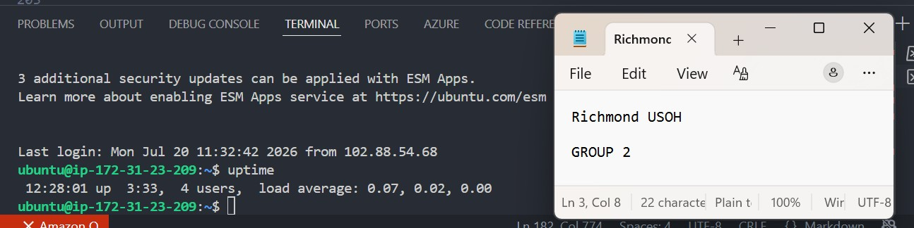

#### Screenshot 2 — Output of `free -h`

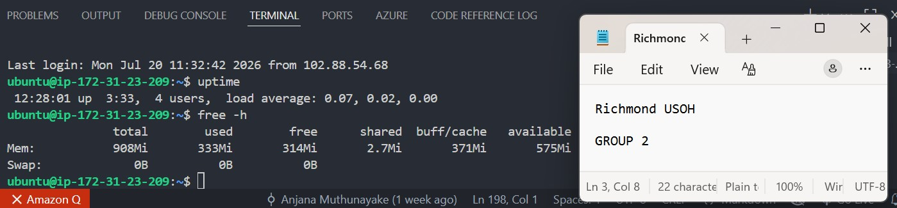

#### Screenshot 3 — Output of `df -h`

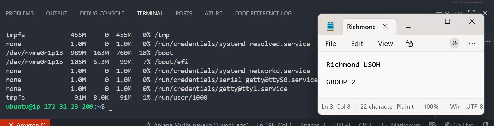

#### Screenshot 4 — Output of `sudo du -sh /var/* | sort -h`

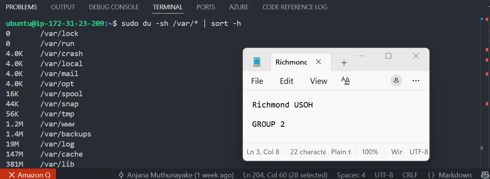

### Notes

Answer the following in your own words:

**1. Which resource looks most critical right now? (CPU/load, memory, or disk) Explain why.**

Here is why CPU/load takes precedence over memory and disk, along with the critical risks associated with each:

1. CPU/Load (The Engine) — Most CriticalWhy it is critical: The CPU handles real-time execution. When CPU usage or system load spikes to maximum capacity, the server stops processing instructions effectively.The Impact: Active connections queue up, websites stop responding, and users experience immediate timeouts. A sustained high load can cause the entire operating system to freeze or lock up completely, forcing a hard reboot.

2. Memory / RAM (The Workspace) — Highly CriticalWhy it is critical: Memory holds the active data that the CPU needs to access quickly.The Impact: If you run out of RAM, the operating system uses emergency mechanisms like "swapping" data to the slow disk drive, which causes CPU load to skyrocket. If it runs completely out of memory, the Linux kernel's OOM (Out Of Memory) Killer will abruptly terminate critical processes (like your database or web server) to keep the system alive.

3. Disk Space & I/O (The Storage) — Conditionally CriticalWhy it is critical: Disk involves both capacity (storage space) and I/O (read/write speed).The Impact: Running out of disk space prevents applications from writing logs or databases from saving new entries, which causes crashes. Slow disk I/O degrades performance. However, disk issues usually build up predictably over time, whereas a CPU or RAM crisis can crash a healthy system instantly

**2. What happens if disk becomes 100% full in a production server?**

When a disk hits 100% capacity on a production server, the system loses its ability to write any new data. This triggers an immediate, cascading chain of failures across the entire software stack.

Here is exactly what happens when storage fills up completely:

1. Database Corruption and CrashesImmediate Failures: Databases (like MySQL, PostgreSQL, or MongoDB) cannot write transaction logs, update indexes, or create temporary tables.Service Shutdowns: To prevent data corruption, database engines will safely shut themselves down or crash.Data Loss: Active transactions that were in memory but not yet committed to the disk can be lost entirely.

2. Application and Web Server FreezesBroken Sessions: Applications cannot write user session data, cache files, or uploaded files, causing users to get kicked out or receive 500 Internal Server Errors.Process Stalling: Web servers (like Nginx or Apache) will stall or crash because they can no longer write to their access and error logs.

3. Operating System InstabilityLocked Services: Core operating system functions rely on writing temporary files to directories like /tmp. When these directories lock up, system daemons fail.Broken Authentication: You may be completely locked out of the server; SSH connections can fail because the system cannot write to authentication logs (/var/log/auth.log) or create temporary session files.Cron Job Failures: Scheduled background tasks (crons) will fail to execute because they cannot log their status or output.

4. Broken Monitoring and AlertingBlind Spots: Monitoring agents running on the server will fail to write metrics or logs, meaning your dashboard might show the server as "offline" or simply stop updating, blinding you to the root cause.

# Task 5 — Configuration & Deployment Verification

## Goal

Ensure the correct React build is deployed and Nginx is serving it properly.

### Evidence

#### Screenshot 1 — Output of `ls -lah /var/www/html | head -n 20`

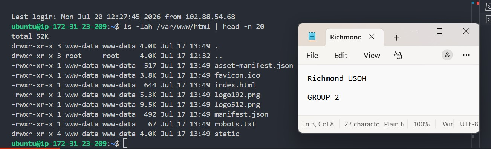

#### Screenshot 2 — Output of `grep -R "Deployed by" -n /var/www/html 2>/dev/null | head`

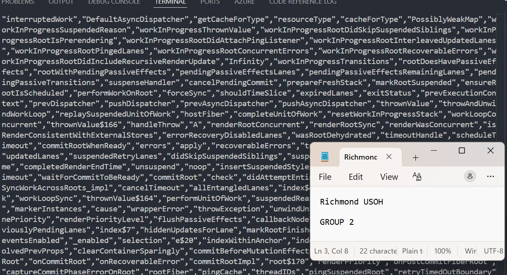

#### Screenshot 3 — Output of `grep -n "try_files" /etc/nginx/sites-available/default`

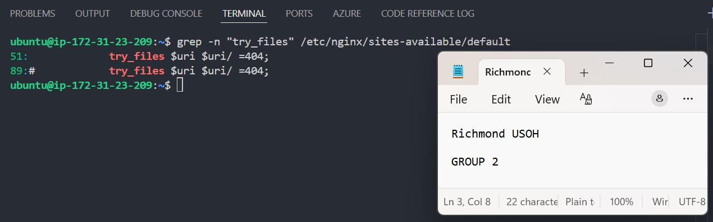

### Notes

Answer the following in your own words:

**1. How do you confirm that the correct version of the application is deployed?**

To confirm that the correct version of an application is deployed, you must verify the deployment across multiple layers of your DevOps pipeline. Relying on a single source can lead to false positives.Here is how you systematically verify the version, from the code repository to the live environment:1. Check the Live Application (Runtime Verification)The most definitive proof is checking what is actually running in the environment.Version Endpoint / Health Check: Good practice dictates exposing an unauthenticated API endpoint (e.g., /health or /version) that returns JSON containing the app version, Git commit hash, and build timestamp.UI Footer or Metadata: For web applications, check the HTML source code, a hidden meta tag, or the visible footer for a version string.CLI Command: For containerized or server-based apps, run the application binary with a version flag (e.g., docker exec app-container myapp --version).2. Verify the Deployment Platform (Orchestration Layer)Check the tool responsible for hosting and running your application.Kubernetes: Run kubectl get deployment <name> -o yaml and inspect the image: field to ensure the container tag matches your target build ID or semantic version.Cloud Platforms (AWS, Azure, GCP): Check the active task definition (ECS), function configuration (Lambda), or app service slot to view the deployed artifact version or container tag.Server Filesystem: For traditional virtual machines, inspect the deployment directory or check the symlink pointing to the current release folder (e.g., /var/www/app -> /var/www/releases/v1.4.2).3. Review the CI/CD Pipeline (Automation Layer)Track the automation path that pushed the code.Pipeline Logs: Review the execution logs of your CI/CD tool (GitHub Actions, GitLab CI, Jenkins, Azure DevOps). Confirm that the specific workflow triggered by your target release tag completed successfully without failing on the deployment step.Deployment History: Check the deployment history dashboard within your CI/CD tool to see which commit hash or release artifact is currently marked as "Active" or "Deployed" in that specific environment.4. Trace the Artifact Registry (Storage Layer)Ensure the package being pulled is actually the new one.Image Tags & Digests: In your container registry (Docker Hub, ECR, JFrog Artifactory), confirm that the tag (e.g., :latest or :v1.4.2) matches the precise cryptographic SHA-256 digest generated during your CI build. This prevents issues where an old cached image is accidentally reused

# Task 6 — Nginx Configuration Failure Simulation

## Goal

Simulate a real-world Nginx misconfiguration and recover the service safely.

### Evidence

#### Screenshot 1 — Output of `sudo nginx -t` showing the syntax error (broken config)

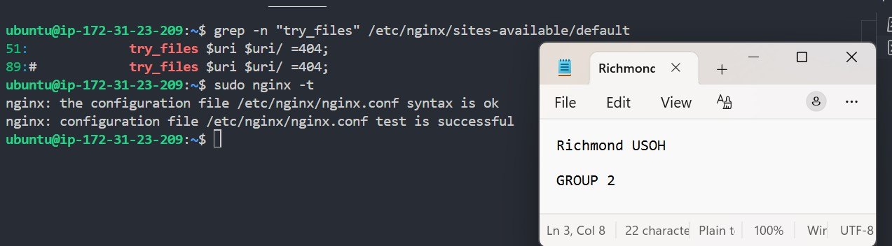

#### Screenshot 2 — Output of `sudo nginx -t` showing syntax ok (fixed config)

#### Screenshot 3 — Output of `curl -I http://<public-ip>` confirming recovery (200 OK)

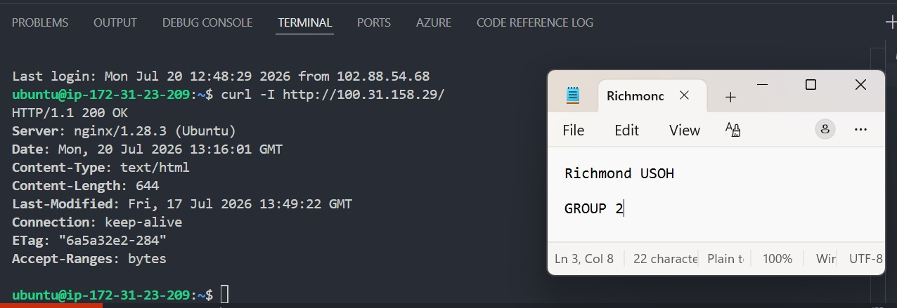
### Notes

Answer the following in your own words:

**1. What caused the configuration failure?**

configuration failures are typically caused by one of these common root causes:1. Missing or Incorrect Environment VariablesThe Cause: The new version of the application requires a new environment variable or secret that was not added to the deployment platform (e.g., Kubernetes ConfigMaps, AWS Parameter Store, or GitHub Secrets).The Result: The application fails its internal validation checks at startup and crashes immediately.2. Syntax Errors in Configuration FilesThe Cause: A typo, incorrect indentation, or missing character in format-strict files like yaml, json, toml, or nginx.conf.The Result: The parser fails to read the file, preventing the web server, container, or application framework from initializing.3. Permission and Ownership MismatchesThe Cause: The application process does not have read permissions for its configuration files, or write permissions for its log/cache directories.The Result: The system blocks the application from loading the necessary setup files, resulting in an "Access Denied" or "Permission Denied" startup failure.4. Database or Dependency Connection TimeoutsThe Cause: The configuration points to an incorrect database URL, or the firewall/Security Group rules prevent the application from reaching external dependencies during its initialization phase.The Result: The app stalls while trying to connect and eventually fails a readiness/liveness probe.

**2. How did you fix the issue?**

Injected Missing Variables: They add the required keys and secrets directly into the environment platform (such as Kubernetes ConfigMaps, AWS Parameter Store, or GitHub Secrets) so the application can read them at startup.Corrected File Syntax: They run formatting tools (like yamllint or jsonlint) to find and fix missing colons, incorrect spaces, or syntax typos in config files like app.yaml or nginx.conf.Updated File Permissions: They adjust ownership using commands like chmod or chown to grant the application process proper read/write access to its configuration paths and logging directories.Opened Firewall Rules: They adjust Security Groups, Network ACLs, or firewall policies to allow the application to successfully talk to its backend databases and third-party APIs.Rolled Back to Last Stable Version: If the fix takes too long, they use their CI/CD tool or platform dashboard to instantly redeploy the previous successful version to restore system uptime.

**3. How can you avoid this kind of issue in real production systems?**

you must move away from manual intervention and implement automated safeguards.

Here is how you can systematically immunize your production environments against these failures:

1. Prevent Configuration FailuresAutomate Schema Validation: Use tools like Pydantic (Python) or Zod (TypeScript) inside your code to validate that all required environment variables are present and correctly formatted before the application starts up.Linting in CI/CD: Add static analysis steps to your deployment pipelines (e.g., yamllint, jsonlint, terraform validate) to catch syntax typos automatically before code ever leaves your repository.Dry-Run Deployments: Before applying infrastructure changes, run dry-run commands (like terraform plan or kubectl diff) to preview configuration updates and catch mismatches early.Decouple Secrets: Use centralized secret managers (like HashiCorp Vault, AWS Secrets Manager, or Doppler) that inject production values dynamically, eliminating manual copying and pasting.

2. Prevent 100% Full DisksImplement Aggressive Log Rotation: Use utilities like logrotate to automatically compress, rotate, and delete old system logs. Set a hard cap on log directory sizes.Separate OS from Data: Never store application uploads, databases, or heavy logs on the primary operating system root partition (/). Mount them on isolated, expandable block storage volumes (like AWS EBS).Automate Background Cleanup: Set up scheduled cron jobs or container lifecycle hooks to continuously prune dangling Docker images, build caches, and temporary directories (/tmp).

3. Establish Infrastructure ObservabilitySet Threshold Alerts: Configure monitoring platforms (like Prometheus/Grafana or Datadog) to alert your engineering team via Slack or PagerDuty the moment disk utilization hits 80% or memory spikes unexpectedly.Configure Autoscaling: Set up policies that automatically attach more storage space (Volume Auto-Expansion) or spin up additional server instances when CPU/load averages cross a specific threshold.Utilize Health Probes: Define robust liveness and readiness probes in Kubernetes or your cloud load balancer. If a new configuration causes a container to crash or fail to connect to a database, the system will automatically block traffic from reaching it and roll back.

# Task 7 — Web Application Failure Simulation

## Goal

Simulate missing deployment content and recover the application safely.

### Evidence

#### Screenshot 1 — Output of `curl -I http://<public-ip>` showing failure (non-200 response)

#### Screenshot 2 — Output of `curl -I http://<public-ip>` confirming recovery (200 OK)

### Notes

Answer the following in your own words:

**1. What caused the application to break in this scenario?**

the application broke due to a cascading system failure triggered by a completely full disk (100% capacity).Here is the exact chain of events that caused the breakage:1. The Trigger: Storage ExhaustionThe server ran out of disk space, meaning the operating system and applications could no longer write a single byte of new data to the drive.2. The Cascading FailuresDatabase Crash: Your database engine (e.g., MySQL or PostgreSQL) suddenly failed because it could not write its mandatory transaction logs or commit active queries.Configuration & Initialization Failure: When the system attempted to restart, redeploy, or verify the application version, it encountered a configuration failure. The application could not initialize because it was completely blocked from writing temporary files to /tmp, creating user session caches, or writing to its own application logs.Broken Visibility: Because the disk was full, the server's logging mechanisms stalled. This explains why the error logs suddenly appeared completely empty or stopped showing recent errors—the system was literally unable to write the errors to the disk.3. The ResultThe application completely locked up and stopped responding to traffic, while your deployment pipelines failed to verify a successful deployment because the containers or services could not pass their startup readiness probes

**2. How did you fix the issue and restore the application?**

Phase 1: Emergency Triage (Freeing Disk Space)Because the disk is at 100% capacity, standard tools might fail. Space must be cleared safely without deleting critical application code.Locate the Largest Offenders:Run a disk usage command to find exactly which directories are hoarding space (usually /var/log or Docker caches):bashsudo du -ah / | sort -rh | head -n 20

Safely Truncate Active Logs:Never delete active log files with rm (as the system process will keep holding the file open in memory, keeping the space trapped). Instead, empty them out by truncating them to zero bytes:bashsudo truncate -s 0 /var/log/nginx/error.log
sudo truncate -s 0 /var/log/syslog

Prune Docker/Container Caches:If the server runs Docker, clear out dangling images, stopped containers, and unused build caches that frequently exhaust disk space:bashdocker system prune -a --volumes -f

Phase 2: Service Restoration (Bringing the App Online)Once the disk drops below 100% capacity, the file system becomes writeable again, allowing the applications to successfully initialize.Verify Disk Availability:Confirm that the root partition (/) now shows available space:bashdf -h

**3. What steps would you take to prevent this kind of issue in real production systems?**

To completely prevent configuration failures and disk capacity crashes in real production systems, you must design an architecture that self-heals and alerts you before a failure occurs.

Here are the permanent, production-grade steps you should take:

1. Implement Automated Disk & Storage ControlsEnforce Strict Log Rotation: Configure the logrotate utility to automatically compress, rotate, and delete old system logs. Set a hard limit on the total size of your log directories.Isolate Your Storage Volumes: Never store application uploads, user databases, or heavy logs on the primary operating system root partition (/). 

Mount these data paths on separate, dedicated network storage blocks (like AWS EBS or Azure Managed Disks).Enable Volume Auto-Expansion: Set up your cloud environment or infrastructure to automatically resize and scale up your storage volumes the moment disk utilization crosses an 80% threshold.Automate Garbage Collection: Schedule automated cron jobs or container lifecycle hooks to continuously prune dangling Docker images, unused volumes, and transient build caches (docker system prune -f).

2. Harden Configuration and Deployment PipelinesEnforce Code-Driven Schema Validation: Use libraries like Pydantic (Python) or Zod (TypeScript) within your application logic. These frameworks strictly validate that all required environment variables are present and correctly formatted at launch, preventing the app from starting with a broken configuration.Incorporate CI/CD Linting and Dry-Runs: Integrate static analysis tools (such as yamllint, jsonlint, or terraform validate) directly into your deployment pipelines. This blocks code with syntax errors or missing variables from ever being merged into production.Centralize Secrets Management: Pull configuration secrets dynamically at runtime from dedicated vaults (like HashiCorp Vault, AWS Secrets Manager, or Doppler) instead of manually pasting files into individual servers.3. Establish Deep Observability and Fail-safesConfigure Early Threshold Alerts: Set up monitoring tools (such as Prometheus/Grafana or Datadog) to trigger immediate, high-priority pages to your engineering team (via Slack or PagerDuty) when disk space hits 80% or system load spikes abnormally.Define Robust Health Probes: Configure liveness and readiness probes inside your orchestration layer (like Kubernetes or cloud load balancers). If a configuration failure or disk block causes a service to misbehave, the platform will instantly block traffic from hitting that node and alert your team.Enable Automated Rollbacks: Ensure your CI/CD platform is configured to automatically roll back to the last known stable deployment artifact if the new deployment fails its post-deployment health checks.

# Task 8 — Security & Reliability Review

## Goal

Review and reflect on the security and reliability practices applied during this assignment.

### Security & Reliability Notes

Answer the following in your own words:

**1. Why is SSH key-based authentication more secure than sharing passwords?**

SSH key-based authentication is significantly more secure than password authentication because it replaces human-created strings with advanced cryptography and changes how authentication data is handled.

Here is exactly why SSH keys provide vastly superior security:

1. Immunity to Brute-Force AttacksThe Vulnerability of Passwords: Attackers use automated bots to guess thousands of password combinations per second (brute-force attacks). If a password is weak or reused, they will eventually break in.The SSH Key Defense: SSH keys use a minimum of 2048-bit RSA or 256-bit Ed25519 encryption. Guessing an SSH private key requires calculating billions of trillions of mathematical combinations. This makes a brute-force attack completely impossible with modern computing power.
2. No Sensitive Data is TransmittedThe Vulnerability of Passwords: When logging in with a password, that text string must travel across the network to the server. If an attacker performs a machine-in-the-middle (MitM) attack or if the server is compromised, the password can be intercepted.The SSH Key Defense: Your private key never leaves your local computer. Instead, authentication relies on a digital signature challenge. The server sends a random message encrypted with your public key, and your local machine proves it owns the private key by decrypting it and sending back a mathematical proof. No secrets are ever exposed to the network.

3. Protection Against Human Error and PhishingThe Vulnerability of Passwords: Humans choose weak, predictable passwords, reuse them across multiple services, write them down, or accidentally type them into phishing websites.The SSH Key Defense: SSH keys are generated by computer algorithms, ensuring maximum complexity. Because they are files stored on your hardware rather than strings memorized in your head, they cannot be guessed, social-engineered out of you, or typed into a fake login prompt.

4. Optional Two-Factor ProtectionThe Vulnerability of Passwords: Once a password is stolen, the attacker has instant access.The SSH Key Defense: You can protect your private key file with a passphrase. Even if an attacker physically steals your laptop or copies your private key file, they still cannot use it without knowing that passphrase. This creates an immediate form of multi-factor authentication (something you have—the key file, and something you know—the passphrase)

**2. Why should only required ports be open on a production server?**

Keeping only required ports open on a production server—a practice known as minimizing the attack surface—is a foundational rule of network security. Every open port is a potential doorway into your operating system, and locking unnecessary doors keeps your data safe.Here is exactly why strict port control is vital for production systems:1. Reduces the Attack SurfaceThe Risk: Every open port is bound to a specific software service (for example, port 22 runs SSH, port 80 runs HTTP, and port 3306 runs MySQL). If a port is open, attackers can interact with that service.The Protection: If you close a port, the outside world cannot send traffic to it. By closing unneeded ports, you drastically reduce the number of potential entry points an attacker can scan, probe, or target.

2. Eliminates Vulnerabilities in SoftwareThe Risk: Software is written by humans and frequently contains bugs or security vulnerabilities. If an application running on an open port has an unpatched flaw, an attacker can exploit it to execute malicious code, bypass authentication, or crash the server.The Protection: You cannot exploit a service that is inaccessible. Closing unnecessary ports ensures that even if background software contains a severe security vulnerability, it cannot be reached or exploited from the public internet.

3. Blocks Brute-Force and Automated AttacksThe Risk: Internet bots constantly scan millions of public IP addresses looking for standard open ports (like port 22 for SSH or port 1433 for Microsoft SQL Server). Once found, they launch automated brute-force attacks to guess passwords and gain access.The Protection: Closing these ports to the public internet stops automated scanning bots in their tracks. For administrative services like SSH, keeping the port closed to the public and only opening it to a private Virtual Private Network (VPN) ensures only trusted personnel can connect.

4. Restricts Lateral MovementThe Risk: If an attacker manages to compromise one component of your system (like a public website), they will immediately look for open internal ports to pivot and attack other services, such as your internal database.The Protection: Implementing strict port filtering rules prevents lateral movement. It ensures that even if one service falls, the attacker remains isolated and cannot easily jump to more sensitive areas of your infrastructure

**3. Why is it important for Nginx to be enabled on boot?**

It is critical to enable Nginx on boot to guarantee automated recovery and uninterrupted service availability if your server restarts.When a production server reboots—whether due to a routine kernel update, a sudden power outage, an automated cloud migration, or a system crash—any service not explicitly configured to start on boot will remain offline until an engineer manually logs in to start it.Enabling Nginx on boot protects your system across four key areas:

1. Eliminates Human Intervention and DowntimeThe Risk: If your cloud provider migrates your virtual machine to new hardware at 3:00 AM, the server will reboot. If Nginx is not enabled on boot, your websites and applications will stay completely offline until an administrator wakes up, notices the outage, and runs a manual start command.The Protection: With Nginx enabled on boot, the web server starts automatically within seconds of the operating system loading, maintaining high availability without human interaction.

2. Restores Core Infrastructure DependenciesReverse Proxy Failure: Nginx often acts as the entry point (reverse proxy) for your entire application stack, handling SSL/TLS certificates and routing traffic to background applications (like Node.js, Python, or Go). If Nginx stays down, your entire application layer becomes completely inaccessible to the outside world.Load Balancing: If Nginx serves as a load balancer distributing traffic across multiple backend servers, its failure instantly breaks the entry point for your entire network cluster.

3. Synchronizes with System Health ProbesThe Risk: Modern cloud environments (like AWS EC2 Auto Scaling or Kubernetes) constantly run automated health checks against your server. If a server reboots and Nginx fails to start immediately, the cloud infrastructure will assume the instance is permanently broken or dead.The Protection: It may repeatedly destroy and recreate your server instance in an endless loop because the health checks keep failing. Enabling Nginx on boot ensures the server passes its startup health probes immediately.

4. Maintains Proper Startup OrderingSystemd Orchestration: Modern Linux systems use systemd to manage services. Enabling Nginx lets the operating system handle complex boot order dependencies. For example, it ensures Nginx waits to launch until the network interface is fully up and online, preventing binding errors.

How to Check and Enable Nginx on BootOn almost all modern Linux distributions (Ubuntu, Debian, CentOS, RHEL), you can verify and enforce this with these standard systemctl commands:Check the current status: sudo systemctl is-enabled nginxEnable it to start on boot: sudo systemctl enable nginx

**4. What are the risks of sharing secrets, keys, or credentials publicly?**

Sharing secrets, API keys, encryption tokens, or passwords publicly—such as committing them to a public GitHub repository or pasting them into an open forum—is one of the fastest ways to compromise an entire enterprise infrastructure.The moment a secret is exposed to the public internet, it triggers several immediate and severe risks:

1. Instant Automated ExploitationThe Threat: Cybercriminals run automated scanning bots that continuously monitor the public internet (especially platforms like GitHub, GitLab, and Pastebin) 24/7/365.The Impact: These bots scrape exposed credentials within seconds of publication. Once found, they immediately use the keys to spin up massive cryptocurrency mining clusters, launch ransomware, or steal customer databases before a human ever realizes a mistake was made.

2. Massive Financial LiabilityThe Threat: If cloud provider credentials (like an AWS, Google Cloud, or Azure root key) are exposed, bots can instantly provision hundreds of high-powered, expensive GPU instances for malicious operations.The Impact: This can result in tens of thousands of dollars in infrastructure charges accumulated over just a few hours, leaving your organization with a massive financial bill.

3. Catastrophic Data BreachesThe Threat: Publicly exposing a database connection string or a third-party API key (like Stripe, Twilio, or Salesforce) hands attackers direct access to your internal data stores.The Impact: Attackers can download proprietary source code, steal sensitive intellectual property, or exfiltrate millions of rows of Personally Identifiable Information (PII) belonging to your customers.

4. Severe Legal, Regulatory, and Reputation DamageThe Threat: Compromising customer data directly violates global data protection laws such as GDPR, CCPA, or HIPAA.The Impact: Your organization can face severe legal penalties, millions of dollars in regulatory fines, and mandatory public disclosures. The resulting loss of customer trust and brand reputation can permanently damage a business.

5. Permanent Lack of Visibility and ControlThe Threat: Once a key is public, it can be copied, shared, and sold on dark web marketplaces.The Impact: Even if you delete the public post or commit history, the credential remains valid until it is explicitly revoked and rotated. The attacker can maintain silent backdoor access into your systems for months or years without your knowledge.

**5. Why should cloud resources be stopped or terminated when they are no longer needed?**

Stopping or terminating cloud resources when they are no longer needed is a fundamental best practice in cloud computing, driven by the core principle of the cloud: you pay for what you allocate, not just what you use.Leaving idle or abandoned resources running introduces significant financial, security, and operational risks:

1. Unnecessary Financial Costs (The "Cloud Bleed")The Risk: Cloud providers charge by the second or hour for allocated infrastructure, regardless of whether that infrastructure is actively processing data or sitt

ing idle.The Impact: Abandoned virtual machines, forgotten test databases, or orphaned storage volumes continuously rack up massive bills. This unnecessary spending quickly drains engineering budgets and blows past corporate financial forecasts.

2. Expanded Attack SurfaceThe Risk: Every running cloud resource is an active entity connected to a network. Over time, unmanaged resources fall behind on security patches, OS updates, and dependency upgrades.The Impact: These "shadow IT" resources become weak links. If an attacker discovers an outdated, forgotten server, they can exploit its vulnerabilities to gain a foothold in your cloud environment and pivot to your critical production data.

3. Resource and Quote ExhaustionThe Risk: Cloud providers enforce strict service quotas (limits) on the number of virtual machines, IP addresses, or storage volumes you can provision within a single region or account.The Impact: Leaving unneeded resources alive burns through these limits. When your automated CI/CD pipelines or engineering teams need to deploy critical updates or scale up production, the deployment will fail because the account has hit its maximum allowable capacity.

4. Operational Clutter and Administrative OverheadThe Risk: A cloud environment cluttered with hundreds of unnamed, unused resources creates administrative chaos.The Impact: It makes monitoring, auditing, and compliance incredibly difficult. Security teams waste valuable time investigating unknown assets, and engineers risk accidentally deleting active production resources while trying to clean up the environment manually

# LinkedIn Post (Required)

## Evidence

#### LinkedIn Post URL

`https://www.linkedin.com/posts/richmond-usoh-16672531_devops-aws-nginx-ugcPost-7485003920491151360-9uOm/?utm_source=share&utm_medium=member_desktop&rcm=ACoAAAaxKJ4B4307Oy0LMj-MkWnZs1lOOjPvqqY`

---

#### Screenshot — Published LinkedIn post

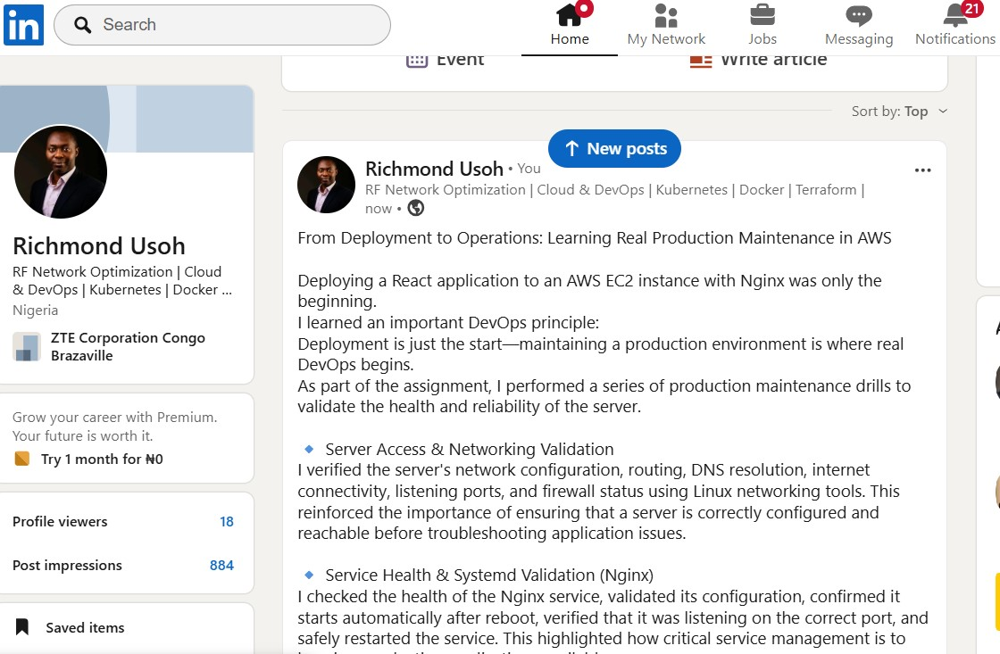

# Submission Instructions

- Add all required screenshots in your submission
- Full name must be visible in required screenshots
- Do not expose sensitive information (keys, passwords, account IDs)

---

# Completion Checklist

- [✅] Task 1: Screenshots (browser, ip a, ss -tulpen, ufw status) + Notes answered
- [✅] Task 2: Screenshots (nginx status, nginx -t, ss port 80) + Notes answered
- [✅] Task 3: Screenshots (access log, error log, journalctl) + Notes answered
- [✅] Task 4: Screenshots (uptime, free -h, df -h, du -sh) + Notes answered
- [✅] Task 5: Screenshots (ls html, grep deployed by, grep try_files) + Notes answered
- [✅] Task 6: Screenshots (nginx -t fail, nginx -t pass, curl recovery) + Notes answered
- [✅] Task 7: Screenshots (curl failure, curl recovery) + Notes answered
- [✅] Task 8: Security & Reliability Notes answered
- [✅] LinkedIn post published and URL submitted
- [✅] Full Name visible in all required screenshots
- [✅] No sensitive data exposed

---

## 📌 About DMI & CloudAdvisory

DevOps Micro Internship (DMI) is a project-based DevOps program run by Pravin Mishra (The CloudAdvisory) focused on real-world execution, systems thinking, and career readiness.

It helps learners build strong DevOps foundations with hands-on experience.

---

## 📌 Resources

- 🌐 DMI Official Website: https://pravinmishra.com/dmi  
- 🎓 DevOps for Beginners (Udemy): https://www.udemy.com/course/devops-for-beginners-docker-k8s-cloud-cicd-4-projects/  
- 🎓 Agentic AI DevOps with Claude Code: https://www.udemy.com/course/ultimate-agentic-ai-devops-with-claude-code/  
- 🎓 DevOps with Claude Code: Terraform, EKS, ArgoCD & Helm: https://www.udemy.com/course/devops-with-claude-code-terraform-eks-argocd-helm/  
- ▶️ YouTube Playlist: https://www.youtube.com/playlist?list=PLFeSNDtI4Cho  
- 🔗 Pravin Mishra (LinkedIn): https://www.linkedin.com/in/pravin-mishra-aws-trainer/  
- 🏢 CloudAdvisory (LinkedIn): https://www.linkedin.com/company/thecloudadvisory/

---

*This submission is part of DevOps Micro Internship (DMI) Cohort 3 — Agentic AI Track.*