# Assignment 5 — Bash Script Automation Drill (OPS Checklist)

Part of the DevOps Micro Internship (DMI) Cohort 3 with Agentic AI

---

## Purpose

In this assignment, you will practice Bash scripting by building a series of small automation scripts covering environment setup, variables, arrays, loops, file conditionals, if-else logic, and functions. These scripts form the foundation of real-world Linux automation used in DevOps, cloud, and production support environments.

---

# Task 1 — Bash Environment & Workspace Setup

## Goal

Verify that Bash is available on your system and create a clean workspace for this assignment.

### Evidence

#### Screenshot 1 — Output of `echo $SHELL` and `bash --version`

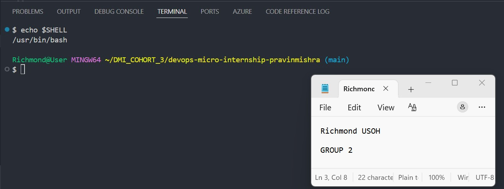

---

#### Screenshot 2 — Output of `pwd` and `ls -lah` showing the scripts directory

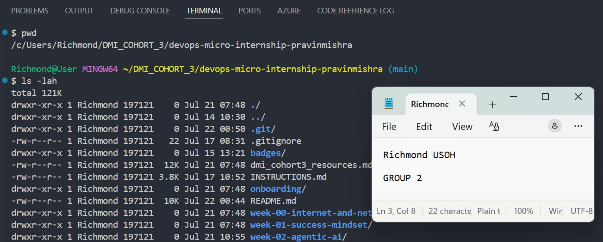

---

### Notes

Answer the following in your own words:

**1. What is Bash?**

Bash (short for "Bourne Again SHell") is a command-line interpreter and scripting language used to interact with an operating system. It allows users to control their computer using keyboard-driven text commands rather than a graphical mouse interface, and is widely used for navigating files and automating repetitive tasks.

---

**2. What is the difference between shell and Bash?**

A shell is a generic category of software, while Bash is a specific brand or implementation of a shell. Think of "shell" as the general term for a vehicle (like a car), and "Bash" as a specific model (like a Toyota Camry).

---

**3. Why is it important to confirm the Bash version before writing scripts?**

Confirming the Bash version before writing or running scripts is critical because it prevents syntax errors and script failures caused by major feature discrepancies across different versions and operating systems.

---

# Task 2 — Your First Bash Script

## Goal

Create your first Bash script, make it executable, and run it from the terminal.

### Evidence

#### Screenshot 1 — Content of `first-script.sh`

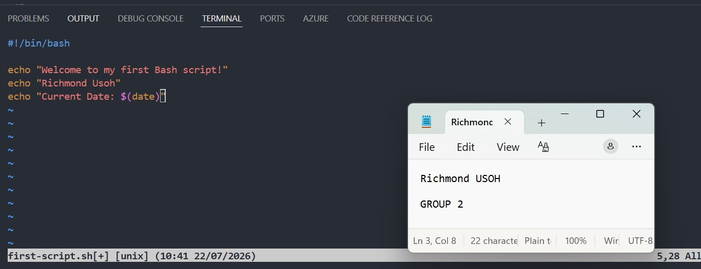

---

#### Screenshot 2 — Output of `./first-script.sh`

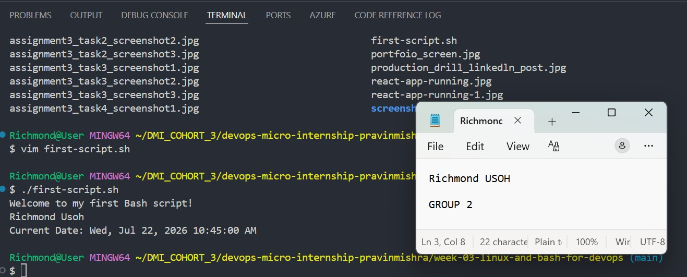

---

#### Screenshot 3 — Output of `ls -l first-script.sh` showing executable permission

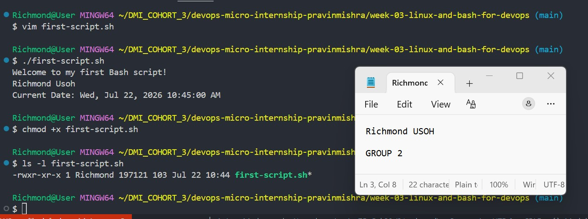

---

### Notes

Answer the following in your own words:

**1. What is the purpose of `#!/bin/bash`?**

Known as a "shebang" or "hashbang," #!/bin/bash is a special sequence placed at the very first line of a script. It tells the operating system's kernel exactly which program to use as an interpreter to execute the subsequent lines of code..

---

**2. Why do we use `chmod +x` before running a script?**

We use chmod +x to tell the operating system that a text file is allowed to run as a compiled program or script. By default, Unix-like operating systems (such as Linux and macOS) restrict newly created text files to read and write states to ensure system security.

---

**3. What is the difference between running a script using `./script.sh` and `bash script.sh`?**

The primary difference between the two commands is how the script file is treated and which program executes it. When you run ./script.sh, the operating system treats the file as an independent executable program and uses the "shebang" line (like #!/bin/bash) inside the script to determine which interpreter to use. When you run bash script.sh, you are explicitly invoking the Bash program and passing the script to it as a plain text argument, completely ignoring any shebang line written inside the file.

---

# Task 3 — Variables: User Information Script

## Goal

Use variables to store and display user-related information.

### Evidence

#### Screenshot 1 — Content of `user-info.sh`

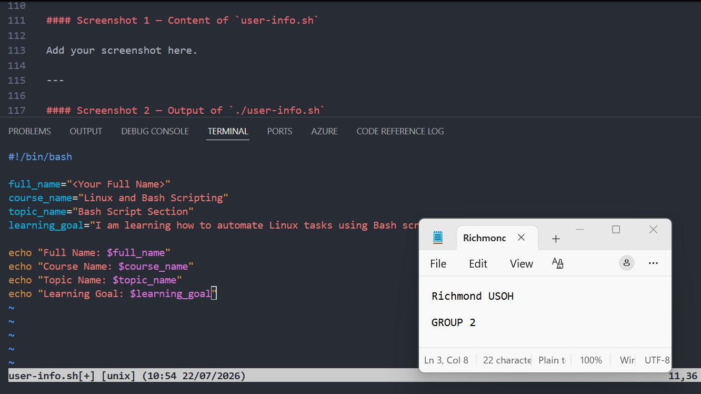

---

#### Screenshot 2 — Output of `./user-info.sh`

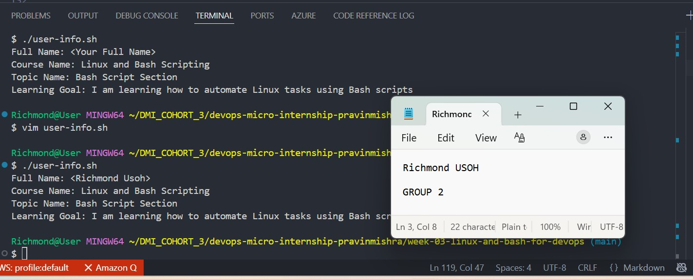

---

### Notes

Answer the following in your own words:

**1. What is a variable in Bash?**

In Bash, a variable is a named storage location in memory used to hold temporary data like text strings, numbers, or command outputs during a terminal session or script execution.

---

**2. Why should we avoid spaces around the `=` sign when creating variables?**

In Bash/shell scripting, you must avoid spaces around the = sign because the shell uses whitespace to separate commands and arguments.Why it fails: If you type VAR = "value", the shell thinks you are trying to run a program named VAR with arguments = and "value".The correct way: VAR="value".

---

**3. How do you access the value stored inside a Bash variable?**

To access the value stored inside a Bash variable, you must prefix the variable name with a dollar sign ($). Without the prefix, Bash treats the name as a literal text string instead of retrieving its stored data.

---

# Task 4 — Arrays & Loops: Tools Checklist Script

## Goal

Use arrays and loops to print a checklist of tools used in Bash scripting.

### Evidence

#### Screenshot 1 — Content of `tools-checklist.sh`

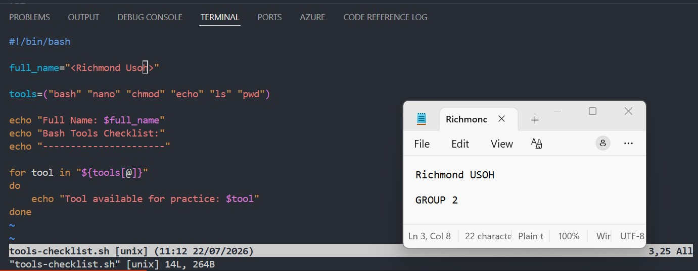

---

#### Screenshot 2 — Output of `./tools-checklist.sh`

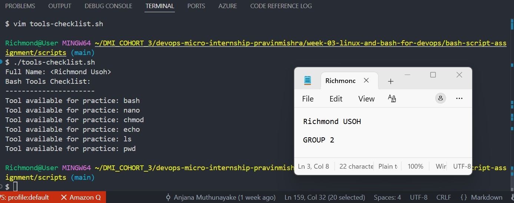

---

### Notes

Answer the following in your own words:

**1. What is an array in Bash?**

An array in Bash is a data structure used to store multiple values in a single variable. Unlike standard variables that hold only one piece of text, an array allows you to manage an indexed list of multiple strings or numbers collectively.

---

**2. Why are arrays useful in scripts?**

Arrays allow you to store and manage multiple related values within a single variable, making your code cleaner and easier to maintain. Instead of creating dozens of individual variables (e.g., item1, item2, item3), you can group them into a single structure, which is essential for processing lists and automating repetitive tasks.

---

**3. What does `"${tools[@]}"` mean?**

In Bash and shell scripting, "${tools[@]}" expands a bash array into separate arguments. It safely expands every element individually while preserving any spaces or special characters within those items..

---

**4. What is the purpose of the `for` loop in this script?**

A for loop in scripting is used to execute a specific block of code repeatedly. It automates repetitive tasks, such as iterating through a sequence of items in a list or executing code an exact number of times.

---

# Task 5 — Loops: Number Counter Script

## Goal

Use loops to repeat a task multiple times.

### Evidence

#### Screenshot 1 — Content of `counter.sh`

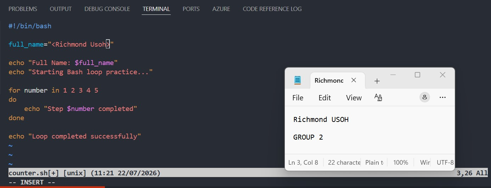

---

#### Screenshot 2 — Output of `./counter.sh`

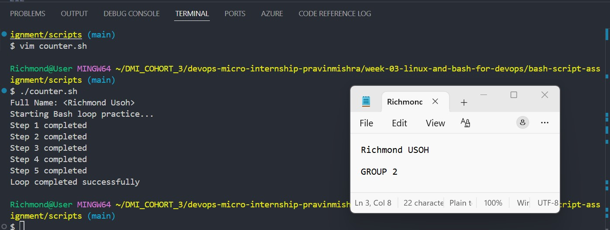

---

### Notes

Answer the following in your own words:

**1. What is a loop?**

A loop is a programming control flow structure that repeates a specific block of code multiple times until a defined condition is met. Loops automate repetitive tasks, reduce code duplication, and save development time.

---

**2. Why do we use loops in Bash scripting?**

We use loops in Bash scripting to automate repetitive tasks, process collections of data, and control script execution based on dynamic conditions without duplicating code. Loops make scripts shorter, easier to read, less prone to human error, and highly efficient for system administration.

---

**3. How many times did the loop run in your script?**

the loop iterated 5 times.

---

**4. What would you change if you wanted the loop to run 10 times?**

i will change the block of code "for number in 1,2,3,4,5 do.

---

# Task 6 — Files & Conditionals: File Validation Script

## Goal

Use file checks and conditionals to verify whether files and directories exist.

### Evidence

#### Screenshot 1 — Output of `ls -lah ../test-folder`

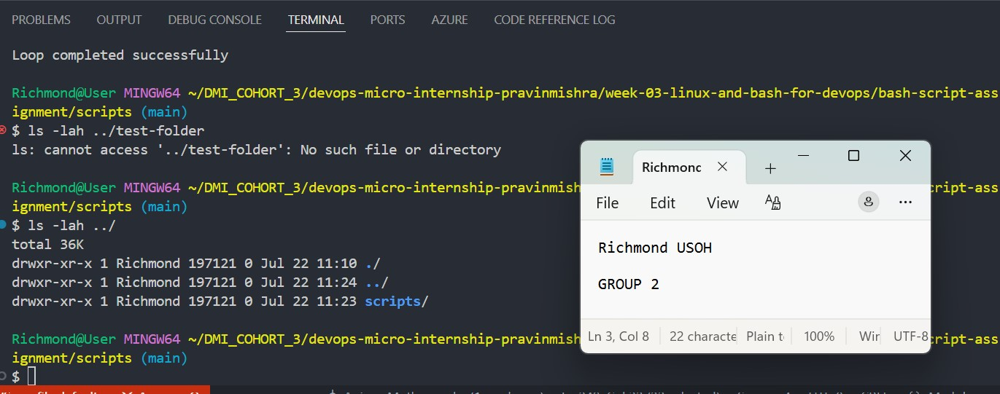

---

#### Screenshot 2 — Content of `file-check.sh`

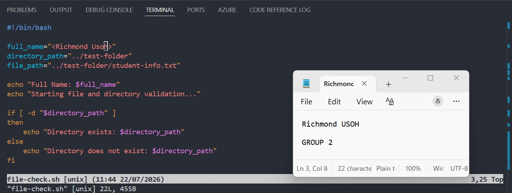

---

#### Screenshot 3 — Output of `./file-check.sh`

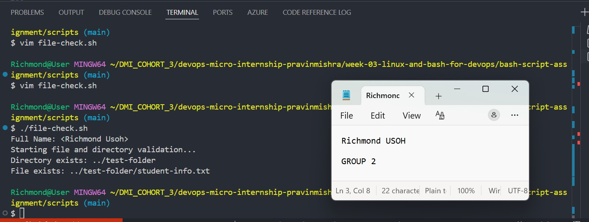

---

### Notes

Answer the following in your own words:

**1. What does `-d` check in Bash?**

In Bash, the -d operator checks if a specified path exists and is a directory. When used inside a conditional expression, it returns a true status (exit code 0) if the target is a valid directory, and false if it does not exist or is a different type of file (like a regular text file).

---

**2. What does `-f` check in Bash?**

In Bash, the -f operator checks if a target exists and is a regular file.A "regular file" means it contains text, data, or binaries, distinguishing it from directories, symbolic links, or system device files.

---

**3. Why should file and directory paths be stored in variables?**

Storing file and directory paths in variables is a programming best practice that improves code maintainability, security, and portability. It ensures your code remains clean, adaptable, and less prone to errors as your project grow.

---

**4. What happens if the file does not exist?**

If a file does not exist when you try to open it, your system or program will generally throw a "File Not Found" error. In programming, languages like Python and Java will raise an exception (e.g., FileNotFoundException or FileNotFoundError) to halt execution, preventing you from reading empty memory or crashing the program.

---

# Task 7 — Conditionals: Pass or Retry Script

## Goal

Use if-else conditionals to make decisions based on a variable value.

### Evidence

#### Screenshot 1 — Content of `score-check.sh` with `score=85`

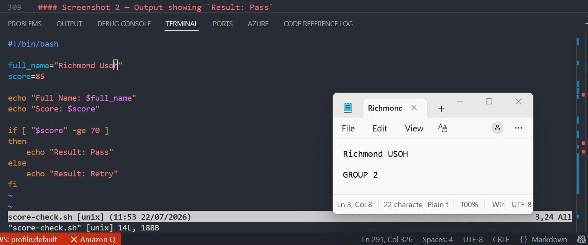

---

#### Screenshot 2 — Output showing `Result: Pass`

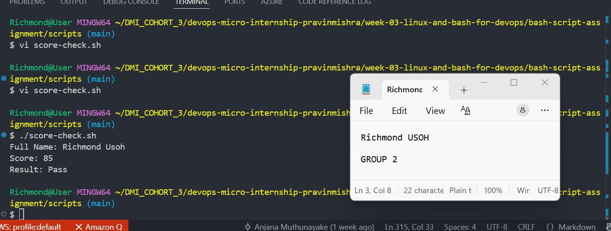

---

#### Screenshot 3 — Content of `score-check.sh` with `score=55`

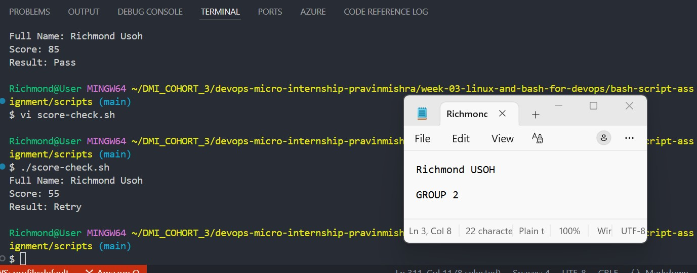

---

#### Screenshot 4 — Output showing `Result: Retry`

---

### Notes

Answer the following in your own words:

**1. What is the purpose of if-else in Bash?**

In Bash, the if-else statement is a control structure used to make decisions and branch script execution based on whether a specific condition or command succeeds (returns an exit status of 0) or fails. It allows your automation scripts to handle different scenarios dynamically rather than executing blindly line-by-line.

---

**2. What does `-ge` mean?**

Programming & Math (Greater than or equal to): It is a common operator (written as -ge or >=) that checks if one value is greater than or equal to another. For example, in scripting languages like Bash or Perl, x -ge y means "x is greater than or equal to y".

---

**3. Why should conditions be tested with different values?**

Testing conditions with different values is critical for software robustness, scientific accuracy, and accurate diagnostics. Evaluating a scenario across multiple inputs—including edge cases and invalid data—ensures reliability, catches unforeseen errors, and verifies that the system responds correctly under all expected and unexpected situations.

---

**4. How can conditionals help in automation scripts?**

Conditionals transform static, rigid automation scripts into dynamic, resilient workflows by allowing scripts to evaluate situations and make decisions in real time. They act as the "if-then" logic that determines which actions to execute, skip, or retry based on specific data inputs or system states.

By using conditional statements like if/else, when, or switch cases in your automation scripts, you can:Prevent Script Crashes: Check if a file or folder exists before attempting to process it, preventing "file not found" errors

---

# Task 8 — Functions: Final Bash Automation Script

## Goal

Create a final Bash script using functions to organize reusable code.

### Evidence

#### Screenshot 1 — Content of `final-automation.sh`

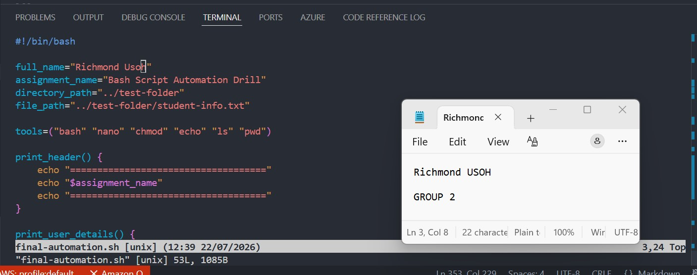

---

#### Screenshot 2 — Output of `./final-automation.sh`

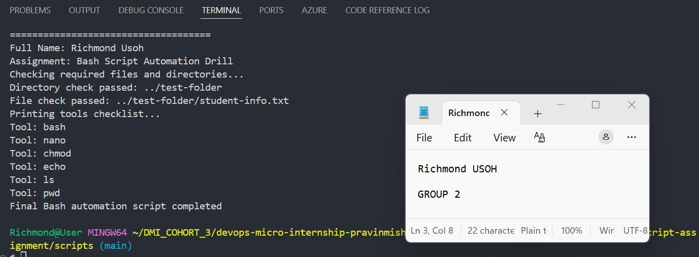

---

#### Screenshot 3 — Output of `ls -lah` showing all created scripts

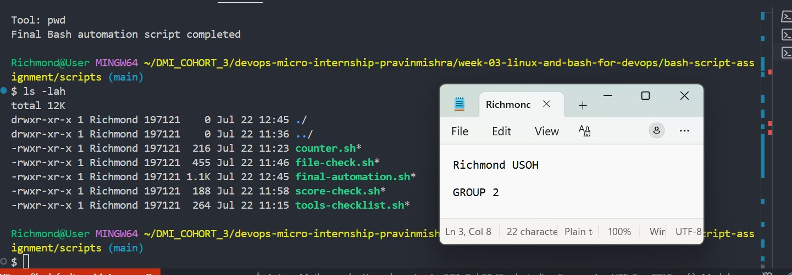

---

### Notes

Answer the following in your own words:

**1. What is a function in Bash?**

A Bash function is a reusable block of commands grouped under a single name that executes within the current shell environment. Instead of rewriting the same block of code multiple times in your script, you can write it once as a function and call it by name whenever needed.

---

**2. Why are functions useful in scripts?**

Functions allow you to package a block of code into a reusable, self-contained unit. By defining the logic once, you can execute it multiple times across your script without rewriting lines. This prevents duplication, simplifies updates, and makes large scripts vastly easier to read and debug.

---

**3. Which functions did you create in this script?**

function print tools was created in the script.

---

**4. How does this final script combine variables, arrays, loops, conditionals, files, and functions?**

This script is a textbook example of a modular Bash script. It serves as an orchestrator that knits multiple fundamental programming concepts together into a clean, automated workflow.Here is exactly how the script combines each of those core elements:1. Variables and FunctionsThe Connection: The script defines global configuration variables at the very top (like $assignment_name, $directory_path, and $file_path).How they combine: Functions like print_header() and check_files() dynamically pull in these global variables. This means if you change the directory path or assignment name once at the top of the script, the behavior of all your functions updates automatically without you needing to rewrite the functions themselves.2. Loops and ArraysThe Connection: The script defines an ordered list of strings inside the tools array.How they combine: Inside the print_tools() function, a for loop is used to iterate over that array. The syntax "${tools[@]}" tells Bash to expand the array into individual elements, and the loop processes them one by one, printing each tool name dynamically until it reaches the end of the collection.3. Conditionals and FilesThe Connection: The script needs to interact with the underlying operating system to check the state of specific files and directories.How they combine: Inside the check_files() function, an if-else conditional block utilizes file test operators. It uses -d "$directory_path" to evaluate if the folder exists, and -f "$file_path" to evaluate if the text file exists. The script branches its execution based on the results, outputting either a "passed" or "failed" log to the terminal.4. Putting It All TogetherThe ultimate integration happens at the very bottom of the file. The main execution block sequentially triggers each function (print_header, print_user_details, check_files, and print_tools). Because everything is neatly compartmentalized, the script can safely read the environment, loop through data structures, and check the file system in a predictable, highly readable order..

---

# LinkedIn Post (Required)

## Evidence

#### LinkedIn Post URL

Paste your LinkedIn post URL here:

`https://www.linkedin.com/posts/richmond-usoh-16672531_devops-linux-ubuntu-activity-7485472295772295168-w8L1?utm_source=share&utm_medium=member_desktop&rcm=ACoAAAaxKJ4B4307Oy0LMj-MkWnZs1lOOjPvqqY`

---

#### Screenshot — Published LinkedIn post

---

# Submission Instructions

- Add all required screenshots in your submission
- Full name must be visible in required screenshots
- All script files must be created and run successfully
- Required notes must be answered clearly for every task
- Do not expose sensitive information (keys, passwords, credentials)

---

# Completion Checklist

- [✅] Task 1: Environment setup verified, workspace created (Screenshots 1–2, Notes answered)
- [✅] Task 2: First script created, executed, permissions verified (Screenshots 1–3, Notes answered)
- [✅] Task 3: Variables script created and run (Screenshots 1–2, Notes answered)
- [✅] Task 4: Arrays and loops script created and run (Screenshots 1–2, Notes answered)
- [✅] Task 5: Counter loop script created and run (Screenshots 1–2, Notes answered)
- [✅] Task 6: File validation script created and run (Screenshots 1–3, Notes answered)
- [✅] Task 7: Pass/Retry conditional script tested with both values (Screenshots 1–4, Notes answered)
- [✅] Task 8: Final automation script created and run (Screenshots 1–3, Notes answered)
- [✅] All scripts run without errors
- [✅] Full Name visible in all required screenshots
- [✅] LinkedIn post published and URL submitted
- [✅] No sensitive data exposed

---

## 📌 About DMI & CloudAdvisory

DevOps Micro Internship (DMI) is a project-based DevOps program run by Pravin Mishra (The CloudAdvisory) focused on real-world execution, systems thinking, and career readiness.

It helps learners build strong DevOps foundations with hands-on experience.

---

## 📌 Resources

- 🌐 DMI Official Website: https://pravinmishra.com/dmi  
- 🎓 DevOps for Beginners (Udemy): https://www.udemy.com/course/devops-for-beginners-docker-k8s-cloud-cicd-4-projects/  
- 🎓 Agentic AI DevOps with Claude Code: https://www.udemy.com/course/ultimate-agentic-ai-devops-with-claude-code/  
- 🎓 DevOps with Claude Code: Terraform, EKS, ArgoCD & Helm: https://www.udemy.com/course/devops-with-claude-code-terraform-eks-argocd-helm/  
- ▶️ YouTube Playlist: https://www.youtube.com/playlist?list=PLFeSNDtI4Cho  
- 🔗 Pravin Mishra (LinkedIn): https://www.linkedin.com/in/pravin-mishra-aws-trainer/  
- 🏢 CloudAdvisory (LinkedIn): https://www.linkedin.com/company/thecloudadvisory/

---

*This submission is part of DevOps Micro Internship (DMI) Cohort 3 — Agentic AI Track.*