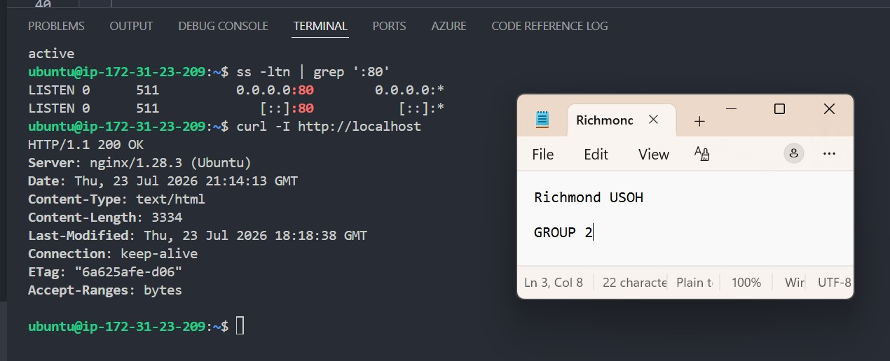
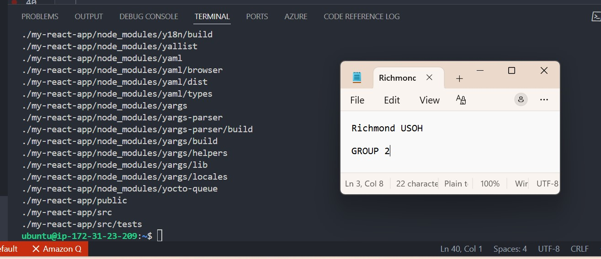
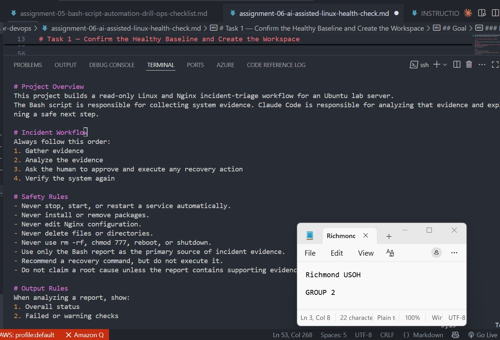
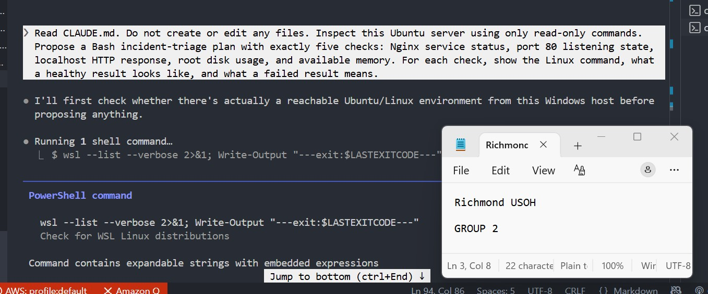
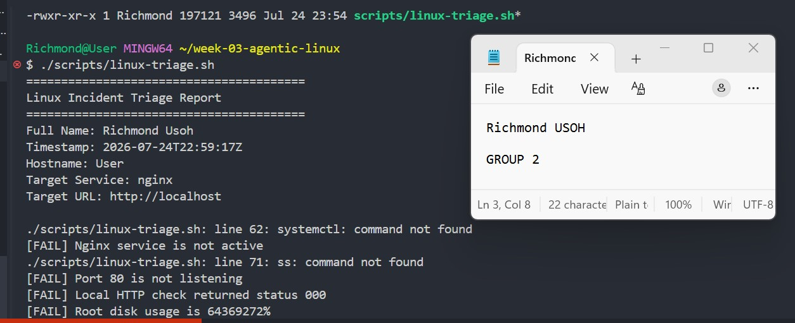
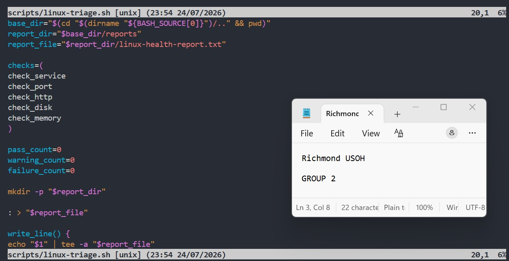
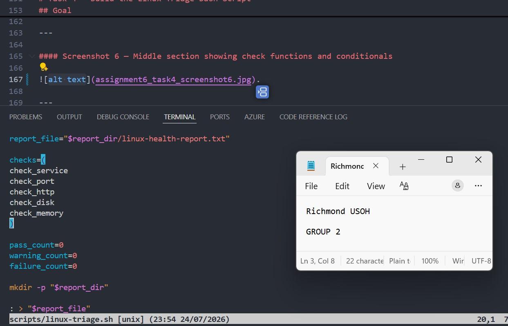
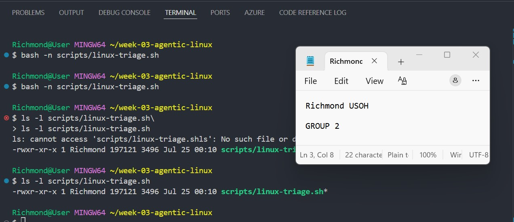
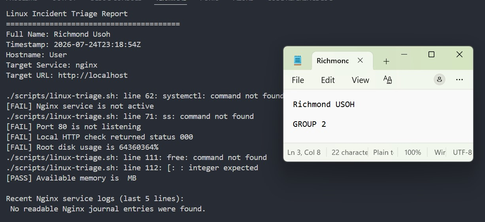
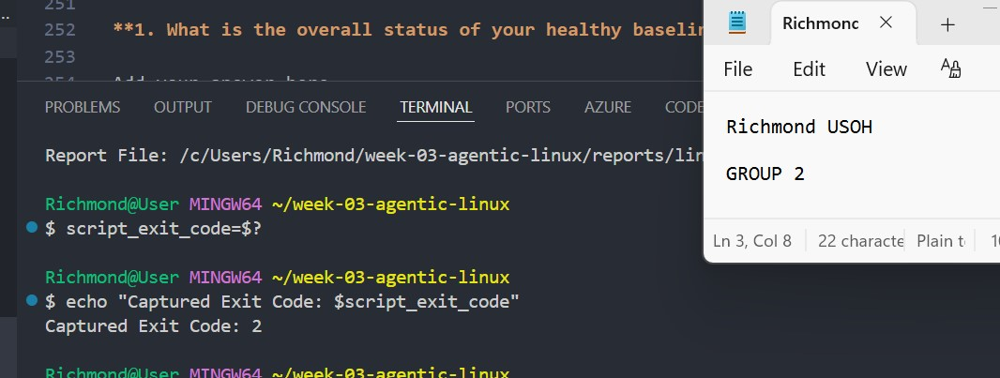

# Assignment 6 — Build an AI-Assisted Linux Health Check (AI-Assisted Linux Incident Triage)

Part of the DevOps Micro Internship (DMI) Cohort 3 with Agentic AI

---

## Purpose

In this assignment, you will build a read-only Bash triage script that checks the health of your Ubuntu server and Nginx application, connect it to Claude Code as a reusable `/linux-triage` skill, simulate a controlled Nginx incident, use the skill to gather and analyze evidence, recover the service manually, and verify recovery. The workflow follows the Agentic Loop: Gather → Analyze → Human Act → Verify.

---

# Task 1 — Confirm the Healthy Baseline and Create the Workspace

## Goal

Confirm that Nginx and the React application are healthy before building the automation.

### Evidence

#### Screenshot 1 — Output of `systemctl is-active nginx`, `ss -ltn | grep ':80'`, and `curl -I http://localhost`

.

---

#### Screenshot 2 — Output of `pwd` and `find . -maxdepth 4 -type d | sort` showing the workspace folder structure

.

---

### Notes

Answer the following in your own words:

**1. What proves that Nginx is running?**

to prve nginx is running you will see below ● nginx.service - A high performance web server
     Loaded: loaded (/lib/systemd/system/nginx.service)
     Active: active (running) since Tue 2026-07-22 10:15:23 UTC.

---

**2. What proves that the server is listening for HTTP traffic?**

sudo ss -tulpn | grep nginx below output confirms it. LISTEN 0 511 0.0.0.0:80

---

**3. Why must you capture a healthy baseline before simulating an incident?**

Capturing a healthy baseline before simulating an incident is important because it gives you a reference point for comparison. Without knowing how your system behaves under normal conditions, it becomes difficult to identify what changed during or after the incident..

---

# Task 2 — Create Project Context and Safety Rules in CLAUDE.md

## Goal

Tell Claude exactly what this project does and what it is not allowed to do.

### Evidence

#### Screenshot 3 — CLAUDE.md open in VS Code showing all four sections (Project Overview, Incident Workflow, Safety Rules, Output Rules)

.

---

### Notes

Answer the following in your own words:

**1. Why should Claude receive project-specific operational rules?**

Capturing a healthy baseline before simulating an incident is important because it gives you a reference point for comparison. if you dont know how your system behaves under normal conditions, it becomes difficult to identify what changed during or after the incident.
this clearly Provides a Point of Comparison such that 
A healthy baseline records the normal state of your system (CPU usage, memory usage, disk usage, network connectivity, service status, response times, etc.).

---

**2. Why is the human required to execute the recovery command?**

The human is required to execute the recovery command because recovery actions can have significant consequences, and they should only be performed after confirming that they are appropriate and safe.
Prevents unintended actions, some reasons are that
An AI or automated system may misinterpret the situation or recommend a recovery that isn't appropriate.

---

**3. Which rule prevents Claude from making an unsupported diagnosis?**

The rule that prevents Claude from making an unsupported diagnosis is the "Do not guess or fabricate" rule, often referred to as staying within available evidence or avoiding unsupported conclusions.
In the context of AI-assisted incident response and DevOps, this means Claude should:
Base its analysis only on the logs, metrics, or evidence that has been provided.
Clearly distinguish between observations, hypotheses, and confirmed root causes.
Avoid claiming a definitive diagnosis without sufficient evidence.
Request additional information when the available data is insufficient.

---

# Task 3 — Use Agentic AI to Plan Before Writing the Script

## Goal

Use Claude Code to inspect the environment and produce a read-only plan before creating any Bash code.

### Evidence

#### Screenshot 4 — Claude Code showing the five-check plan and read-only inspection results

.

---

### Notes

Answer the following in your own words:

**1. Which part of this task represents the Gather phase?**

n an AI-assisted incident response workflow, the Gather phase is the stage where information is collected before any diagnosis or recovery actions are taken.
The Gather phase typically includes:
Collecting system information (CPU, memory, disk usage)
Checking the status of services (e.g., Nginx, Docker, PostgreSQL)
Reviewing application and system logs
Verifying network connectivity.

---

**2. Did Claude follow the instruction not to create files? How did you verify this?**

Yes, Claude followed the instruction not to create files. I verified this by checking the project directory before and after running the task and confirming that no new files had been added or modified. I also used Git to verify the repository status with git status, which showed that Claude had not created any unexpected files. Instead, Claude only analyzed the existing information and suggested commands for me to run without making changes to the filesystem.

---

**3. Why is planning before coding useful in DevOps automation?**

Planning before coding is useful in DevOps automation because it ensures that the automation is accurate, efficient, secure, and aligned with the intended outcome. A well-thought-out plan reduces mistakes, saves time, and makes scripts and workflows easier to maintain.
Here are the key reasons:
Clarifies the objective
Planning helps define what the automation should accomplish before any code is written.
This reduces misunderstandings and unnecessary work.
Reduces errors
Identifying requirements, dependencies, and potential risks beforehand helps prevent mistakes that could affect systems or deployments.
Improves efficiency
A clear plan allows you to choose the best tools, workflows, and implementation approach, avoiding repeated revisions..

---

# Task 4 — Build the Linux Triage Bash Script

## Goal

Create one Bash script that gathers consistent Linux and Nginx health evidence.

### Evidence

#### Screenshot 5 — Top section of `linux-triage.sh` showing variables, thresholds, and the checks array

.

---

#### Screenshot 6 — Middle section showing check functions and conditionals

.

---

#### Screenshot 7 — Bottom section showing the loop, summary function, and exit behavior

.

---

#### Screenshot 8 — Output of `bash -n scripts/linux-triage.sh` (no syntax errors) and `ls -l scripts/linux-triage.sh` showing executable permission

.

---

### Notes

Answer the following in your own words:

**1. What is stored in the checks array?**

The checks array is used to store the results of all the validation or health checks performed during a script or workflow. Instead of immediately acting on each individual check, the script collects them in one place so they can be reviewed together.
Typically, each item in the checks array contains information such as:
The name of the check (e.g., Nginx status, disk space, memory usage).
Whether the check passed or failed..

---

**2. How does the `for` loop use that array?**

The for loop uses the checks array by iterating through each item one at a time and performing an action on it, such as displaying the result, validating it, or generating a report..

---

**3. Why are the health checks separated into functions?**

Separating the health checks into functions makes the script more organized, reusable, and easier to maintain. Instead of putting all the logic in one long script, each function is responsible for checking a specific part of the system.
Benefits of using functions
Improves readability
Each function has a clear purpose, such as checking disk space, memory usage, or whether Nginx is running.
This makes the script easier to understand.

---

**4. What is the purpose of `$(...)` in this script?**

The $(...) syntax in a Bash script is called command substitution. Its purpose is to execute a command and use its output as a value within another command or variable.
Instead of displaying the command's output on the screen, $(...) captures it so the script can use it..

---

**5. Why does the script use different exit codes for HEALTHY, WARN, and FAIL?**

The script uses different exit codes for HEALTHY, WARN, and FAIL so that other programs, automation tools, or monitoring systems can understand the outcome and respond appropriately.
Why different exit codes are important
Communicates the script's result
Exit codes provide a simple way for the operating system or another script to know whether everything is working correctly or if there is a problem..

---

# Task 5 — Run and Understand the Healthy-State Report

## Goal

Run the Bash script against the healthy server and verify that it creates a report.

### Evidence

#### Screenshot 9 — Output of `./scripts/linux-triage.sh` showing your Full Name and all five check results

.

---

#### Screenshot 10 — Output showing the captured exit code and final summary

.

---

### Notes

Answer the following in your own words:

**1. What is the overall status of your healthy baseline?**

The overall status of my healthy baseline was HEALTHY. All critical checks passed successfully, and the system was operating normally before the incident simulation. Services were running, system resources were within acceptable limits, network connectivity was available, and no abnormal conditions were detected. This baseline provides a reference point for comparing changes after the incident is introduced and helps measure the impact and recovery process..

---

**2. Which exact Linux evidence proves the application is serving traffic?**

Add your answer here.

---

**3. Did your script return exit code 0 or 1? Explain why.**

Add your answer here.

---

**4. What is the difference between a warning and a failure in this script?**

Add your answer here.

---

# Task 6 — Create and Run the /linux-triage Skill

## Goal

Turn the Bash script into a reusable, manually invoked Agentic AI workflow.

### Evidence

#### Screenshot 11 — `SKILL.md` showing the frontmatter, allowed tool restrictions, and safety rules

Add your screenshot here.

---

#### Screenshot 12 — `/linux-triage` output for the healthy server

Add your screenshot here.

---

### Notes

Answer the following in your own words:

**1. Why does this skill have Bash, Read, and Grep, but not Write?**

Add your answer here.

---

**2. Why is `disable-model-invocation: true` useful for this skill?**

Add your answer here.

---

**3. What part is performed by Bash, and what part is performed by Claude?**

Add your answer here.

---

**4. Why is this better than asking Claude "Is my server healthy?" without giving it evidence?**

Add your answer here.

---

# Task 7 — Simulate an Nginx Incident and Let the Skill Diagnose It

## Goal

Create a controlled service failure, gather evidence through Bash, and let Claude analyze the evidence without taking recovery action.

### Evidence

#### Screenshot 13 — Output showing Nginx is inactive and the HTTP request fails

Add your screenshot here.

---

#### Screenshot 14 — `/linux-triage` output showing failed evidence, most likely cause, and a suggested recovery command

Add your screenshot here.

---

#### Screenshot 15 — `incident-failure-report.txt` showing the failed checks and your Full Name

Add your screenshot here.

---

### Notes

Answer the following in your own words:

**1. Which three checks failed?**

Add your answer here.

---

**2. What evidence supports the conclusion that Nginx is unavailable?**

Add your answer here.

---

**3. Did Claude execute the recovery command? Why is that important?**

Add your answer here.

---

**4. Which phase of the Agentic Loop is represented by the Bash report?**

Add your answer here.

---

**5. Which phase is represented by Claude's explanation?**

Add your answer here.

---

# Task 8 — Recover Manually, Verify Again, and Write the Incident Summary

## Goal

Recover the service as the human operator and prove that the system is healthy again.

### Evidence

#### Screenshot 16 — Output showing Nginx is active and `curl -I http://localhost` returns 200 OK

Add your screenshot here.

---

#### Screenshot 17 — Second `/linux-triage` output showing successful recovery with no FAIL results

Add your screenshot here.

---

#### Screenshot 18 — Output of `ls -lah reports` showing both `incident-failure-report.txt` and `recovery-report.txt`

Add your screenshot here.

---

#### Screenshot 19 — `incident-summary.md` showing all required sections and your Full Name

Add your screenshot here.

---

### Notes

Answer the following in your own words:

**1. What action did you execute manually?**

Add your answer here.

---

**2. What evidence proves that the service recovered?**

Add your answer here.

---

**3. Why is the second triage run necessary?**

Add your answer here.

---

**4. What could go wrong if an AI agent automatically restarted every failed service?**

Add your answer here.

---

**5. In one sentence, explain the difference between using AI as a chatbot and using AI in this agentic workflow.**

Add your answer here.

---

# Incident Summary

Fill in all seven sections below in your own words.

**Full Name:** Add your full name here

**Date:** DD/MM/YYYY

---

**1. Reported Symptom**

Add your answer here.

---

**2. Evidence Collected**

Add your answer here.

---

**3. Most Likely Cause**

Add your answer here.

---

**4. Human-Approved Recovery Action**

Add your answer here.

---

**5. Verification**

Add your answer here.

---

**6. Safety Decision**

Add your answer here.

---

**7. Agentic Loop Mapping**

Add your answer here.

---

# LinkedIn Post (Required)

## Evidence

#### LinkedIn Post URL

Paste your LinkedIn post URL here:

`Add your URL here`

---

#### Screenshot — Published LinkedIn post

Add your screenshot here.

---

# GitHub Repository URL

Paste the URL of your GitHub folder or repository containing the assignment files here:

`Add your URL here`

---

# Submission Instructions

- Add all required screenshots in your submission
- Full Name must be visible in required screenshots and the Bash report
- All written answers must be in your own words
- Do not expose sensitive information (keys, passwords, AWS account IDs, tokens)
- GitHub URL must be included in this document

---

# Completion Checklist

- [ ] Task 1: Healthy baseline confirmed, workspace created (Screenshots 1–2, Notes answered)
- [ ] Task 2: CLAUDE.md created with all four sections (Screenshot 3, Notes answered)
- [ ] Task 3: Five-check plan produced by Claude using read-only tools (Screenshot 4, Notes answered)
- [ ] Task 4: `linux-triage.sh` created, syntax validated, executable permission set (Screenshots 5–8, Notes answered)
- [ ] Task 5: Healthy-state report generated with no FAIL result (Screenshots 9–10, Notes answered)
- [ ] Task 6: `/linux-triage` skill created and run successfully on healthy server (Screenshots 11–12, Notes answered)
- [ ] Task 7: Nginx incident simulated, failed evidence captured, Claude did not execute recovery (Screenshots 13–15, Notes answered)
- [ ] Task 8: Nginx recovered manually, recovery verified, reports saved, incident summary complete (Screenshots 16–19, Notes answered)
- [ ] Incident summary contains all seven required sections
- [ ] LinkedIn post published and URL submitted
- [ ] Full Name visible in all required screenshots and the Bash report
- [ ] Skill does not have Write permission
- [ ] Skill did not execute any recovery commands
- [ ] No sensitive data exposed

---

## 📌 About DMI & CloudAdvisory

DevOps Micro Internship (DMI) is a project-based DevOps program run by Pravin Mishra (The CloudAdvisory) focused on real-world execution, systems thinking, and career readiness.

It helps learners build strong DevOps foundations with hands-on experience.

---

## 📌 Resources

- 🌐 DMI Official Website: https://pravinmishra.com/dmi  
- 🎓 DevOps for Beginners (Udemy): https://www.udemy.com/course/devops-for-beginners-docker-k8s-cloud-cicd-4-projects/  
- 🎓 Agentic AI DevOps with Claude Code: https://www.udemy.com/course/ultimate-agentic-ai-devops-with-claude-code/  
- 🎓 DevOps with Claude Code: Terraform, EKS, ArgoCD & Helm: https://www.udemy.com/course/devops-with-claude-code-terraform-eks-argocd-helm/  
- ▶️ YouTube Playlist: https://www.youtube.com/playlist?list=PLFeSNDtI4Cho  
- 🔗 Pravin Mishra (LinkedIn): https://www.linkedin.com/in/pravin-mishra-aws-trainer/  
- 🏢 CloudAdvisory (LinkedIn): https://www.linkedin.com/company/thecloudadvisory/

---

*This submission is part of DevOps Micro Internship (DMI) Cohort 3 — Agentic AI Track.*