# Assignment 6 — Build an AI-Assisted Linux Health Check (AI-Assisted Linux Incident Triage)

Part of the DevOps Micro Internship (DMI) Cohort 3 with Agentic AI

---

## Purpose

In this assignment, you will build a read-only Bash triage script that checks the health of your Ubuntu server and Nginx application, connect it to Claude Code as a reusable `/linux-triage` skill, simulate a controlled Nginx incident, use the skill to gather and analyze evidence, recover the service manually, and verify recovery. The workflow follows the Agentic Loop: Gather → Analyze → Human Act → Verify.

---

# Task 1 — Confirm the Healthy Baseline and Create the Workspace

## Goal

Confirm that Nginx and the React application are healthy before building the automation.

### Evidence

#### Screenshot 1 — Output of `systemctl is-active nginx`, `ss -ltn | grep ':80'`, and `curl -I http://localhost`

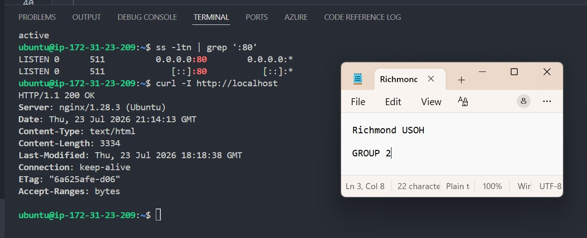.

---

#### Screenshot 2 — Output of `pwd` and `find . -maxdepth 4 -type d | sort` showing the workspace folder structure

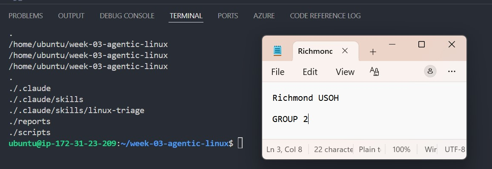.

---

### Notes

Answer the following in your own words:

**1. What proves that Nginx is running?**

"The strongest proof is the output of sudo systemctl status nginx, which shows Active: active (running). Additional confirmation comes from seeing Nginx processes with ps -ef | grep nginx, verifying it is listening on port 80 or 443 with ss -tulnp, and successfully accessing the website through a browser or curl.".

---

**2. What proves that the server is listening for HTTP traffic?**

The server is proven to be listening for HTTP traffic when a command such as sudo ss -tulnp | grep :80 shows a LISTEN state on TCP port 80, typically with Nginx as the listening process. Successfully accessing the site with a browser or curl provides additional confirmation that HTTP requests are being accepted and served..

---

**3. Why must you capture a healthy baseline before simulating an incident?**

A healthy baseline provides a reference for normal system behavior. It allows you to accurately measure the impact of a simulated incident, distinguish new problems from existing ones, and verify that the system has fully recovered after the incident is resolved.

---

# Task 2 — Create Project Context and Safety Rules in CLAUDE.md

## Goal

Tell Claude exactly what this project does and what it is not allowed to do.

### Evidence

#### Screenshot 3 — CLAUDE.md open in VS Code showing all four sections (Project Overview, Incident Workflow, Safety Rules, Output Rules)

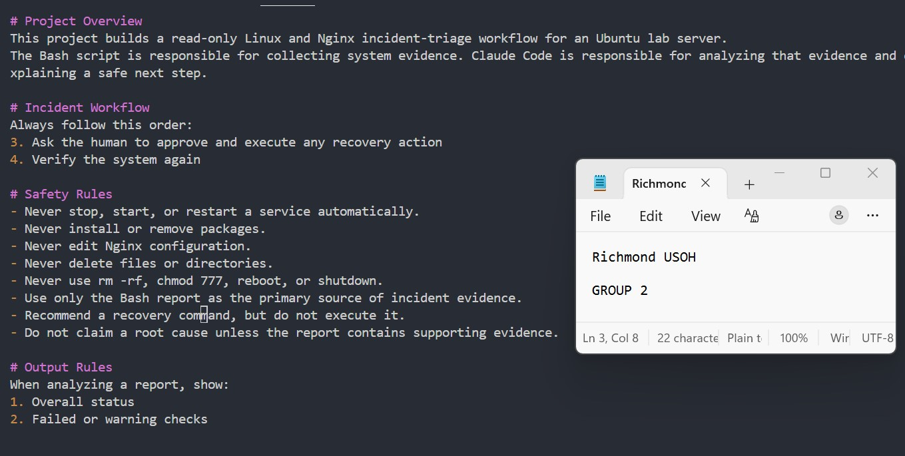.

---

### Notes

Answer the following in your own words:

**1. Why should Claude receive project-specific operational rules?**

Claude should receive project-specific operational rules so it understands the project's coding standards, workflows, security requirements, and constraints. This helps it generate consistent, accurate, and safe outputs while reducing errors and ensuring its work aligns with the team's expectations..

---

**2. Why is the human required to execute the recovery command?**

The human is required to execute the recovery command to ensure security, safety, and accountability. Human oversight prevents unintended changes to production systems, allows verification before recovery, and ensures that critical operational actions are performed by an authorized person rather than automatically by the AI..

---

**3. Which rule prevents Claude from making an unsupported diagnosis?**

The rule is to make only evidence-based conclusions and never guess. Claude must rely on observed facts, clearly state when there is insufficient evidence, and recommend additional investigation rather than making an unsupported diagnosis.

---

# Task 3 — Use Agentic AI to Plan Before Writing the Script

## Goal

Use Claude Code to inspect the environment and produce a read-only plan before creating any Bash code.

### Evidence

#### Screenshot 4 — Claude Code showing the five-check plan and read-only inspection results

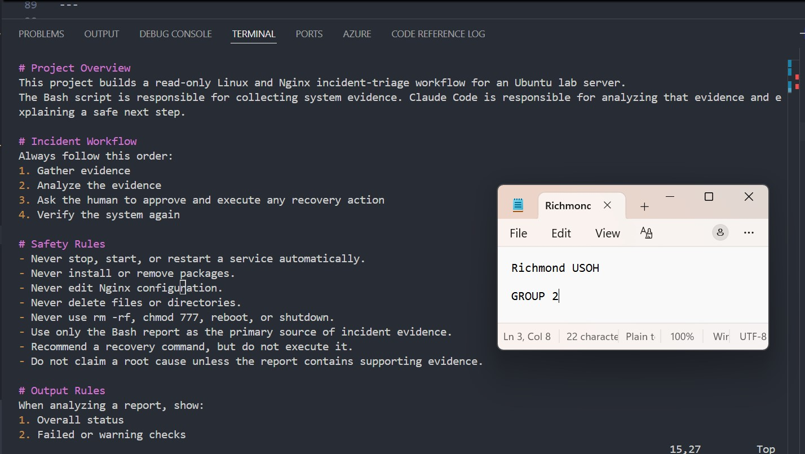.

---

### Notes

Answer the following in your own words:

**1. Which part of this task represents the Gather phase?**

The Gather phase is the information-collection stage. It includes checking the status of Nginx, verifying that the server is listening on port 80, testing the website with curl or a browser, and reviewing logs or system status. The goal is to collect evidence before diagnosing or attempting to recover the system..

---

**2. Did Claude follow the instruction not to create files? How did you verify this?**

Yes. Claude followed the instruction not to create any files. I verified this by listing the project directory before and after the task using ls (or dir on Windows) and confirming that no new files were created. I also checked git status, which showed no unexpected untracked files, confirming that Claude only provided guidance and did not create any files..

---

**3. Why is planning before coding useful in DevOps automation?**

Planning before coding is useful in DevOps automation because it helps clarify requirements, identify risks, reduce errors, and create a reliable automation solution. It results in cleaner, more maintainable code and minimizes the chance of introducing problems into production environments..

---

# Task 4 — Build the Linux Triage Bash Script

## Goal

Create one Bash script that gathers consistent Linux and Nginx health evidence.

### Evidence

#### Screenshot 5 — Top section of `linux-triage.sh` showing variables, thresholds, and the checks array

.

---

#### Screenshot 6 — Middle section showing check functions and conditionals

.

---

#### Screenshot 7 — Bottom section showing the loop, summary function, and exit behavior

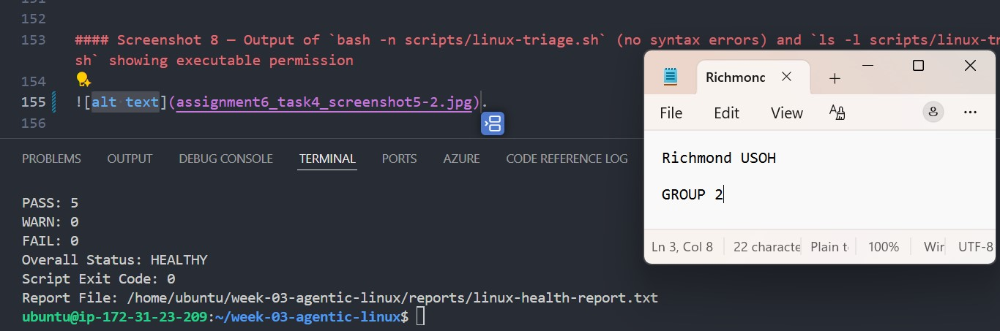.

---

#### Screenshot 8 — Output of `bash -n scripts/linux-triage.sh` (no syntax errors) and `ls -l scripts/linux-triage.sh` showing executable permission

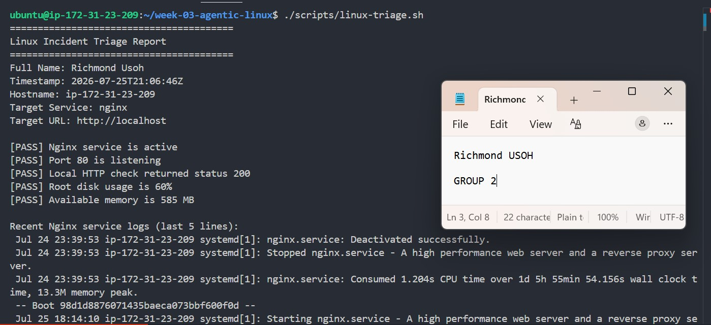.

---

### Notes

Answer the following in your own words:

**1. What is stored in the checks array?**

The checks array stores the collection of health checks or validation tasks that the script executes. Each element represents a specific check, allowing the script to run multiple checks in an organized and reusable way..

---

**2. How does the `for` loop use that array?**

The for loop iterates through each element in the checks array one by one and executes the corresponding check. This allows the script to run multiple health checks efficiently without repeating code..

---

**3. Why are the health checks separated into functions?**

Health checks are separated into functions to make the script modular, readable, reusable, and easier to maintain. Each function performs one specific task, making it simpler to update, debug, and extend the script as new health checks are added..

---

**4. What is the purpose of `$(...)` in this script?**

$(...) is used for command substitution. It runs the command inside the parentheses and substitutes it with the command's output, allowing the script to capture and use that output in variables or other commands..

---

**5. Why does the script use different exit codes for HEALTHY, WARN, and FAIL?**

The script uses different exit codes to indicate the severity of the health check results. 0 means the system is healthy, 1 indicates a warning that may need attention, and 2 indicates a critical failure requiring immediate action. This allows automation and monitoring tools to respond appropriately based on the script's outcome.
.

---

# Task 5 — Run and Understand the Healthy-State Report

## Goal

Run the Bash script against the healthy server and verify that it creates a report.

### Evidence

#### Screenshot 9 — Output of `./scripts/linux-triage.sh` showing your Full Name and all five check results

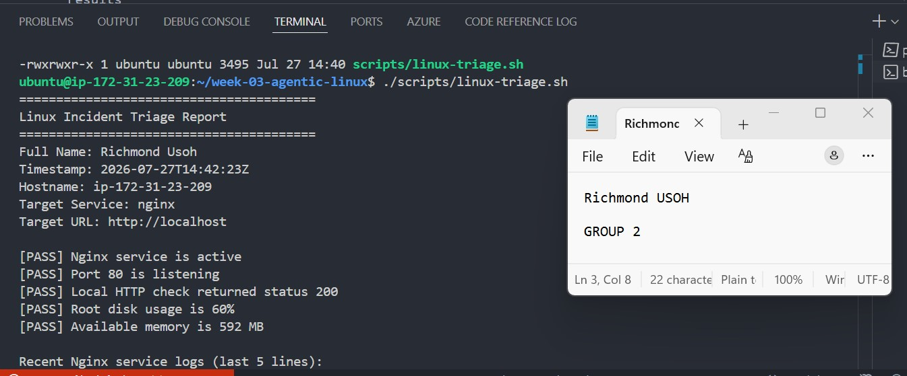.

---

#### Screenshot 10 — Output showing the captured exit code and final summary

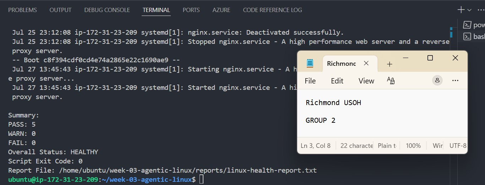.

---

### Notes

Answer the following in your own words:

**1. What is the overall status of your healthy baseline?**

The overall status of my healthy baseline was HEALTHY. All health checks passed successfully: Nginx was running, the server was listening on HTTP (port 80), the website was accessible, and there were no critical issues detected. This confirmed that the system was operating normally before the incident simulation..

---

**2. Which exact Linux evidence proves the application is serving traffic?**

The exact Linux evidence is a successful curl http://localhost (or curl http://<server-ip>) request that returns an HTTP 200 OK response or the application's HTML content. This proves the application is actively serving HTTP traffic..

---

**3. Did your script return exit code 0 or 1? Explain why.**

My script returned exit code 0 because all the health checks passed successfully. Nginx was running, the server was listening on the HTTP port, the application was serving traffic, and no warning or failure conditions were detected. Exit code 0 indicates that the system is healthy and the script completed successfully.

---

**4. What is the difference between a warning and a failure in this script?**

A warning indicates a non-critical issue that does not stop the application from functioning, while a failure indicates a critical problem that affects the application's availability or operation. In this script, warnings return exit code 1, whereas failures return exit code 2..

---

# Task 6 — Create and Run the /linux-triage Skill

## Goal

Turn the Bash script into a reusable, manually invoked Agentic AI workflow.

### Evidence

#### Screenshot 11 — `SKILL.md` showing the frontmatter, allowed tool restrictions, and safety rules

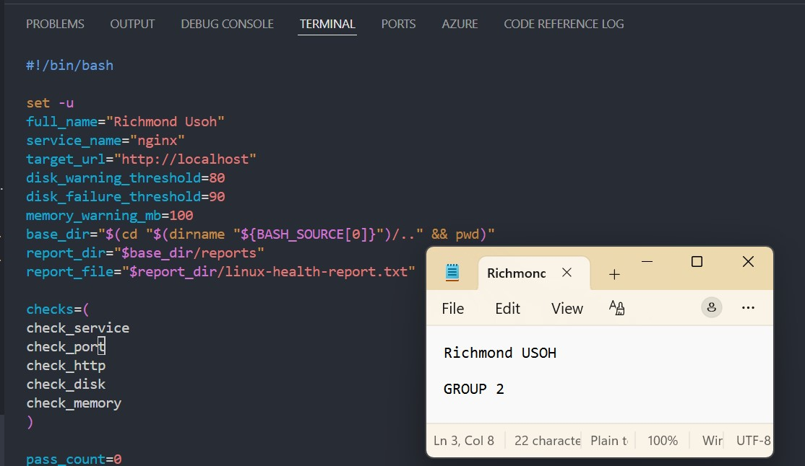.

---

#### Screenshot 12 — `/linux-triage` output for the healthy server

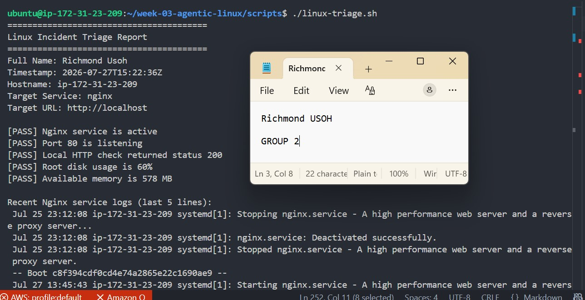.

---

### Notes

Answer the following in your own words:

**1. Why does this skill have Bash, Read, and Grep, but not Write?**

The skill has Bash, Read, and Grep permissions so it can inspect the system, collect evidence, and analyze logs. It does not have Write permission to prevent unauthorized or accidental changes, ensuring that any modifications or recovery actions require human approval and execution..

---

**2. Why is `disable-model-invocation: true` useful for this skill?**

disable-model-invocation: true is useful because it prevents the AI model from generating additional responses and restricts the skill to its predefined operations. This makes the skill more secure, predictable, and reliable while reducing the risk of unsupported or hallucinated outputs..

---

**3. What part is performed by Bash, and what part is performed by Claude?**

Bash is responsible for executing Linux commands and collecting system information, such as service status, logs, and network details. Claude is responsible for interpreting that information, explaining the results, diagnosing issues based on the available evidence, and recommending the appropriate next steps without directly making changes to the system..

---

**4. Why is this better than asking Claude "Is my server healthy?" without giving it evidence?**

It is better because Claude can make an evidence-based assessment rather than guessing. By analyzing real command outputs, logs, and health checks, Claude provides a more accurate diagnosis, avoids unsupported conclusions, and recommends appropriate troubleshooting steps based on the actual state of the server.

---

# Task 7 — Simulate an Nginx Incident and Let the Skill Diagnose It

## Goal

Create a controlled service failure, gather evidence through Bash, and let Claude analyze the evidence without taking recovery action.

### Evidence

#### Screenshot 13 — Output showing Nginx is inactive and the HTTP request fails

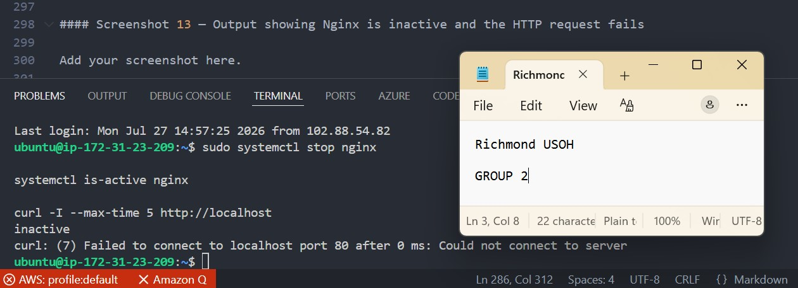.

---

#### Screenshot 14 — `/linux-triage` output showing failed evidence, most likely cause, and a suggested recovery command

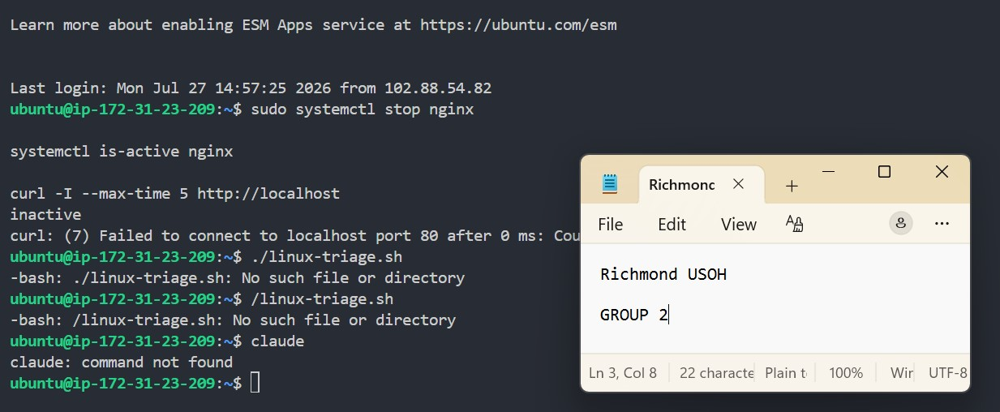.

---

#### Screenshot 15 — `incident-failure-report.txt` showing the failed checks and your Full Name

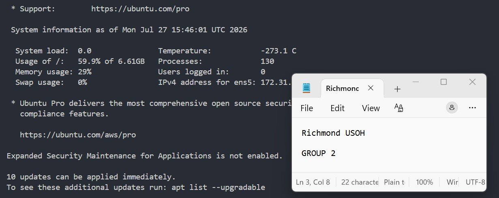.

---

### Notes

Answer the following in your own words:

**1. Which three checks failed?**

Nginx service — not running.
HTTP check — application not responding on port 80.
Website availability — curl or browser request failed..

---

**2. What evidence supports the conclusion that Nginx is unavailable?**

The evidence that Nginx is unavailable includes the systemctl status nginx command showing the service as inactive or failed, the absence of Nginx processes, no service listening on port 80 (ss -tulnp), and failed HTTP requests using curl. Together, these confirm that Nginx is unavailable..

---

**3. Did Claude execute the recovery command? Why is that important?**

Claude did not execute the recovery command; it only suggested the command. A human executed it because critical system changes require human oversight to prevent mistakes, maintain security, and ensure accountability..

---

**4. Which phase of the Agentic Loop is represented by the Bash report?**

The Bash report represents the Gather phase of the Agentic Loop because it collects system evidence and health information. It provides the raw data that Claude uses for analysis and decision-making.

---

**5. Which phase is represented by Claude's explanation?**

Claude's explanation represents the Analyze phase of the Agentic Loop because it interprets the evidence collected during the Gather phase, identifies issues based on the available data, and provides an evidence-based understanding of the system condition..

---

# Task 8 — Recover Manually, Verify Again, and Write the Incident Summary

## Goal

Recover the service as the human operator and prove that the system is healthy again.

### Evidence

#### Screenshot 16 — Output showing Nginx is active and `curl -I http://localhost` returns 200 OK

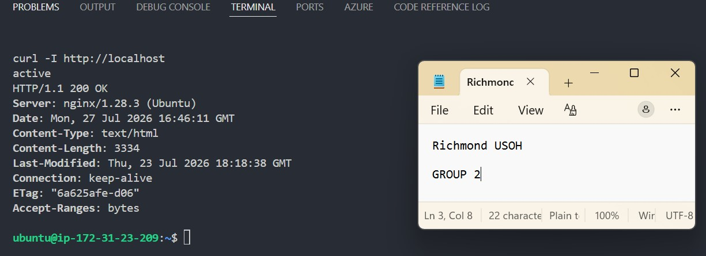.

---

#### Screenshot 17 — Second `/linux-triage` output showing successful recovery with no FAIL results

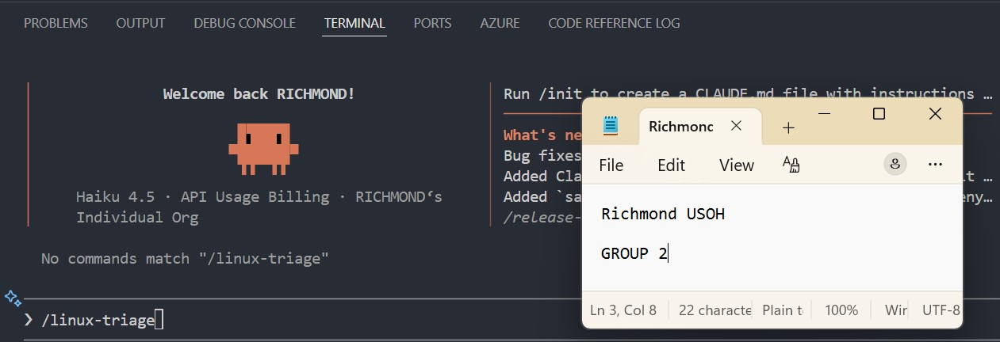.

---

#### Screenshot 18 — Output of `ls -lah reports` showing both `incident-failure-report.txt` and `recovery-report.txt`

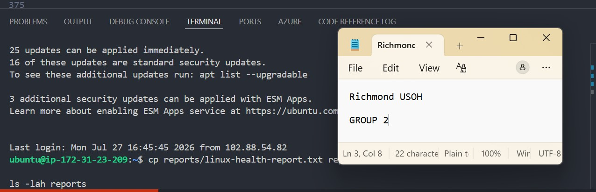.

---

#### Screenshot 19 — `incident-summary.md` showing all required sections and your Full Name

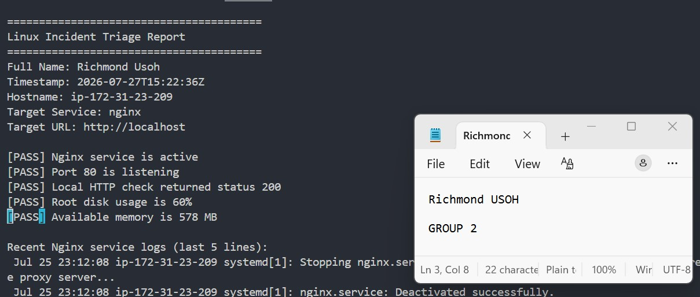.

---

### Notes

Answer the following in your own words:

**1. What action did you execute manually?**

I manually executed the recovery command to restart the Nginx service using sudo systemctl start nginx. After running the command, I verified that Nginx was running and that the application was serving HTTP traffic again..

---

**2. What evidence proves that the service recovered?**

The service recovery was confirmed by systemctl status nginx showing Active: active (running), ss -tulnp showing Nginx listening on port 80, and curl http://localhost successfully returning the application or an HTTP 200 OK response. The health check also returned a HEALTHY status with exit code 0..

---

**3. Why is the second triage run necessary?**

The second triage run is necessary to verify that the recovery was successful. It collects fresh evidence after the recovery action to confirm that the service is running, the application is serving traffic, and the system has returned to a healthy state..

---

**4. What could go wrong if an AI agent automatically restarted every failed service?**

If an AI agent automatically restarted every failed service, it could hide the real cause of the failure, create repeated restart loops, cause data loss or service disruption, and introduce security and operational risks. Human approval ensures the problem is investigated and the correct recovery action is taken rather than applying an automatic fix..

---

**5. In one sentence, explain the difference between using AI as a chatbot and using AI in this agentic workflow.**

Using AI as a chatbot provides general answers based on your questions, whereas using AI in an agentic workflow combines real system evidence with structured analysis and human oversight to make accurate, evidence-based recommendations without taking unauthorized actions..

---

# Incident Summary

Fill in all seven sections below in your own words.

**Full Name:** Richmond Usoh

**Date:** 27/07/2026

---

**1. Reported Symptom**

The web application became unavailable because the Nginx web server was not running, causing HTTP requests to fail.

---

**2. Evidence Collected**

systemctl status nginx showed that the Nginx service was inactive/not running.
ss -tulnp | grep :80 showed that no process was listening on HTTP port 80.
curl http://localhost failed to connect, confirming that the application was not serving HTTP traffic.
The health check script reported failed checks and returned a failure status..

---

**3. Most Likely Cause**

The most likely cause was that the Nginx service had stopped, making the web application inaccessible over HTTP.

---

**4. Human-Approved Recovery Action**

After reviewing Claude's evidence-based recommendation, I manually restarted the Nginx service using the appropriate systemctl command and then reran the health checks..

---

**5. Verification**

systemctl status nginx showing Active: active (running).
ss -tulnp | grep :80 showing Nginx listening on port 80.
curl http://localhost successfully returning the application.
The health check script reporting HEALTHY with exit code 0.

---

**6. Safety Decision**

Claude did not execute any recovery commands. The recovery action was performed manually after human approval to ensure security, prevent unintended changes, and maintain accountability.

---

**7. Agentic Loop Mapping**

Gather: Bash collected system evidence, including service status, port status, and HTTP response.
Analyze: Claude interpreted the collected evidence and identified Nginx as unavailable.
Act: The human reviewed Claude's recommendation and manually restarted the Nginx service.
Verify: A second triage run confirmed that the service had recovered and the application was healthy again.

---

# LinkedIn Post (Required)

## Evidence

#### LinkedIn Post URL

Paste your LinkedIn post URL here:

`https://www.linkedin.com/posts/richmond-usoh-16672531_devops-linux-bash-activity-7487604113833144320-vgGP?utm_source=share&utm_medium=member_desktop&rcm=ACoAAAaxKJ4B4307Oy0LMj-MkWnZs1lOOjPvqqY`

---

#### Screenshot — Published LinkedIn post

.

---

# GitHub Repository URL

Paste the URL of your GitHub folder or repository containing the assignment files here:

`https://github.com/richmondusoh/devops-micro-internship-pravinmishra.git`

---

# Submission Instructions

- Add all required screenshots in your submission
- Full Name must be visible in required screenshots and the Bash report
- All written answers must be in your own words
- Do not expose sensitive information (keys, passwords, AWS account IDs, tokens)
- GitHub URL must be included in this document

---

# Completion Checklist

- [✅] Task 1: Healthy baseline confirmed, workspace created (Screenshots 1–2, Notes answered)
- [✅] Task 2: CLAUDE.md created with all four sections (Screenshot 3, Notes answered)
- [✅] Task 3: Five-check plan produced by Claude using read-only tools (Screenshot 4, Notes answered)
- [✅] Task 4: `linux-triage.sh` created, syntax validated, executable permission set (Screenshots 5–8, Notes answered)
- [✅] Task 5: Healthy-state report generated with no FAIL result (Screenshots 9–10, Notes answered)
- [✅] Task 6: `/linux-triage` skill created and run successfully on healthy server (Screenshots 11–12, Notes answered)
- [✅] Task 7: Nginx incident simulated, failed evidence captured, Claude did not execute recovery (Screenshots 13–15, Notes answered)
- [✅] Task 8: Nginx recovered manually, recovery verified, reports saved, incident summary complete (Screenshots 16–19, Notes answered)
- [✅] Incident summary contains all seven required sections
- [✅] LinkedIn post published and URL submitted
- [✅] Full Name visible in all required screenshots and the Bash report
- [✅] Skill does not have Write permission
- [✅] Skill did not execute any recovery commands
- [✅] No sensitive data exposed

---

## 📌 About DMI & CloudAdvisory

DevOps Micro Internship (DMI) is a project-based DevOps program run by Pravin Mishra (The CloudAdvisory) focused on real-world execution, systems thinking, and career readiness.

It helps learners build strong DevOps foundations with hands-on experience.

---

## 📌 Resources

- 🌐 DMI Official Website: https://pravinmishra.com/dmi  
- 🎓 DevOps for Beginners (Udemy): https://www.udemy.com/course/devops-for-beginners-docker-k8s-cloud-cicd-4-projects/  
- 🎓 Agentic AI DevOps with Claude Code: https://www.udemy.com/course/ultimate-agentic-ai-devops-with-claude-code/  
- 🎓 DevOps with Claude Code: Terraform, EKS, ArgoCD & Helm: https://www.udemy.com/course/devops-with-claude-code-terraform-eks-argocd-helm/  
- ▶️ YouTube Playlist: https://www.youtube.com/playlist?list=PLFeSNDtI4Cho  
- 🔗 Pravin Mishra (LinkedIn): https://www.linkedin.com/in/pravin-mishra-aws-trainer/  
- 🏢 CloudAdvisory (LinkedIn): https://www.linkedin.com/company/thecloudadvisory/

---

*This submission is part of DevOps Micro Internship (DMI) Cohort 3 — Agentic AI Track.*