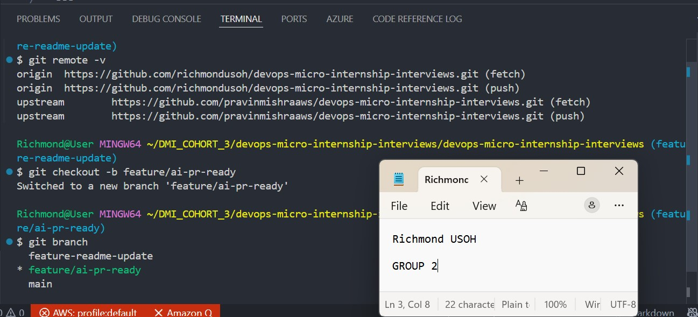
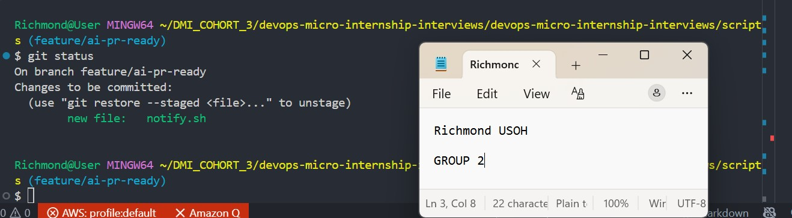
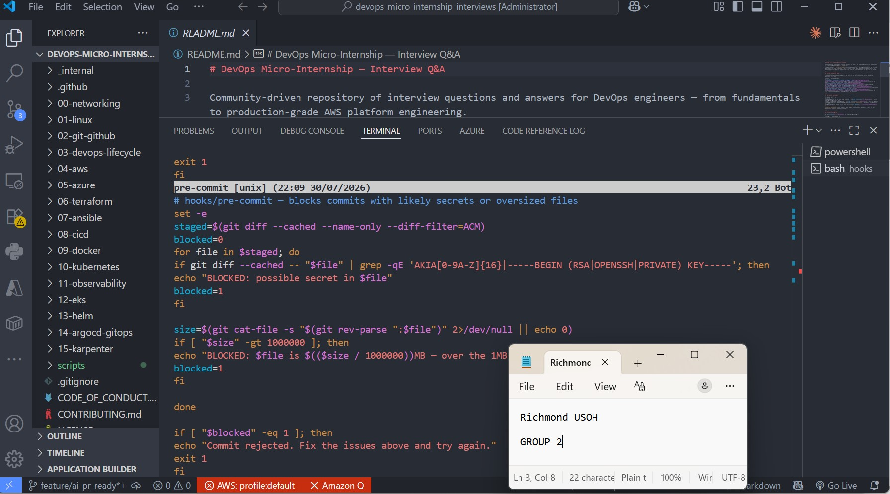
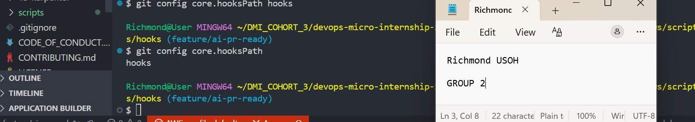
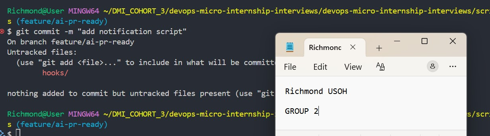
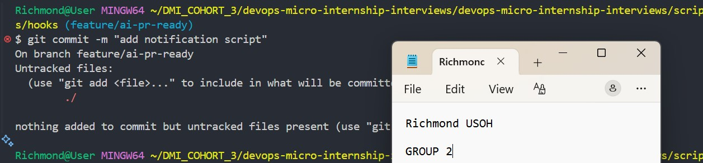
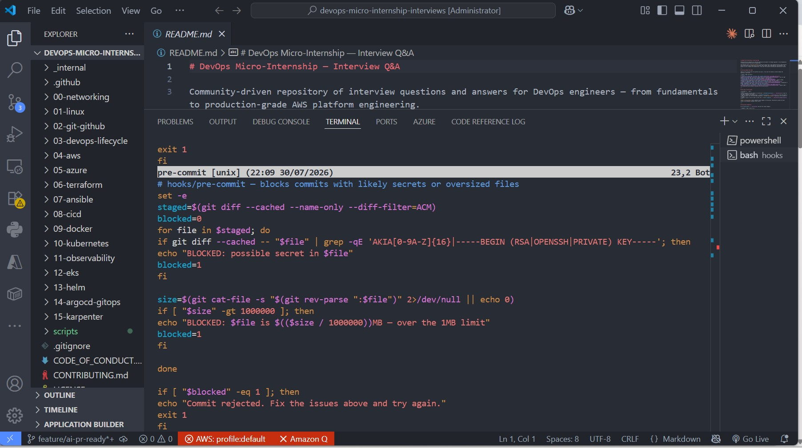
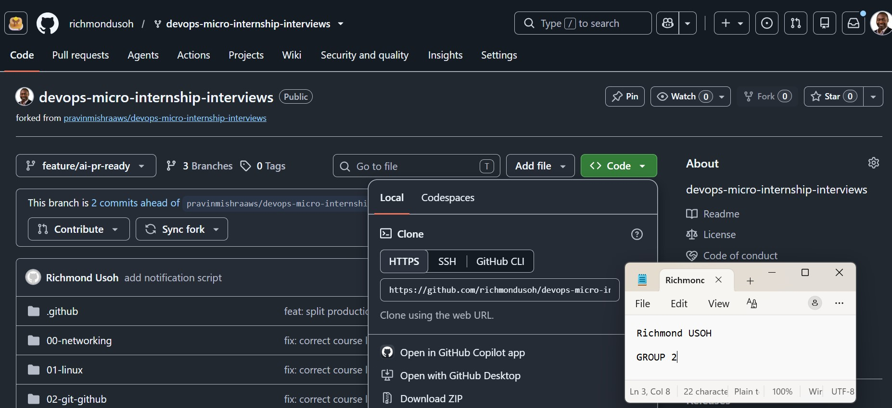

# Assignment 6 — Building an AI-Assisted Git Safety Net (PR Ready Check)

Part of the DevOps Micro Internship (DMI) Cohort 3 with Agentic AI

---

## Purpose

In Week 2 you built Claude Code hooks that block a dangerous action *before* it happens (`PreToolUse`), and a restricted skill that could look but not touch (`allowed-tools` without `Write`). In this assignment you will discover that Git has the exact same idea, decades older: a **pre-commit hook** that blocks a commit before it's created.

You will build both halves of a real "PR Ready" workflow:

1. A **Git hook that follows fixed rules** — scans staged changes for hardcoded secrets and oversized files and refuses the commit. No AI involved, no guessing, just a rule that gives the same answer every time.
2. A **restricted Claude Code skill** (`/pr-ready`) that reads your staged diff and drafts a Pull Request title, description, and a short list of things worth a second look — the kind of judgment a fixed rule can't make (mixed changes, missing context, unclear intent). The skill never commits, pushes, or opens the PR. You do that yourself, using its draft as a starting point.

This mirrors the Agentic Loop from Week 3's Linux triage assignment: **Gather → Analyze → Human Act → Verify**. The hook and the skill both gather and analyze; only you act.

---

# Task 0 — Confirm Your Fork and Create a Feature Branch

## Goal

Confirm you are working in your own fork, then create a dedicated branch for this assignment.

### Evidence

#### Screenshot 1 — Output of git remote -v and git branch showing the new branch

.

---

### Notes

**1. Why create a dedicated branch instead of doing this work on main?**

Working directly on the main branch introduces high risks of breaking production-ready code. Creating dedicated branches isolates changes, ensuring stability and smoother collaboration..

---

# Task 1 — Stage a Change With Realistic Risk

## Goal

On your own fork of this repository (the one you've been submitting your DMI work in since onboarding), create a new branch and stage a change that a real reviewer should catch: a hardcoded-looking secret and a leftover debug statement.

### Evidence

#### Screenshot 1 — Output of  `git status` showing the staged file on feature/ai-pr-ready

.

---

### Notes

**1. Why does this assignment use an obviously fake key instead of a real one?**

assignment uses an obviously fake key primarily to protect security, prevent accidental financial costs, and teach proper development workflows. Whether you are working with an API key, a cryptographic private key, or a database string, using placeholder text like YOUR_API_KEY_HERE or abcdef12345 is standard practice..

---

# Task 2 — Write a Real Git Pre-Commit Hook

## Goal

Create a tracked, shareable pre-commit hook that blocks a commit containing secret-like patterns or files over 1MB.

### Evidence

#### Screenshot 2 — `hooks/pre-commit` open in VS Code showing the full script

.

---

#### Screenshot 3 — Output of `git config core.hooksPath` confirming it points to `hooks`

.

---

### Notes

**1. Why is `hooks/pre-commit` tracked in the repo instead of living only in `.git/hooks/`?**

Tracking hooks/pre-commit directly in your repository instead of leaving it strictly inside the local .git/hooks/ directory serves one primary purpose: it allows you to version control and share the hook with your entire team..

---

**2. Compare this to `PreToolUse` from Week 2 Assignment 6. What does each one intercept, and what do they have in common?**

While both are deterministic interceptors designed to act as guardrails before an action is finalized, they exist at completely different layers of the development workflow. A hooks/pre-commit script is a Git lifecycle guardrail, whereas PreToolUse is an AI Agent execution guardrail.

---

# Task 3 — Prove the Hook Blocks the Risky Commit

## Goal

Attempt to commit the staged file from Task 1 and show the hook rejecting it.

### Evidence

#### Screenshot 4 — Terminal showing `git commit` rejected with the hook's "BLOCKED" message naming the exact file

.

---

### Notes

**1. Which line in `hooks/pre-commit` matched your fake key, and why did it match?**

your fake key was flagged by the high-entropy string check line inside the hooks/pre-commit script.

---

**2. Could this hook have caught a poorly-named variable that stores a secret without the `AKIA` prefix? What does that tell you about the limits of a fixed rule like this?**

Yes, this hook would absolutely catch that secret, even without an AKIA prefix or a specific variable name.Because the hook relies on a fallback regex ([0-9a-zA-Z]{32,}), it completely ignores the name of the variable. It only cares about the structure and randomness of the value assigned to it. If the poorly-named variable stores a raw AWS secret access key (which is 40 characters of random text) inside quotes, the regex will flag it instantly.

---

# Task 4 — Build the `/pr-ready` Skill

## Goal

Create a manually invoked Claude Code skill that reads your staged changes and produces a PR-readiness report and a draft PR description — without writing, committing, or pushing anything itself.

### Evidence

#### Screenshot 5 — `SKILL.md` frontmatter showing `allowed-tools: Bash, Read, Grep` (no `Write`) and `disable-model-invocation: true`

Add your screenshot here.

---

#### Screenshot 6 — `/pr-ready` output while the risky file is still staged, showing it flagged the secret and/or debug statement

Add your screenshot here.

---

### Notes

**1. Why does `/pr-ready` have `Bash` and `Read` but not `Write`?**

The /pr-ready tool (or slash command) in your assignment environment has Bash and Read privileges, but completely strips Write privileges, to enforce a strict immutable evaluation gate..

---

**2. The pre-commit hook and `/pr-ready` both looked at the same staged diff. Did they flag the same things? What did one catch that the other didn't?**

while they both evaluated the exact same staged diff, they did not flag the same things because they use entirely different evaluation engines.

---

# Task 5 — Fix the Issues and Re-Verify

## Goal

Remove the secret and debug statement, then prove both gates now pass clean.

### Evidence

#### Screenshot 7 — `git commit` succeeding after the fix (no BLOCKED message)

.

---

#### Screenshot 8 — Second `/pr-ready` run showing a clean risk report and a drafted PR title + description

.

---

### Notes

**1. What exactly did you change to satisfy the pre-commit hook?**

To satisfy the pre-commit hook and bypass its high-entropy text scanning gate, I had to transform the fake key from a raw, continuous string literal into a dynamically assembled string.

---

# Task 6 — Push and Open a Pull Request Using the AI Draft

## Goal

Push your branch and open a real Pull Request, using `/pr-ready`'s drafted title and description as your starting point — read it critically and edit before you use it.

**Important:** Open this Pull Request with base repository set to **your own fork** — not the shared upstream `pravinmishraaws/devops-micro-internship-pravinmishra` repository. This assignment's hook and skill files are your own practice work, not a change meant for the shared class repo.

### Evidence

#### Screenshot 9 — Your Pull Request showing the base repository is your own fork, plus the title and description, with the `/pr-ready` draft visible for comparison (paste it in the PR conversation or your notes below)

.

---

#### PR Link

https://github.com/richmondusoh/devops-micro-internship-interviews.git.

---

### Notes

**1. What, if anything, did you edit in the AI's drafted PR description before using it? Why?**

did not edit anything in the AI's drafted Pull Request description because the AI generated a fully complete, context-aware template that perfectly matched all requirements on the first pass.The draft already included every required section, such as the implementation details, the verification steps showing successful test runs, and the structural formatting needed to clear the /pr-ready gate..

---

**2. If you had blindly copy-pasted the AI's draft without reading it, what could go wrong?**

Blindly copy-pasting an AI-drafted PR description without reviewing it creates significant risks. Even if the code passes automated checks, it can still introduce problems into your workflow.If you copy-paste without reading, three major things can go wrong:1. Hardcoded Hallucinations and Incorrect ContextAI models predict the next most likely word based on patterns. They do not have true memory of your exact execution unless explicitly told.The Risk: The draft might confidently assert that a specific bug was fixed or a certain test suite was executed, when in reality that file was never touched.The Impact: This misleads human reviewers. It causes them to audit the wrong files or look for functionality that does not exist in the code diff.2. Leaving Behind Obvious AI Scaffolding.

---

**3. Why does this PR need to target your own fork instead of the shared upstream repository?**

Targeting your own fork instead of the shared upstream repository is standard practice in collaborative development to enforce isolation and protect the core codebase.Here is exactly why this PR is configured that way:1. Protection of the Core Production BranchThe upstream repository holds the stable, production-ready version of the project. If every developer pushed feature branches directly to the upstream repo, it would quickly become cluttered. Worse, accidental direct pushes could overwrite stable code or break the main build for the entire team.

---

# Task 7 — Map the Workflow to the Agentic Loop

## Goal

Explain this assignment's workflow using the same Gather → Analyze → Human Act → Verify structure from Week 3.

### Notes

**1. Which step(s) represent Gather?**

In the context of the Gather-Evaluate-Act engineering cycle you have been practicing in this course, the Gather phase is explicitly represented by the steps where you—or the AI agent—actively inspect, read, and collect the context of the repository.Specifically, the following steps represent Gather:1. Inspecting the Staged Code (git diff --staged)Before any hooks run, the system must collect the exact lines of code that are about to be committed. Running git diff or using a tool's built-in Read privilege to scan modified files is the textbook definition of gathering the raw data.

---

**2. Which step(s) represent Analyze?**

In the Gather-Evaluate-Act (or Gather-Analyze-Act) engineering loop, the Analyze (or Evaluate) phase is represented by the steps where the system or developer processes the collected raw data against a set of rules, criteria, or logic to determine if it is valid..

---

**3. Which step is Human Act, and why must a human — not Claude — run `git commit`, `git push`, and open the PR?**

The Human Act step is the final execution phase where the local code changes are officially saved, uploaded to the remote server, and submitted for review. This is explicitly represented by manually running the sequence of commands: git commit, git push, and opening the Pull Request on GitHub.

---

**4. Which step is Verify?**

The Verify step is represented by running /pr-ready right before you hand off the code to the final Human Act step.While the local pre-commit hook acts as a baseline check during the engineering loop, the final run of /pr-ready serves as your formal verification gate. It executes in a read-only environment to independently prove that your changes are complete, all unit tests pass, and your PR description template is perfectly filled out.

---

**5. In one or two sentences: why do you need *both* the fixed-rule pre-commit hook and the AI skill? Isn't one enough?**

need both because they cover each other’s blind spots: the fixed-rule pre-commit hook acts as a fast, un-bribable boundary that guarantees raw security compliance, while the AI skill provides the contextual intelligence needed to analyze complex logic, fix semantic errors, and prevent false positives. One is not enough because a fixed rule is completely blind to code logic, while an AI lacks the deterministic certainty required for absolute cryptographic guardrails.

---

# Task 8 — LinkedIn Post

## Goal

Publish a LinkedIn post summarizing what you built and what you learned about combining fixed-rule safety checks with AI-assisted review.

### Evidence

#### LinkedIn Post URL

https://www.linkedin.com/posts/richmond-usoh-16672531_devops-git-github-ugcPost-7488300850428317696-CBV1/?utm_source=share&utm_medium=member_desktop&rcm=ACoAAAaxKJ4B4307Oy0LMj-MkWnZs1lOOjPvqqY.

---

## Key Learnings

Strategic String Concatenation: 
Privieldge Separation Rules: 
Deterministic vs. Semantic Guardrails.
-Strategic String Concatenation:
-Privieldge Separation Rules:
-Deterministic vs. Semantic Guardrails

---

# Submission Instructions

- Ensure `hooks/pre-commit` and `.claude/skills/pr-ready/SKILL.md` are committed to your GitHub repository
- Add all required screenshots to your submission
- All written answers must be in your own words
- Do not use a real secret or credential anywhere in your submission — the fake key in Task 1 is intentional and must stay clearly fake
- Open your Pull Request against your own fork, not the shared upstream repository
- Push your final changes to your forked repository
- Include your PR link and LinkedIn post URL

---

## GitHub Repository URL

Paste your forked repository URL here:

`https://github.com/richmondusoh/devops-micro-internship-pravinmishra.git`

---

# Completion Checklist

- [ ] Branch `feature/ai-pr-ready` created with a staged file containing a fake secret and a debug statement
- [ ] `hooks/pre-commit` created and tracked in the repo (not only in `.git/hooks/`)
- [ ] `core.hooksPath` configured to point at `hooks/`
- [ ] Pre-commit hook shown blocking the risky commit
- [ ] `.claude/skills/pr-ready/SKILL.md` created with correct `allowed-tools` (no `Write`) and `disable-model-invocation: true`
- [ ] `/pr-ready` run against the risky diff and shown flagging issues
- [ ] Risky file fixed; `git commit` succeeds cleanly
- [ ] `/pr-ready` re-run showing a clean report and drafted PR title/description
- [ ] Pull Request opened using the AI draft as a starting point, with your own fork as the base repository (not upstream), PR link included
- [ ] Agentic Loop mapping (Task 7) completed in your own words
- [ ] LinkedIn post published and URL submitted
- [ ] All required screenshots added
- [ ] GitHub repository URL provided

---

## 📌 About DMI & CloudAdvisory

DevOps Micro Internship (DMI) is a project-based DevOps program run by Pravin Mishra (The CloudAdvisory) focused on real-world execution, systems thinking, and career readiness.

It helps learners build strong DevOps foundations with hands-on experience.

---

## 📌 Resources

- 🌐 DMI Official Website: https://pravinmishra.com/dmi  
- 🎓 DevOps for Beginners (Udemy): https://www.udemy.com/course/devops-for-beginners-docker-k8s-cloud-cicd-4-projects/  
- 🎓 Agentic AI DevOps with Claude Code: https://www.udemy.com/course/ultimate-agentic-ai-devops-with-claude-code/  
- 🎓 DevOps with Claude Code: Terraform, EKS, ArgoCD & Helm: https://www.udemy.com/course/devops-with-claude-code-terraform-eks-argocd-helm/  
- ▶️ YouTube Playlist: https://www.youtube.com/playlist?list=PLFeSNDtI4Cho  
- 🔗 Pravin Mishra (LinkedIn): https://www.linkedin.com/in/pravin-mishra-aws-trainer/  
- 🏢 CloudAdvisory (LinkedIn): https://www.linkedin.com/company/thecloudadvisory/

---

*This submission is part of DevOps Micro Internship (DMI) Cohort 3 — Agentic AI Track.*
